<div style="text-align:center;">
    <h1>UNIVERSIDAD PERUANA<br> DE CIENCIAS APLICADAS</h1>
    
    <h2>SI730 Aplicaciones Web</h2>
    <p><strong>Sección:</strong> WS51</p>
    <p><strong>Carrera:</strong> Ingeniería de Software</p>
    <p><strong>Ciclo:</strong> 5-6</p>
    <p><strong>Profesor:</strong> Hugo Allan Mori Paiva</p>
    <h3>"Informe de Trabajo Final"</h3>
    <h4>TB1</h4>
    <p><strong>Tema:</strong> Reservas</p>
    <p><strong>Producto:</strong> KingReserve de KingGroup</p>
    <p><strong>Agosto 2024</strong></p>
</div>

<div style="text-align:left;">
    <h3>Integrantes:</h3>
    <ul>
        <li>Gómez Vallejos Sergio André - U20221D401</li>
        <li>Rojas Velasquez Maycol Jhordan - U202219984</li>
        <li>Zevallos Linares Alessandro Netto - U202216035</li>
        <li>Pedraza Maldonado Joaquin Andree - U202218514</li>
        <li>Romero Qwistgaard Russell Stephen - U202211043</li>
    </ul>
</div>


<p style="text-align: center;">
  <strong>Registro de versiones de informe:</strong><br>
</p>


| Entregables | Fecha       | Autor                             | Descripción de modificación                                                                                      |  
|-------------|-------------|-----------------------------------|------------------------------------------------------------------------------------------------------------------|  
| TB1         | 23/08/2024  | Sergio André Gómez Vallejos       | Implementación de contenido en el Student Outcome   | 
| TB1         | 23/08/2024  | Sergio André Gómez Vallejos       |  Competidores y Desarrollo del perfil de integrante  | 
| TB1         | 23/08/2024  | Sergio André Gómez Vallejos       |  Analisis Competitivo  |  
| TB1         | 23/08/2024  | Sergio André Gómez Vallejos       |  Estrategias y tácticas frente a competidores | 
| TB1         | 24/08/2024  | Sergio André Gómez Vallejos       | Registro de 2 entrevistas del sector Huespedes, Diseño de Entrevista |  
| TB1         | 23/08/2024  | Joaquin Pedraza Maldonado         | Antecedentes y problemática   Perfil de integrante                                                               |  
| TB1         | 24/03/2024  | Maycol Jhordan Rojas Velasquez    | Implementación de la descripción de la Startup                                                                   |  
| TB1         | 24/08/2024  | Joaquin Pedraza Maldonado         | Lean UX Process/                                                                                                  |  
| TB1         | 26/08/2024  | Alessandro Zevallos Linares       | Perfil de integrante                                                                                             |  
| TB1         | 26/08/2024  | Alessandro Zevallos Linares       | Diseño de Entrevistas                                                                                            |  
| TB1         | 25/03/2024  | Maycol Jhordan Rojas Velasquez    | Desarrollo del perfil de integrante, estructuración del informe índice, cuadros, carátula                        |  
| TB1         | 27/08/2024  | Maycol Jhordan Rojas Velasquez    | Desarrollo del perfil de integrante, Creación del logo                                                           |
| TB1         | 04/09/2024  | Russell Stephen Romero Qwistgaard | User Stories, Product Backlog                                                                                    |
| TB1         | 04/08/2024  | Sergio André Gómez Vallejos       | Diagrama de base de datos|  
| TB1         | 05/09/2024  | Maycol Jhordan Rojas Velasquez    | CAPÍTULO IV: Product Design Style Guidelines<br>General Style Guidelines <br> Web Style Guidelines <br> 2 entrevistas de empresas hoteleras |
|TB1 | 05/09/2024|Maycol Jhordan Rojas Velasquez| Registro de 2 entrevistas del sector Empresa Hotelera|
|TB1|05/09/2024|Maycol Jhordan Rojas Velasquez| Agregar el Ubiquitous Language para conocer los terminos de los segmentos. |
| TB1         | 05/09/2024  | Sergio André Gómez Vallejos       | Agregación de User Persona del sector Empresa Hotelera|  
|TB1| 05/09/2024 | Maycol Jhordan Rojas Velasquez| Hacer el Software Configuration Management|
|TB1|06/092024|Maycol Jhordan Rojas Velasquez | Hacer las User Stories|
|TB1|06/09/2024|Maycol Jhordan Rojas Velasquez| Se agrego descripciones generales, como el diagrama de C4 contexto, componentes y contenedores. |
| TB1         | 06/09/2024  | Sergio André Gómez Vallejos       | Implementación del  Landing Page Mock-up|  
| TB1         | 03/09/2024  | Joaquin Pedraza Maldonado         |Software Architecture Context Diagram                                                                                                    | 
| TB1         | 03/09/2024  | Joaquin Pedraza Maldonado         |Software Architecture Container Diagram                                                                                                    | 
| TB1         | 02/09/2024  | Joaquin Pedraza Maldonado         | Organization Systems                                                                                                  | 
| TB1         | 02/09/2024  | Joaquin Pedraza Maldonado         | Labeling  Systems                                                                                                   | 
| TB1         | 02/09/2024  | Joaquin Pedraza Maldonado         | SEO and Meta Tags                                                                                                   | 
| TB1         | 02/09/2024  | Joaquin Pedraza Maldonado         | Searching   Systems                                                                                                  | 
| TB1         | 02/09/2024  | Joaquin Pedraza Maldonado         | Navegation  Systems                                                                                                   | 
|TB1|02/09/2024|Alessandro Zevallos Linares| User Task Matrix |
|TB1|04/09/2024|Alessandro Zevallos Linares| User Persona |
|TB1|04/09/2024|Alessandro Zevallos Linares| User Journey Mapping |
|TB1|04/09/2024|Alessandro Zevallos Linares| Landing Page UI Design |
|TB1|06/09/2024|Alessandro Zevallos Linares| Web Applications UX/UI Design |
|TB1|06/09/2024|Alessandro Zevallos Linares| Web Applications Prototyping |
|TB1|06/09/2024|Maycol Jhordan Rojas Velasquez| Se hizo  Software Configuration Management.  |
|TB1|06/09/2024|Maycol Jhordan Rojas Velasquez| Se hizo  Landing Page, Services & Applications Implementation.  |
|TB1|06/09/2024|Maycol Jhordan Rojas Velasquez| Se hizo  Sprint 1 ,Sprint Planning 1. Sprint Backlog 1. Development Evidence for Sprint Review. Testing Suite Evidence for Sprint Review. Execution Evidence for Sprint Review. Services Documentation Evidence for Sprint Review. Software Deployment Evidence for Sprint Review. Team Collaboration Insights during Sprint. |
|TB1|06/09/2024|Russell Stephen Romero Qwistgaard| AS - IS MAPPING, TO - BE MAPPING, Impact Mapping|
| TB1         | 08/09/2024  | Sergio André Gómez Vallejos       |  Implementación de user story, product backlog y sprint 1 | 
| TP1         | 09/09/2024  | Sergio André Gómez Vallejos       |  Implementación del sprint 2, sprint backlog, testing | 

**Project Report Collaboration Insights**

### URL del Repositorio 
https://github.com/KingGroupOficial/Documento-KingReserve


<p style="text-align: center; font-weight: bold;">
  Tabla de contenido
  
</p>

1. [CAPÍTULO I: Introducción](#CAPÍTULO-I-Introducción)<br>
      1.1. [Startup Profile](#Startup-Profile)<br>
      1.1.1. [Descripción de la Startup](#Descripción-de-la-Startup)<br>
      1.1.2. [Perfiles de integrantes del equipo](#Perfiles-de-integrantes-del-equipo)<br>
   1.2. [Solution Profile](#Solution-Profile)<br>
      1.2.1. [Antecedentes y problemática](#Antecedentes-y-problemática)<br>
      1.2.2. [Lean UX Process](#Lean-UX-Process)<br>
             1.2.2.1 [Lean UX Problem Statements](#Lean-UX-Problem-Statements)<br>
             1.2.2.2 [Lean UX Assumptions](#Lean-US-Assumptions)<br>
             1.2.2.3 [Lean UX Hypothesis Statements](#Lean-UX-Hypothesis-Statements)<br>
             1.2.2.4 [Lean UX Canvas](#Lean-UX-Canvas) <br>
1.3. [Segmentos objetivo](#Segmentos-objetivo) <br>
2. [CAPÍTULO II: Requirements Elicitation & Analysis](#Capítulo-II-Requirements-Elicitation--Analysis) <br>
   2.1. [Competidores](#Competidores) <br>
      2.1.1. [Análisis competitivo](#Análisis-competitivo) <br>
      2.1.2. [Estrategias y tácticas frente a competidores](#Estrategias-y-tácticas-frente-a-competidores) <br>
   2.2. [Entrevistas](#Entrevistas) <br>
      2.2.1. [Diseño de entrevistas](#Diseño-de-entrevistas) <br>
      2.2.2. [Registro de entrevistas](#Registro-de-entrevistas)<br> 
      2.2.3. [Análisis de entrevistas](#Análisis-de-entrevistas)<br> 
   2.3. [Needfinding](#Needfinding) <br>
      2.3.1. [User Personas](#User-Personas) <br>
      2.3.2. [User Task Matrix](#User-Task-Matrix) <br>
      2.3.3. [User Journey Mapping](#User-Journey-Mapping) <br>
      2.3.4. [Empathy Mapping](#Empathy-Mapping) <br>
      2.3.5. [As-is Scenario Mapping](#As-is-Scenario-Mapping) <br>
   2.4. [Ubiquitous Language](#Ubiquitous-Language) <br>
3. [CAPÍTULO III: Requirements Specification](#Capítulo-III-Requirements-Specification) <br>
   3.1. [To-Be Scenario Mapping](#To-Be-Scenario-Mapping) <br>
   3.2. [User Stories](#User-Stories) <br>
   3.3. [Impact Mapping](#Impact-Mapping) <br>
   3.4. [Product Backlog](#Product-Backlog) <br>
4. [CAPÍTULO IV: Product Design](#Capítulo-IV-Product-Design) <br>
   4.1. [Style Guidelines](#Style-Guidelines) <br>
      4.1.1. [General Style Guidelines](#General-Style-Guidelines) <br>
      4.1.2. [Web Style Guidelines](#Web-Style-Guidelines) <br>
   4.2. [Information Architecture](#Information-Architecture) <br>
      4.2.1. [Organization Systems](#Organization-Systems) <br>
      4.2.2. [Labeling Systems](#Labeling-Systems) <br>
      4.2.3. [SEO Tags and Meta Tags](#SEO-Tags-and-Meta-Tags) <br>
      4.2.4. [Searching Systems](#Searching-Systems) <br>
      4.2.5. [Navigation Systems](#Navigation-Systems) <br>
   4.3. [Landing Page UI Design](#Landing-Page-UI-Design) <br>
      4.3.1. [Landing Page Wireframe](#Landing-Page-Wireframe) <br>
      4.3.2. [Landing Page Mock-up](#Landing-Page-Mock-up) <br>
   4.4. [Web Applications UX/UI Design](#Web-Applications-UX-UI-Design) <br>
      4.4.1. [Web Applications Wireframes](#Web-Applications-Wireframes) <br>
      4.4.2. [Web Applications Wireflow Diagrams](#Web-Applications-Wireflow-Diagrams) <br>
      4.4.3. [Web Applications Mock-ups](#Web-Applications-Mock-ups) <br>
      4.4.4. [Web Applications User Flow Diagrams](#Web-Applications-User-Flow-Diagrams) <br>
   4.5. [Web Applications Prototyping](#Web-Applications-Prototyping) <br>
   4.6. [Domain-Driven Software Architecture](#Domain-Driven-Software-Architecture) <br>
      4.6.1. [Software Architecture Context Diagram](#Software-Architecture-Context-Diagram) <br>
      4.6.2. [Software Architecture Container Diagrams](#Software-Architecture-Container-Diagrams) <br>
      4.6.3. [Software Architecture Components Diagrams](#Software-Architecture-Components-Diagrams) <br>
   4.7. [Software Object-Oriented Design](#Software-Object-Oriented-Design) <br>
      4.7.1. [Class Diagrams](#Class-Diagrams) <br>
      4.7.2. [Class Dictionary](#Class-Dictionary) <br>
   4.8. [Database Design](#Database-Design) <br>
      4.8.1. [Database Diagram](#Database-Diagram) <br>
5. [CAPÍTULO V: Product Implementation, Validation & Deployment](#Capítulo-V-Product-Implementation--Validation--Deployment) <br>
   5.1. [Software Configuration Management](#Software-Configuration-Management) <br>
      5.1.1. [Software Development Environment Configuration](#Software-Development-Environment-Configuration) <br>
      5.1.2. [Source Code Management](#Source-Code-Management) <br>
      5.1.3. [Source Code Style Guide & Conventions](#Source-Code-Style-Guide--Conventions) <br>
      5.1.4. [Software Deployment Configuration](#Software-Deployment-Configuration) <br>
   5.2. [Landing Page, Services & Applications Implementation](#Landing-Page--Services--Applications-Implementation) <br>
      5.2.1. [Sprint 1](#Sprint-1) <br>
         5.2.1.1. [Sprint Planning 1](#Sprint-Planning-1) <br>
         5.2.1.2. [Sprint Backlog 1](#Sprint-Backlog-1) <br>
         5.2.1.3. [Development Evidence for Sprint Review](#Development-Evidence-for-Sprint-Review) <br>
         5.2.1.4. [Testing Suite Evidence for Sprint Review](#Testing-Suite-Evidence-for-Sprint-Review) <br>
         5.2.1.5. [Execution Evidence for Sprint Review](#Execution-Evidence-for-Sprint-Review) <br>
         5.2.1.6. [Services Documentation Evidence for Sprint Review](#Services-Documentation-Evidence-for-Sprint-Review) <br>
         5.2.1.7. [Software Deployment Evidence for Sprint Review](#Software-Deployment-Evidence-for-Sprint-Review) <br>
         5.2.1.8. [Team Collaboration Insights during Sprint](#Team-Collaboration-Insights-during-Sprint) <br>
      5.2.2. [Sprint 2](#Sprint-2) <br>
         5.2.2.1. [Sprint Planning 2](#Sprint-Planning-2) <br>
         5.2.2.2. [Sprint Backlog 2](#Sprint-Backlog-2) <br>
         5.2.2.3. [Development Evidence for Sprint Review](#Development-Evidence-for-Sprint-Review-2)<br> 
         5.2.2.4. [Testing Suite Evidence for Sprint Review](#Testing-Suite-Evidence-for-Sprint-Review-2) <br>
         5.2.2.5. [Execution Evidence for Sprint Review](#Execution-Evidence-for-Sprint-Review-2) <br>
         5.2.2.6. [Services Documentation Evidence for Sprint Review](#Services-Documentation-Evidence-for-Sprint-Review-2) <br>
         5.2.2.7. [Software Deployment Evidence for Sprint Review](#Software-Deployment-Evidence-for-Sprint-Review-2) <br>
         5.2.2.8. [Team Collaboration Insights during Sprint](#Team-Collaboration-Insights-during-Sprint-2) <br>
      5.2.3. [Sprint 3](#Sprint-3) <br>
         5.2.3.1. [Sprint Planning 3](#Sprint-Planning-3) <br>
         5.2.3.2. [Sprint Backlog 3](#Sprint-Backlog-3) <br>
         5.2.3.3. [Development Evidence for Sprint Review](#Development-Evidence-for-Sprint-Review-3) <br>
         5.2.3.4. [Testing Suite Evidence for Sprint Review](#Testing-Suite-Evidence-for-Sprint-Review-3) <br>
         5.2.3.5. [Execution Evidence for Sprint Review](#Execution-Evidence-for-Sprint-Review-3) <br>
         5.2.3.6. [Services Documentation Evidence for Sprint Review](#Services-Documentation-Evidence-for-Sprint-Review-3) <br>
         5.2.3.7. [Software Deployment Evidence for Sprint Review](#Software-Deployment-Evidence-for-Sprint-Review-3) <br>
         5.2.3.8. [Team Collaboration Insights during Sprint](#Team-Collaboration-Insights-during-Sprint-3) <br>
      5.2.4. [Sprint 4](#Sprint-4) <br>
         5.2.4.1. [Sprint Planning 4](#Sprint-Planning-4) <br>
         5.2.4.2. [Sprint Backlog 4](#Sprint-Backlog-4) <br>
         5.2.4.3. [Development Evidence for Sprint Review](#Development-Evidence-for-Sprint-Review-4) <br>
         5.2.4.4. [Testing Suite Evidence for Sprint Review](#Testing-Suite-Evidence-for-Sprint-Review-4) <br>
         5.2.4.5. [Execution Evidence for Sprint Review](#Execution-Evidence-for-Sprint-Review-4) <br>
         5.2.4.6. [Services Documentation Evidence for Sprint Review](#Services-Documentation-Evidence-for-Sprint-Review-4) <br>
         5.2.4.7. [Software Deployment Evidence for Sprint Review](#Software-Deployment-Evidence-for-Sprint-Review-4) <br>
         5.2.4.8. [Team Collaboration Insights during Sprint](#Team-Collaboration-Insights-during-Sprint-4) <br>
   5.3. [Validation & Testing](#Validation--Testing) <br>
      5.3.1. [Testing Plan](#Testing-Plan) <br>
      5.3.2. [Quality Assurance](#Quality-Assurance) <br>
      5.3.3. [User Acceptance Testing (UAT)](#User-Acceptance-Testing-UAT) <br>
   5.4. [Product Deployment](#Product-Deployment) <br>
      5.4.1. [Deployment Plan](#Deployment-Plan) <br>
      5.4.2. [Deployment Process](#Deployment-Process) <br>
      5.4.3. [Post-Deployment Review](#Post-Deployment-Review) <br>
6. [CAPÍTULO VI: Appendix](#Capítulo-VI-Appendix) <br>
   6.1. [References](#References) <br>
   6.2. [Glossary](#Glossary) <br>
   6.3. [Acronyms](#Acronyms) <br>
   6.4. [Bibliography](#Bibliography)<br>
   # STUDENT OUTCOME
El curso contribuye al cumplimiento del Student Outcome ABET: 
##### ABET – EAC - Student Outcome 5 
Criterio: Trabaja efectivamente en un equipo cuyos miembros juntos proporcionan liderazgo; crea un entorno colaborativo e inclusivo y establece metas, planifica tareas y cumple objetivos, que permiten sustentar el haber alcanzado el logro del ABET – EAC - Student Outcome 5. 

| **Criterio específico** | **Acciones realizadas** | **Conclusiones** |
|-------------------------|------------------------|------------------|
| Trabaja en equipo para proporcionar liderazgo en forma conjunta | 1.- <b>Sergio André Gómez Vallejos TB1:</b> Participé activamente en el desarrollo del documento y la landing page, colaborando con el equipo en la división de tareas y asegurando que se completaran en el plazo establecido.<br>2.-<b>Maycol Jhordan Rojas Velasquez TB1:</b> Participé activamente en el desarrollo del documento y la landing page colaborando en el tipo de colores y estilos para la web page.<br>3.-<b>Joaquín Pedraza Maldonado:</b> Participé frecuentemente en el documento y las funcionalidades de la landing page apoyando a mis compañeros a que puedan resolver problemas que se les presentaban a la hora de resolver sus partes.<br>4.-<b> Alessandro Netto Zevallos Linares TB1:</b> Participé activamente en la creación del documento, asegurando una correcta coordinación y cumpliendo con los plazos establecidos.<br>5.-<b>Russell Stephen Romero Qwistgaard TB1:</b> Trabaje en coordinación con mi equipo, siempre estando atento a sus llamadas e intentando entregar mis partes a tiempo<br> 1.- **Sergio André Gómez Vallejos TP1:** Colaboré activamente en el desarrollo de la aplicación web, asegurándome de coordinar la asignación de tareas y garantizar que el equipo cumpliera con los plazos.| La colaboración y el liderazgo conjunto permitieron una distribución eficiente de las tareas y aseguraron que se cumplieran los plazos establecidos. La participación activa de todos los miembros del equipo fue crucial para el éxito del proyecto. |
| Crea un entorno colaborativo e inclusivo, establece metas, planifica tareas y cumple objetivos | 1.- <b>Sergio André Gómez Vallejos TB1:</b> Contribuí trabajando en equipo, enfocándome en mis tareas asignadas y apoyando a mis compañeros en sus áreas cuando fue necesario, manteniendo una actitud colaborativa para cumplir los objetivos establecidos.<br>2.-<b>Maycol Jhordan Rojas Velasquez TB1:</b> Creé diversas sub tareas para el grupo para poder cumplir a tiempo todos los entregables, haciendo un entorno más dinámico y amigable para el grupo.<br>3.-<b>Joaquín Pedraza Maldonado TB1:</b> Contribuí trabajando en equipo, realizando mis tareas asignadas y escuchando a mis compañeros para así generar un buen ambiente de trabajo como grupo.<br>4.-<b> Alessandro Netto Zevallos Linares TB1:</b> Me encargué realizar las tareas asignadas para que el equipo pudiera avanzar de manera eficiente y coordinada, asegurando que los objetivos del proyecto se alcanzaran en los tiempos previstos.<br>5.-<b>Russell Stephen Romero Qwistgaard TB1:</b> Impuse mi trabajo en el proyecto con perseverancia y dedicación, buscando mejorar mi desempeño con cada entrega<br> 1.- **Sergio André Gómez Vallejos TP1:** Contribuí a que el proyecto avanzara sin problemas, completando mis tareas y apoyando a mis compañeros cuando lo requerían.| La creación de un entorno colaborativo e inclusivo, junto con la planificación y establecimiento de metas claras, permitió al equipo cumplir con los objetivos del proyecto de manera eficiente. La división de tareas y el apoyo mutuo fueron fundamentales para el éxito del Sprint. |


# 1. CAPÍTULO I: Introducción
## 1.1 Startup Profile
### 1.1.1Descripción de la Startup
#### Descripción de la Startup:
<div style="text-align: justify">
KingReserve es una startup inovadora 
<div/>

Nuestra plataforma principal, **KingReserve**, permite a los hoteles gestionar sus operaciones de manera más eficiente y mejorar la experiencia de sus huéspedes. **KingReserve** no solo es una herramienta para administrar reservas y personal, sino también para ofrecer servicios de manera accesible e intuitiva.


### **Colaboraciones Estratégicas:**
En **KingReserve**, estamos comprometidos a establecer sólidas alianzas con cadenas hoteleras, hoteles boutique, y resorts. Trabajamos en estrecha colaboración con estos socios para garantizar que nuestras soluciones tecnológicas respondan a sus necesidades operativas, facilitando la gestión diaria y mejorando la satisfacción del cliente. Invitamos a los hoteles a integrar nuestras soluciones para optimizar la administración de reservas, la gestión de empleados, y la atención al cliente, creando una experiencia más fluida y eficiente.

### **Innovación y Tecnología:**
Nuestra plataforma utiliza tecnologías avanzadas para ofrecer una experiencia optimizada tanto para el personal hotelero como para los huéspedes. Desde la capacidad de administrar reservas y asignar tareas de manera automatizada hasta la personalización de servicios según las preferencias de los clientes, **KingReserve** busca redefinir la forma en que los hoteles gestionan sus operaciones. Queremos que cada hotel se sienta respaldado por una solución tecnológica que le permita mejorar su eficiencia y ofrecer una atención al cliente excepcional.

### **Comunidad y Funciones Sociales:**
**KingReserve** no es solo una plataforma para la gestión operativa; es también un espacio de colaboración donde los hoteles pueden compartir buenas prácticas y aprender unos de otros. La plataforma incluye funciones que permiten a los administradores conectarse con otros profesionales del sector, intercambiar ideas y estrategias, y mantenerse al día con las últimas tendencias en gestión hotelera. Esta característica fomenta la creación de una comunidad de aprendizaje y mejora continua, donde los hoteles pueden crecer y prosperar juntos.

### **Visión:**
Visualizamos un mundo donde la tecnología y la gestión hotelera se fusionan para crear experiencias excepcionales tanto para los empleados como para los huéspedes. Nuestro objetivo es que **KingReserve** sea sinónimo de innovación en el sector hotelero, un lugar donde las empresas puedan optimizar sus operaciones y elevar la calidad de sus servicios. Aspiramos a construir una industria hotelera más conectada, eficiente y orientada al cliente.

### **Misión:**
Nos esforzamos por proporcionar una plataforma que conecte a los hoteles con herramientas avanzadas de gestión, mejorando la eficiencia operativa y la satisfacción del cliente. Estamos decididos a utilizar la tecnología para generar un impacto positivo en la experiencia de los huéspedes y la eficiencia del personal hotelero. **KingReserve** será símbolo de excelencia en la gestión hotelera, innovación en la administración de servicios, y compromiso con la mejora continua, mientras fomentamos una comunidad activa y colaborativa en torno a la hospitalidad y el servicio.

### 1.1.2  Perfiles de integrantes del equipo
| Integrante | Descripción |
| ---- | --- |
|  | Sergio André Gómez Vallejos – Ingeniería de Software – u20221d401 <br> Soy una persona resiliente que, sin importar cuántas veces caiga, siempre encuentra la manera de levantarse. Tengo habilidades sociales sólidas y una amplia experiencia en la resolución de problemas de código. Suelo ser el miembro más activo de mi equipo de trabajo. Me apasionan los lenguajes de programación y la tecnología, y constantemente me esfuerzo por alcanzar mis objetivos y contribuir al desarrollo del startup. |
|  |Joaquín Andree Pedraza Maldonado <br> Mi nombre es Joaquín Andreé Pedraza Maldonado , tengo 20 años y actualmente me encuentro en 6to ciclo de la carrera de Ingeniería de Software , en la UPC , sede San Miguel. Al terminar mi carrera desearía dedicarme al rubro de desarrollo Web o cyberseguridad.Soy una persona centrada , perseverante , tranquila  , optimista y efectiva.|
||Maycol Jhordan Rojas Velasquez – Ingeniería de Software – u202219984<br>Elegí la carrera de Ingeniería de Software debido a mi gusto por la innovación y la implementación de la tecnología en cualquier rubro  social, de una manera creativa y en todos los aspectos. Me considero una persona creativa, en busca de ideas, estrategias con mente nueva. También me gusta escuchar ideas de mi equipo, dar ideas de mejora, evaluar las ventajas y desventajas . Además, tengo conocimientos de programación en C + +, HTML, Python,Angular,Backend en Java. Además, Tengo un enfoque responsable y dedicado mediante un aprendizaje rápido así puedo ayudar a mis compañeros en sus dudas. Por otro lado, mis hobbies son ver series, jugar , escuchar música, nadar y  manejar.|
| | Russell Stephen Romero Qwistgaard - Ingeniería de Software - U202211043 <br> Tengo 19 y estudió la carrera de ingeniería de software, actualmente en el 6 ciclo de esta. Me apasiona crear programas en entornos distintos para poder ampliar mi conocimiento en las muchas áreas que dependen de mi formación. Estoy dispuesto a cooperar y ser puntual en mis trabajos individuales y grupales. |
|  | Alessandro Zevallos Linares - Ingeniería de Software - U202216035 <br>Soy estudiante de Ingeniería de Software con un fuerte interés en el desarrollo de productos digitales y la tecnología. En mi tiempo libre, me gusta jugar videojuegos. También tengo un interés especial en la música, lo que me ayuda a equilibrar mi vida académica y personal. Cuento con habilidades en gestión de bases de datos. Además, tengo experiencia en análisis de datos, lo que me ayuda a tomar decisiones informadas y crear soluciones efectivas. |

## 1.2 Solution Profile
### 1.2.1  Antecedentes y Problematica **

En la actualidad se puede evidenciar que la industria turistica a incrementado de manera exponencial estos ultimos años en nuestro país , esto a traido como consecuencia la aparición de más agencias hoteleras debido a la vista de una gran oportunidad de negocio frente a la alta demanda del sector turistico, sin embargo esto ocasiono que la productividad en el sector hotelero disminuya por la falta de eficiencia a la hora de realizar las reservas o la mala desorganización dentro del sector hotelero .

En el Perú el problema de la informalidad en el sector turístico, que también abarca el sector hotelero, es evidente, como lo revela un estudio realizado por el Ministerio de Comercio Exterior y Turismo del Perú (Mincetur, 2019). Según este estudio, en el distrito de Miraflores, el 24% de las agencias de viajes operan de manera informal. Esta situación se traduce en deficiencias en los estándares de servicio, incluyendo la descoordinación en las reservas de restaurantes, excursiones, hoteles y guías de turismo. Además, se presentan errores en la comunicación con las agencias de origen, en la programación de vuelos de llegada y vuelos locales, en la categorización de hoteles, en el tipo de excursión, y en la coincidencia de identidad y fechas en el destino. También se observa una falta de efectividad en la capacidad de respuesta de los sistemas ante solicitudes de los servicios de hotel

Fuente: https://revistasinvestigacion.unmsm.edu.pe/index.php/quipu/article/view/20192

### 1.2.2 Lean Ux Procces

### 1.2.2.1  Problem Statement 
## Ciudadanos Peruanos
El crecimiento acelerado del turismo en Perú ha generado la creación de numerosas agencias de viajes y hoteles, impulsados por la alta demanda del sector. Sin embargo, la informalidad y la desorganización dentro del sector han llevado a una disminución en la productividad, afectando tanto a turistas como a trabajadores del sector. Además, la falta de coordinación y estándares de servicio en las agencias informales provoca una experiencia deficiente para los turistas, lo que puede impactar negativamente la reputación del turismo en el país.

¿Cómo podemos mejorar la eficiencia y organización en el sector hotelero y turístico, garantizando al mismo tiempo que los servicios ofrecidos cumplan con altos estándares de calidad?

Implementar Soluciones Tecnológicas para la Gestión:

Desarrollar plataformas tecnológicas que integren la gestión de reservas, excursiones, y otros servicios turísticos, facilitando la coordinación y reduciendo los errores humanos.
Capacitar al personal en el uso de tecnologías de la información para mejorar la eficiencia en la gestión de reservas y servicios hoteleros.

Establecer Estándares de Calidad y Certificación:

Introducir un sistema de certificación que garantice que las agencias de viajes y hoteles cumplen con estándares de servicio, incluyendo la correcta categorización de hoteles y excursiones, y la coincidencia de identidad y fechas en el destino.
Ofrecer incentivos a aquellas agencias y hoteles que alcancen y mantengan altos estándares de calidad.

Empresas Peruanas
El aumento en la cantidad de agencias de viajes y hoteles, acompañado por la falta de eficiencia y desorganización, ha llevado a una reducción en la productividad del sector turístico en Perú. Las empresas, en su mayoría, enfrentan problemas derivados de la informalidad, como la descoordinación en las reservas y la deficiencia en los estándares de servicio. Esto afecta la satisfacción del cliente y puede llevar a una disminución en las ventas y la reputación del negocio.

¿Cómo ayudamos a las empresas a mejorar la eficiencia y la organización en el sector hotelero, aumentando así su competitividad y garantizando una experiencia de calidad para los usuarios?

Automatización y Mejora de Procesos:

Implementar sistemas de gestión hotelera y de agencias de viajes que automatizan la coordinación de reservas y servicios, reduciendo errores y mejorando la eficiencia operativa.
Adoptar tecnologías que permitan una mejor comunicación y coordinación con agencias de origen, asegurando la correcta programación de reservas y servicios de los hoteles.
Incentivar la Formalización:

Crear programas de incentivos que animen a las empresas informales a regularizar su situación, ofreciéndoles beneficios como acceso a financiamiento, capacitación, y promoción en plataformas turísticas oficiales.
Establecer sanciones y controles más estrictos para reducir la competencia desleal de las empresas informales.

### 1.2.2.2 Lean Ux Assumptions 

### Buisness Assumptions
-Creo que mis clientes (hoteles ) necesitan una mejora en la eficiencia y organización del proceso de reservas para reducir errores, mejorar la calidad del servicio y competir con las operaciones informales.

-Estas necesidades se pueden resolver con una aplicación que centralice y automatice el proceso de reservas, integrando servicios como la reserva de habitaciones, excursiones, y restaurantes, y mejorando la comunicación entre hoteles

-Mis clientes iniciales serán hoteles que enfrentan problemas de desorganización y errores en sus sistemas de reservas 

-El valor número 1 que un cliente quiere obtener de mi producto es una gestión de reservas más eficiente y sin errores, lo que mejora la experiencia del cliente final y optimiza la ocupación hotelera.

-Obteneré la mayoría de mis clientes a través de recomendaciones, asociaciones con agencias de viaje y publicidad dirigida en plataformas digitales.

-Ganaré dinero mediante comisiones sobre cada reserva procesada a través de la aplicación, así como tarifas de suscripción para el uso de la plataforma por parte de los hoteles.

-Mi competencia en el mercado serán las soluciones de gestión de reservas ya establecidas y las operaciones informales que ofrecen precios más bajos a costa de la calidad.

-Los venceremos debido a nuestra capacidad de integrar múltiples servicios en una sola plataforma, mejorar la precisión en las reservas, y ofrecer soporte continuo a los usuarios.

-Mi mayor riesgo es la resistencia al cambio por parte de los hoteles y agencias acostumbrados a métodos tradicionales o informales de gestión.

-Resolveremos esto proporcionando formación y soporte continuo, demostrando las ventajas de la automatización y la mejora de la eficiencia.

-Sabremos que tenemos éxito cuando veamos un aumento en la adopción de la plataforma, una reducción en los errores de reserva, y un incremento en la satisfacción del cliente final.

### User Assumptions
¿Quién es el usuario?
Los usuarios incluyen hoteles que buscan mejorar la gestión de sus reservas, agencias de viaje que necesitan coordinar mejor los servicios turísticos y huéspedes que desean una experiencia de reserva más fluida y personalizada.

¿Qué problemas resuelve nuestro producto?
Nuestro producto resuelve problemas de desorganización, errores en la gestión de reservas, y la falta de coordinación entre hoteles, agencias de viaje y huéspedes. Además, mejora la experiencia de los huéspedes al ofrecer un proceso de reserva más transparente y eficiente.

¿Qué características son importantes?
Es crucial que el producto permita la gestión integral de reservas y servicios asociados en una sola plataforma de manera eficiente, confiable y sin errores. Para los huéspedes, es importante que puedan acceder fácilmente a la información de su reserva, opciones de servicios adicionales, y comunicarse con el hotel o la agencia en cualquier momento.

¿Dónde encaja nuestro producto en su trabajo o vida?
Para los hoteles y agencias de viaje, el producto encaja en su operación diaria, optimizando la gestión de reservas y mejorando la coordinación de servicios. Para los huéspedes, el producto se integra en su experiencia de viaje, facilitando la reserva y personalización de servicios antes y durante su estancia.

¿Cuándo y cómo es nuestro producto usado?
El producto es utilizado cada vez que los hoteles o agencias necesitan gestionar reservas y coordinar servicios turísticos, y cada vez que los huéspedes necesitan reservar alojamiento, personalizar su estancia o consultar su itinerario.

¿Cómo debe verse nuestro producto y cómo debe comportarse?
El producto debe ser intuitivo, fácil de usar y altamente funcional. Los usuarios deben poder gestionar reservas, coordinar servicios y realizar consultas de manera rápida, sencilla y precisa, mientras los huéspedes disfrutan de un proceso de reserva claro y una comunicación fluida con el hotel .

### 1.2.2.3Lean Ux Proccess Hypothesis Statement
Usuario Huésped
Creemos que, al desarrollar una aplicación que centralice y automatice el proceso de reservas y servicios turísticos, mejoraremos la experiencia de los huéspedes al ofrecerles un proceso de reserva más sencillo, rápido y personalizado.

Lograremos que los huéspedes disfruten de una experiencia de hospedaje, sin complicaciones en las reservas y con opciones personalizadas según sus necesidades.

Sabremos que hemos tenido éxito cuando el número de reservas realizadas a través de la aplicación haya incrementado sus ingresos durante los primeros tres meses posteriores al lanzamiento.

Usuario Empresa (Hoteles y Agencias de Viaje)
Creemos que, al optimizar la gestión de reservas y la coordinación de servicios a través de nuestra plataforma, reduciremos los errores y desorganización, mejorando la ocupación y la satisfacción del cliente.

Lograremos evitar problemas de desorganización y comunicación que resultan en cancelaciones y bajas tasas de ocupación, además de reducir los costos asociados con estos errores.

Sabremos que hemos tenido éxito cuando la totalidad de las reservas gestionadas a través de la plataforma hayan sido procesadas sin errores, y los hoteles  reporten una mejora en su eficiencia operativa.

### 1.2.2.4 Lean UX Canvas

<div style="text-align:justify;">
</div>
<div style="text-align:center;">
    <br>
    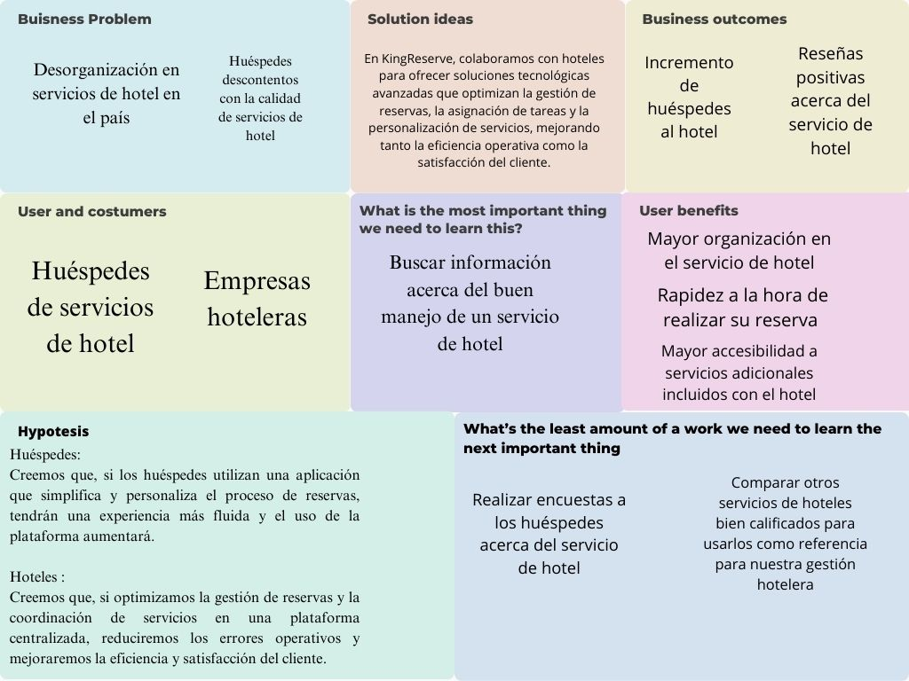
    <div><b>Lean UX Canvas</b></div>
</div>
<br>
    
### 1.3 Segmentos Objetivo

#### 1. Empresas Hoteleras:

Este segmento se enfoca en cadenas hoteleras, hoteles boutique y resorts que buscan transformar sus operaciones mediante la implementación de soluciones tecnológicas avanzadas. Estas empresas están comprometidas con la mejora continua de sus procesos operativos y la optimización de la experiencia de sus huéspedes. Su principal objetivo es integrar herramientas que les permitan gestionar reservas, coordinar al personal y ofrecer un servicio al cliente de alta calidad de manera más eficiente. Buscan reducir la carga administrativa mediante la automatización de tareas y mejorar la comunicación interna para una gestión más fluida. Además, valoran las oportunidades de colaborar con otros profesionales del sector, compartir buenas prácticas y estar al tanto de las últimas tendencias en gestión hotelera para mantener un estándar elevado en sus operaciones.

#### 2. Huéspedes:

Este segmento está compuesto por viajeros que buscan una experiencia de alojamiento personalizada y de alta calidad. Los huéspedes valoran una experiencia que se ajuste a sus preferencias individuales, desde la facilidad de reserva hasta la atención personalizada durante su estancia. Están interesados en un proceso de reserva intuitivo que simplifique la planificación de su viaje y en recibir un servicio al cliente eficiente que pueda resolver cualquier inconveniente de manera rápida. Además, aprecian servicios y comodidades que mejoren su confort y hagan su estancia más placentera. La capacidad de personalizar su experiencia y acceder a un servicio excepcional son factores clave para su satisfacción y fidelización.

<div class="segmento">
    <h3>Datos Cuantitativos del Problema:</h3>
    <p><strong>Empresas Hoteleras:</strong></p>
    <p>Las empresas hoteleras, incluidas cadenas hoteleras, hoteles boutique y resorts, enfrentan desafíos significativos en la gestión de sus operaciones debido a la falta de integración de soluciones tecnológicas avanzadas. Se estima que al menos el 30% de estas empresas reportan ineficiencias operativas que afectan la experiencia del huésped y la rentabilidad del negocio. La falta de automatización en la gestión de reservas y la coordinación del personal puede resultar en una carga administrativa elevada y una comunicación interna deficiente, lo que impacta negativamente en la calidad del servicio ofrecido.</p>
    <p><strong>Huéspedes:</strong></p>
    <p>Los huéspedes, compuestos por viajeros que buscan una experiencia de alojamiento personalizada y de alta calidad, enfrentan desafíos relacionados con la falta de opciones de alojamiento que se ajusten a sus preferencias individuales. Se estima que al menos el 40% de los huéspedes tienen dificultades para encontrar hoteles que ofrezcan servicios personalizados y de alta calidad, lo que resulta en una experiencia de alojamiento menos satisfactoria. Además, la falta de transparencia y confiabilidad en el proceso de reserva puede generar incertidumbre y estrés en los huéspedes, afectando su bienestar emocional durante su estancia.</p>
</div>

<div class="segmento">
    <h3>Variables geográficas, demográficas y psicológicas:</h3>
    <p><strong>Variable geográfica:</strong></p>
    <ul>
        <li>País: Peru</li>
        <li>Ciudad: Zonas urbanas y turísticas</li>
    </ul>
    <p><strong>Variable demográfica:</strong></p>
    <ul>
        <li>Género: Femenino / Masculino</li>
        <li>Ocupación: Todas las ocupaciones</li>
        <li>Estado civil: Todos los estados</li>
        <li>Edad y etapa de ciclo de vida: Ciudadanos mayores a 18 años</li>
    </ul>
    <p><strong>Variable psicográfica:</strong></p>
    <ul>
        <li>Nivel Socioeconómico (NSE): Todos los niveles</li>
        <li>Características de personalidad:
            <ul>
                <li>Altruismo</li>
                <li>Perseverancia</li>
                <li>Honestidad</li>
            </ul>
        </li>
    </ul>
</div>
<br>
<br>

# 2 Capítulo II: Requirements Elicitation & Analysis
##  2.1 Competidores
KingReserve se diferencia de competidores como Opera PMS, RoomRaccoon y Mews al combinar la gestión hotelera con una comunidad colaborativa para profesionales del sector. Mientras que Opera PMS es ideal para grandes cadenas pero costoso para pequeños hoteles, RoomRaccoon se centra en hoteles más pequeños con una solución integral, y Mews destaca por su automatización y diseño moderno, KingReserve ofrece una solución versátil que no solo optimiza la operación, sino que también fomenta la interacción y el intercambio de conocimientos entre usuarios, elevando la calidad del servicio y la experiencia del cliente.
## 2.1.1 Análisis Competitivo
<table>
   <tr>
      <td align="center" colspan="6"><b>Competitive Analysis Landscape</b></td>
   </tr>
   <tr>
      <td colspan="2"><b>¿Por qué llevar a cabo este análisis?</b></td>
      <td colspan="4">¿Cómo podemos proporcionar una gestión hotelera eficiente que además de optimizar las operaciones, fomente una experiencia personalizada y excelente para los huéspedes?</td>
   </tr>
   <tr align="center">
      <td colspan="2"></td>
      <td><b>KingReserve</b><br></td>
      <td><b>Cloudbeds</b><br></td>
      <td><b>RoomRaccoon</b><br></td>
      <td><b>Mews</b><br></td>
   </tr>

   <tr>
      <td rowspan="2"><b>Perfil</b></td>
      <td><b>Overview</b></td>
      <td>KingReserve es una plataforma innovadora que ofrece una solución integral para la gestión hotelera, combinando funciones operativas con un enfoque en la experiencia del cliente. Además de optimizar la administración, se enfoca en crear un entorno que fomente la interacción social y la personalización.</td>
      <td>Cloudbeds es una plataforma moderna para la gestión hotelera que integra PMS, motor de reservas y canal de distribución, destacándose por su facilidad de uso y su enfoque en la automatización y centralización de operaciones para hoteles de distintos tamaños.</td>
      <td>RoomRaccoon es una solución todo-en-uno diseñada para pequeños y medianos hoteles, que combina gestión de reservas, un motor de reservas en línea y herramientas de facturación.</td>
      <td>Mews ofrece una plataforma moderna y flexible que automatiza gran parte de las operaciones hoteleras, enfocándose en mejorar la eficiencia y la experiencia del huésped.</td>
   </tr>
   <tr>
      <td><b>Ventaja competitiva. ¿Qué valor ofrece a los clientes?</b></td>
      <td>KingReserve se diferencia al integrar la gestión hotelera con funciones sociales para crear una comunidad interactiva entre los hoteles y sus huéspedes, mejorando la experiencia del cliente a través de la personalización y comunicación directa.</td>
      <td>Cloudbeds combina gestión, distribución y automatización en una única plataforma, facilitando la administración hotelera desde una interfaz intuitiva y accesible.</td>
      <td>RoomRaccoon ofrece una interfaz intuitiva para pequeños hoteles, con un enfoque en la facilidad de uso y precios accesibles.</td>
      <td>Mews se centra en la automatización y la experiencia del usuario, con un diseño moderno y adaptable, aunque su integración personalizada puede ser limitada.</td>
   </tr>
   <tr>
      <td rowspan="2"><b>Perfil de Marketing</b></td>
      <td><b>Mercado Objetivo</b></td>
      <td>El mercado objetivo de KingReserve incluye hoteles de tamaño mediano y grande que buscan optimizar sus operaciones y mejorar la experiencia del huésped mediante la tecnología. También apunta a cadenas hoteleras que desean mejorar la personalización y el servicio al cliente.</td>
      <td>Hoteles y alojamientos de diversos tamaños que buscan una solución todo-en-uno para centralizar y automatizar su gestión operativa y de reservas.</td>
      <td>Pequeños y medianos hoteles que buscan una solución todo-en-uno con funcionalidades simples y una curva de aprendizaje baja.</td>
      <td>Hoteles que valoran la automatización y buscan mejorar la experiencia del huésped a través de una plataforma moderna y flexible.</td>
   </tr>
   <tr>
      <td><b>Estrategias de Marketing</b></td>
      <td>KingReserve se centrará en campañas digitales dirigidas a hoteles medianos y grandes, promoviendo su capacidad para mejorar la personalización y la experiencia del huésped. Además, se buscarán alianzas estratégicas con grupos hoteleros y eventos del sector.</td>
      <td>Cloudbeds promueve su solución como una plataforma integral que simplifica la gestión hotelera mediante la automatización, dirigida a alojamientos que buscan centralizar y optimizar sus operaciones.</td>
      <td>RoomRaccoon se promociona principalmente a través de campañas en línea, con un enfoque en la facilidad de uso y los precios accesibles para pequeños hoteles.</td>
      <td>Mews invierte en marketing digital y en la creación de una marca que se asocia con la modernidad y la innovación en la gestión hotelera.</td>
   </tr>
   <tr>
      <td rowspan="3"><b>Perfil de Producto</b></td>
      <td><b>Productos & Servicios</b></td>
      <td>Solución integral de gestión hotelera, combinando administración de reservas, comunicación directa con huéspedes, y herramientas para personalizar la experiencia del cliente.</td>
      <td>PMS, motor de reservas, gestor de canales, y herramientas para automatizar operaciones y mejorar la experiencia del huésped.</td>
      <td>Gestión de reservas, motor de reservas en línea, herramientas de facturación y PMS, diseñado para pequeños hoteles.</td>
      <td>Automatización de operaciones, gestión de reservas y experiencias del huésped, todo dentro de una interfaz moderna.</td>
   </tr>
   <tr>
      <td><b>Precios & Costos</b></td>
      <td>Ofreceremos un modelo de suscripción con opciones escalables según el tamaño del hotel y las funciones necesarias, además de herramientas adicionales para personalización y servicios exclusivos.</td>
      <td>Modelo de suscripción escalable según las necesidades del hotel, con opciones de pago mensuales y personalización de funcionalidades.</td>
      <td>Precios accesibles con paquetes todo-en-uno adaptados a pequeños hoteles.</td>
      <td>Suscripción basada en el tamaño del hotel y las funcionalidades necesarias, con opciones adicionales para automatización avanzada.</td>
   </tr>
   <tr>
      <td><b>Canales de Distribución (Web y/o Móvil)</b></td>
      <td>Web y app móvil con sincronización en tiempo real entre dispositivos para una gestión fluida en múltiples plataformas.</td>
      <td>Web y app móvil con sincronización entre todas las herramientas, accesible desde cualquier dispositivo.</td>
      <td>Web y aplicaciones móviles, con una interfaz sencilla y accesible desde cualquier dispositivo.</td>
      <td>Web y móvil, con un diseño adaptable para distintos tipos de dispositivos.</td>
   </tr>

   <tr>
      <td rowspan="5"><b>Análisis SWOT</b></td>
      <td><b>Fortalezas</b></td>
      <td>Enfoque en la experiencia personalizada del huésped, comunidad interactiva, e integración fluida entre funciones operativas y sociales.</td>
      <td>Plataforma integral que centraliza la gestión y distribución, con una interfaz intuitiva y accesible para hoteles de distintos tamaños.</td>
      <td>Interfaz fácil de usar y precios accesibles para pequeños hoteles.</td>
      <td>Automatización avanzada y diseño moderno.</td>
   </tr>
   <tr>
      <td><b>Debilidades</b></td>
      <td>Dependencia inicial de alianzas estratégicas para atraer grandes cadenas hoteleras.</td>
      <td>Dependencia en su modelo SaaS para alojamientos de menor tamaño, lo que puede limitar su adopción en cadenas grandes.</td>
      <td>Limitado a hoteles pequeños y medianos.</td>
      <td>Limitaciones en integraciones personalizadas.</td>
   </tr>
   <tr>
      <td><b>Oportunidades</b></td>
      <td>Expansión en mercados internacionales, adopción de tecnologías emergentes, y crecimiento en la digitalización hotelera.</td>
      <td>Creciente demanda de soluciones automatizadas y centralizadas, expansión a nuevos mercados geográficos.</td>
      <td>Mayor demanda de soluciones accesibles y eficientes para hoteles pequeños y medianos.</td>
      <td>Creciente interés en automatización hotelera y tecnología moderna.</td>
   </tr>
   <tr>
      <td><b>Amenazas</b></td>
      <td>Competencia fuerte en el mercado de gestión hotelera, cambios en las tendencias tecnológicas.</td>
      <td>Aumento de la competencia en soluciones todo-en-uno y herramientas más especializadas para hoteles grandes.</td>
      <td>Aumento en la competencia de otras soluciones todo-en-uno.</td>
      <td>Nuevas plataformas que ofrezcan soluciones más flexibles o especializadas.</td>
   </tr>
</table>

### 2.1.2 Estrategias y tácticas frente a competidores
**Diferenciación mediante la Experiencia del Cliente y Comunidad Colaborativa:**

**Estrategia:** Resaltar el enfoque único de KingReserve en la creación de una comunidad interactiva y colaborativa, donde los usuarios no solo gestionan operaciones, sino que también comparten conocimientos, experiencias y mejores prácticas dentro de la industria hotelera.
**Táctica:** Desarrollar y promover funciones sociales exclusivas dentro de la plataforma, como foros, grupos de discusión y programas de fidelización basados en la interacción comunitaria. Implementar herramientas de análisis que permitan a los usuarios personalizar las interacciones y mejorar la experiencia del huésped basándose en datos compartidos por otros miembros de la comunidad.

**Enfoque en la Personalización y la Comunicación Directa:**

**Estrategia:** Destacar la capacidad de KingReserve para ofrecer experiencias personalizadas y comunicación directa con los huéspedes, diferenciándose de competidores que se enfocan más en la automatización que en la personalización.
**Táctica:** Incluir opciones avanzadas de personalización que permitan a los hoteles adaptar sus servicios a las preferencias de cada huésped. Integrar un sistema de mensajería instantánea que facilite la comunicación directa entre hotel y cliente antes, durante y después de la estancia.

**Alianzas Estratégicas con Grupos Hoteleros y Eventos del Sector:**

**Estrategia:** Aprovechar alianzas estratégicas con grupos hoteleros y participación en eventos de la industria para expandir la adopción de KingReserve en mercados clave.
**Táctica:** Realizar acuerdos con asociaciones hoteleras para ofrecer demos personalizadas y precios exclusivos a sus miembros. Patrocinar y participar en eventos del sector para posicionar a KingReserve como una solución innovadora y necesaria en la digitalización hotelera.

**Escalabilidad y Flexibilidad en la Oferta de Servicios:**

**Estrategia:** Ofrecer un modelo de suscripción escalable que se adapte tanto a hoteles pequeños como a cadenas grandes, brindando la flexibilidad para agregar o eliminar funcionalidades según las necesidades del cliente.
**Táctica:** Crear paquetes de suscripción modulares que permitan a los hoteles seleccionar solo las funciones que necesitan, y que puedan expandirse conforme crezcan o cambien sus requerimientos. Proporcionar soporte técnico y actualizaciones continuas que se ajusten a la evolución tecnológica del sector.

**Innovación Continua en Tecnologías Emergentes:**

**Estrategia:** Mantenerse a la vanguardia en la adopción de tecnologías emergentes para optimizar la experiencia del usuario y la eficiencia operativa.
**Táctica:** Invertir en la investigación y desarrollo de tecnologías como inteligencia artificial y análisis predictivo para anticipar las necesidades de los huéspedes y ofrecer recomendaciones personalizadas. Implementar mejoras continuas en la plataforma basadas en feedback de los usuarios y avances tecnológicos en la industria.
## 2.2 Entrevistas

### 2.2.1   Diseño de Entrevistas

### 1. Preguntas para Gestores de Empresas Hoteleras

#### 1.1. Información Demográfica

<table class="min-w-full bg-white border border-gray-300 mb-6">  
        <thead>  
            <tr>  
                <th class="border border-gray-300 p-2">Categoría</th>  
                <th class="border border-gray-300 p-2">Preguntas</th>  
            </tr>  
        </thead>  
        <tbody>  
            <tr>  
                <td class="border border-gray-300 p-2">Edad y género</td>  
                <td class="border border-gray-300 p-2">  
                    - ¿Podrías indicarme tu edad y género? <br>  
                    - ¿Crees que tu edad influye en la forma en que gestionas un hotel?  
                </td>  
            </tr>  
            <tr>  
                <td class="border border-gray-300 p-2">Ubicación del hotel</td>  
                <td class="border border-gray-300 p-2">  
                    - ¿En qué ciudad o región se encuentra tu hotel? <br>  
                    - ¿Cómo influye la ubicación del hotel en la estrategia de gestión y reservas?  
                </td>  
            </tr>  
            <tr>  
                <td class="border border-gray-300 p-2">Experiencia en el sector hotelero</td>  
                <td class="border border-gray-300 p-2">  
                    - ¿Cuántos años de experiencia tienes en la gestión hotelera? <br>  
                    - ¿Cómo ha cambiado tu enfoque de gestión con el tiempo?  
                </td>  
            </tr>  
        </tbody>  
    </table>  

#### 1.2. Características Personales y Profesionales

<table class="min-w-full bg-white border border-gray-300 mb-6">  
        <thead>  
            <tr>  
                <th class="border border-gray-300 p-2">Categoría</th>  
                <th class="border border-gray-300 p-2">Preguntas</th>  
            </tr>  
        </thead>  
        <tbody>  
            <tr>  
                <td class="border border-gray-300 p-2">Motivaciones y objetivos</td>  
                <td class="border border-gray-300 p-2">  
                    - ¿Qué te motiva en la gestión de un hotel y cuáles son tus principales objetivos (e.g., maximización de ocupación, satisfacción del cliente, etc.)? <br>  
                    - ¿Cómo evalúas el éxito de tu gestión hotelera?  
                </td>  
            </tr>  
            <tr>  
                <td class="border border-gray-300 p-2">Herramientas y plataformas</td>  
                <td class="border border-gray-300 p-2">  
                    - ¿Qué sistemas o plataformas utilizas para gestionar reservas y operaciones hoteleras? <br>  
                    - ¿Has probado alguna solución integrada para la gestión hotelera? ¿Cuál ha sido tu experiencia?  
                </td>  
            </tr>  
            <tr>  
                <td class="border border-gray-300 p-2">Retos y frustraciones</td>  
                <td class="border border-gray-300 p-2">  
                    - ¿Cuáles son los principales desafíos que enfrentas en la gestión hotelera? <br>  
                    - ¿Cómo abordas estos desafíos? ¿Hay alguna área específica donde sientas que necesitas más apoyo o mejores herramientas?  
                </td>  
            </tr>  
            <tr>  
                <td class="border border-gray-300 p-2">Expectativas tecnológicas</td>  
                <td class="border border-gray-300 p-2">  
                    - ¿Qué características tecnológicas consideras esenciales en un sistema de gestión hotelera? <br>  
                    - ¿Qué te gustaría que una plataforma como KingReserve mejorara o incluyera para facilitar la gestión de tu hotel?  
                </td>  
            </tr>  
        </tbody>  
    </table>  

### 2. Preguntas para Huéspedes:

#### 2.1. Información Demográfica

<table class="min-w-full bg-white border border-gray-300 mb-6">  
        <thead>  
            <tr>  
                <th class="border border-gray-300 p-2">Categoría</th>  
                <th class="border border-gray-300 p-2">Preguntas</th>  
            </tr>  
        </thead>  
        <tbody>  
            <tr>  
                <td class="border border-gray-300 p-2">Edad y género</td>  
                <td class="border border-gray-300 p-2">  
                    - ¿Podrías indicarme tu edad y género? <br>  
                    - ¿En qué rango de edad sueles realizar más reservas?  
                </td>  
            </tr>  
            <tr>  
                <td class="border border-gray-300 p-2">Distrito de residencia</td>  
                <td class="border border-gray-300 p-2">  
                    - ¿En qué distrito o ciudad resides actualmente? <br>  
                    - ¿Prefieres realizar reservas cerca de tu residencia o estás dispuesto a viajar?  
                </td>  
            </tr>  
            <tr>  
                <td class="border border-gray-300 p-2">Ocupación</td>  
                <td class="border border-gray-300 p-2">  
                    - ¿Cuál es tu ocupación actual? <br>  
                    - ¿Tu ocupación influye en la frecuencia con la que realizas reservas?  
                </td>  
            </tr>  
        </tbody>  
    </table>  

#### 2.2. Características Personales y Preferencias

<table class="min-w-full bg-white border border-gray-300 mb-6">  
        <thead>  
            <tr>  
                <th class="border border-gray-300 p-2">Categoría</th>  
                <th class="border border-gray-300 p-2">Preguntas</th>  
            </tr>  
        </thead>  
        <tbody>  
            <tr>  
                <td class="border border-gray-300 p-2">Tipos de reservas preferidos</td>  
                <td class="border border-gray-300 p-2">  
                    - ¿Qué tipo de servicios sueles reservar con mayor frecuencia (restaurantes, hoteles, eventos, etc.)? <br>  
                    - ¿Qué aspectos consideras al realizar una reserva (ubicación, precio, reputación, etc.)?  
                </td>  
            </tr>  
            <tr>  
                <td class="border border-gray-300 p-2">Experiencia en reservas</td>  
                <td class="border border-gray-300 p-2">  
                    - ¿Qué es lo que más valoras al realizar una reserva? <br>  
                    - ¿Hay algún aspecto que te haya frustrado o decepcionado en reservas anteriores?  
                </td>  
            </tr>  
            <tr>  
                <td class="border border-gray-300 p-2">Uso de plataformas para realizar reservas</td>  
                <td class="border border-gray-300 p-2">  
                    - ¿Qué plataformas o métodos usas para realizar reservas? <br>  
                    - ¿Prefieres realizar tus reservas en línea o en persona? ¿Por qué?  
                </td>  
            </tr>  
            <tr>  
                <td class="border border-gray-300 p-2">Interacción con la tecnología</td>  
                <td class="border border-gray-300 p-2">  
                    - ¿Qué tan cómodo te sientes usando aplicaciones móviles o plataformas web para buscar y realizar reservas? <br>  
                    - ¿Qué características tecnológicas te gustaría ver en una plataforma que gestione reservas?  
                </td>  
            </tr>  
            <tr>  
                <td class="border border-gray-300 p-2">Comunicación con proveedores de servicios</td>  
                <td class="border border-gray-300 p-2">  
                    - ¿Qué tan importante es para ti recibir actualizaciones o notificaciones del proveedor antes y durante el servicio reservado? <br>  
                    - ¿Te gustaría tener la opción de comunicarte directamente con el proveedor a través de la plataforma?  
                </td>  
            </tr>  
        </tbody>  
    </table>  
    
#### Conclusión de la Entrevista

<table class="min-w-full bg-white border border-gray-300 mb-6">  
        <thead>  
            <tr>  
                <th class="border border-gray-300 p-2">Categoría</th>  
                <th class="border border-gray-300 p-2">Pregunta</th>  
            </tr>  
        </thead>  
        <tbody>  
            <tr>  
                <td class="border border-gray-300 p-2">Pregunta Final</td>  
                <td class="border border-gray-300 p-2">  
                    - ¿Hay algo más que consideras importante compartir sobre tu experiencia como organizador o usuario de reservas?  
                </td>  
            </tr>  
  </table>  
         
##   2.2.2 Registro de entrevistas
### Segmento: Huespedes

    
#### Entrevista 1
| **Datos del entrevistado** | 
|--------------------------|
| **Nombre:**  Nanfuñay Liza Pedro Jesús |
| **Minuto del video:**  00:00 |
| **Edad:**  19 años |
| **Procedencia:**  Lima, Ate |
| |
| **Resumen:** Pedro Fiñei, un estudiante universitario de 19 años que reside en San Isidro, Lima, realiza la mayoría de sus reservas entre los 18 y 20 años, principalmente para salidas con amigos y eventos sociales. Prefiere hacer reservas en línea utilizando aplicaciones como  Airbnb, valorando el precio, la ubicación y las opiniones de otros usuarios. Se siente cómodo usando su smartphone para realizar reservas, pero sugiere que las plataformas deberían ofrecer más opciones de personalización, recordatorios automáticos, y ser más transparentes con las tarifas adicionales. También considera importante recibir notificaciones y la posibilidad de comunicarse directamente con los proveedores a través de la plataforma. |


#### Entrevista 2
| **Datos del entrevistado** | 
|--------------------------|
| **Nombre:**  Ramiro Guzman |
| **Minuto del video:**  04:41 |
| **Edad:**  20 años |
| **Procedencia:**  Lima, Lima |
| 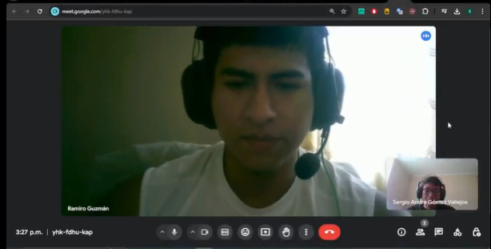|
| **Resumen:** Ramiro Guzmán, con 20 años, valora la conveniencia y calidad en sus reservas. Prefiere utilizar plataformas en línea por su accesibilidad y rapidez, y aprecia la transparencia en la información y las reseñas. Su ocupación y presupuesto afectan su frecuencia de reservas, y aunque prefiere hacer reservas cerca de su residencia, está dispuesto a viajar por experiencias únicas. Desea mejoras tecnológicas como chat en vivo y recomendaciones personalizadas para optimizar su experiencia de reserva. |

#### Entrevista 3
| **Datos del entrevistado** | 
|--------------------------|
| **Nombre:** Vasco Zagaceta |
| **Edad:** 20 años |
| **Minuto del video:**  10:23 |
| **Procedencia:** San Miguel, Lima |
|  |
| **Resumen:** Vasco Zagaceta, un estudiante de 20 años residente en San Miguel, Lima, suele reservar hoteles y valora principalmente las reseñas de otros usuarios y la ubicación del hotel al hacer sus reservas. Utiliza la aplicación Booking para realizar sus reservas y se siente cómodo utilizando aplicaciones móviles y plataformas web para este propósito. Vasco sugiere que la implementación de una inteligencia artificial que mejore las recomendaciones basadas en las preferencias del usuario sería una buena idea. Además, considera muy importante recibir actualizaciones y notificaciones del proveedor antes y durante el servicio reservado. También le gustaría tener la opción de comunicarse directamente con el proveedor a través de la plataforma para resolver dudas o recibir información adicional. |

### Segmento: Empresas Hoteleras

#### Entrevista 4
| **Datos del entrevistado** | 
|--------------------------|
| **Nombre:** María Delia Martínez |
| **Edad:** 22 años |
| **Minuto del video:**  14:27 |
| **Procedencia:** Miraflores, Lima |
|  |
| **Resumen:** María Delia Martínez, gerente de un hotel boutique en Miraflores, Lima, enfrenta desafíos en la gestión de reservas y la coordinación del personal. Valora principalmente la eficiencia operativa y la satisfacción del huésped. Utiliza varias plataformas de gestión hotelera, pero encuentra que la falta de integración entre ellas dificulta la operación diaria. María Delia sugiere que la implementación de una inteligencia artificial que optimice la asignación de habitaciones y gestione las solicitudes de los huéspedes en tiempo real sería muy beneficiosa. Además, considera crucial recibir actualizaciones y notificaciones sobre el estado de las reservas y la ocupación del hotel. También le gustaría tener la opción de comunicarse directamente con los huéspedes a través de la plataforma para resolver dudas o proporcionar información adicional. |

#### Entrevista 5
| **Datos del entrevistado** | 
|--------------------------|
| **Nombre:** María José Canahualpa |
| **Edad:** 23 años |
| **Minuto del video:**  21:36 |
| **Procedencia:** Cusco, Perú |
|  |
| **Resumen:** María José Canahualpa, administradora de un resort en Cusco, Perú, se enfrenta a desafíos relacionados con la gestión de grandes volúmenes de reservas y la coordinación de eventos. Valora principalmente la capacidad de la plataforma para manejar múltiples tareas simultáneamente y la facilidad de uso. Utiliza varias herramientas de gestión, pero encuentra que la falta de automatización en la gestión de eventos y reservas complica su trabajo. María José sugiere que la implementación de una inteligencia artificial que pueda predecir la demanda y optimizar la asignación de recursos sería muy útil. Además, considera muy importante recibir actualizaciones y notificaciones en tiempo real sobre las reservas y eventos. También le gustaría tener la opción de comunicarse directamente con los proveedores y clientes a través de la plataforma para resolver dudas o recibir información adicional. |


### 2.2.3 Análisis de entrevistas
Después de llevar a cabo y describir los registros de los entrevistados, esta sección desarrollará una estrategia conjunta que permitirá al equipo identificar ciertos aspectos y puntos en común. Este análisis ayudará a obtener una visión más analítica y concreta sobre el desarrollo de la aplicación KingReserve.

### Segmento 1: Huéspedes

1. **Tipo de Reserva y Preferencias**
   - **Tipo de Reserva:** El 70% de los huéspedes prefieren realizar reservas en línea utilizando plataformas como Airbnb y Booking.
   - **Preferencias:** Valoran principalmente el precio, la ubicación y las opiniones de otros usuarios. La comodidad del smartphone para hacer reservas es una ventaja clave.

2. **Prioridades al Reservar**
   - **Principales Prioridades:** Según el 90%, los huéspedes buscan precios competitivos, ubicaciones convenientes y transparencia en las tarifas adicionales. También valoran la posibilidad de recibir notificaciones y tener opciones de personalización.

3. **Herramientas Actuales**
   - **Herramientas Utilizadas:** El 60% usa plataformas en línea como Airbnb, mientras que el 40% utiliza aplicaciones como Booking para gestionar sus reservas.

4. **Características Deseadas en la Aplicación**
   - **Características Deseadas:** El 60% de los usuarios desean opciones avanzadas de personalización, recordatorios automáticos y mayor transparencia en tarifas. También consideran importante la integración de chat en vivo y recomendaciones basadas en inteligencia artificial.

### Segmento 2: Empresas Hoteleras

1. **Desafíos y Prioridades en la Gestión**
   - **Desafíos Actuales:** El 65% de los administradores de hoteles enfrentan dificultades con la falta de integración entre plataformas de gestión y la coordinación del personal.
   - **Prioridades:** Valoran la eficiencia operativa y la capacidad de manejar múltiples tareas simultáneamente, como la asignación de habitaciones y la gestión de reservas.

2. **Uso de Herramientas Actuales**
   - **Herramientas Utilizadas:** El 70% utiliza varias plataformas de gestión hotelera pero encuentra que la falta de integración es un problema significativo.

3. **Características Deseadas en la Plataforma**
   - **Características Deseadas:** El 60% de los administradores busca implementar inteligencia artificial para optimizar la asignación de habitaciones y gestionar solicitudes en tiempo real. También desean actualizaciones en tiempo real y opciones de comunicación directa con los huéspedes.

4. **Objetivos al Usar la Aplicación**
   - **Objetivos:** El 100% espera que la aplicación les ayude a mejorar la eficiencia operativa y optimizar la gestión de reservas y eventos, además de proporcionar una mejor comunicación con los huéspedes y clientes.

## 2.3 Needfinding
### 2.3.1 User Persona

##### Huesped


##### Empresas Hoteleras
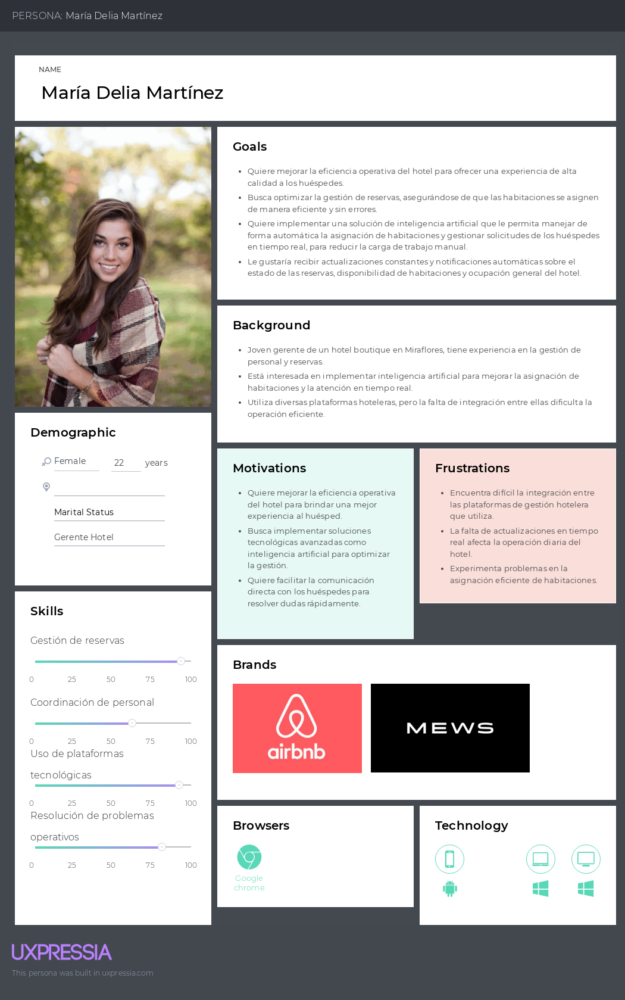


#### 2.3.2 User Task Matrix

##### Matriz de Tareas del Usuario


| **Tareas**                           | **Frecuencia** | **Importancia** | **Frecuencia** | **Importancia** |
|--------------------------------------|----------------|-----------------|----------------|-----------------|
| Gestionar reservas de huéspedes      | Alta           | Alta            | -            | -             |
| Coordinar y asignar tareas al personal| Media          | Alta            | -            | -             |
| Automatizar la facturación           | Media          | Media           | -            | -             |
| Monitorear rendimiento de operaciones| Alta           | Alta            | -            | -             |
| Buscar y comparar opciones de alojamiento| -            | -             | Alta           | Alta            |
| Realizar reservas en línea           | -            | -             | Alta           | Alta            |
| Personalizar experiencia de estancia | -            | -             | Media          | Alta            |
| Recibir notificaciones y actualizaciones| -            | -             | Alta           | Media           |
| Comunicarse con el hotel             | -            | -             | Media          | Alta            |

### Explicación de las Tareas

- **Tareas con mayor frecuencia e importancia**:
  - Para los **gestores de hoteles**, las tareas más frecuentes e importantes son "Gestionar reservas de huéspedes" y "Monitorear rendimiento de operaciones", ya que estas son críticas para la operación diaria y la satisfacción del cliente.
  - Para los **viajeros**, las tareas más frecuentes e importantes son "Buscar y comparar opciones de alojamiento" y "Realizar reservas en línea", dado que son esenciales para planificar y asegurar sus viajes.

- **Principales diferencias**:
  - Los gestores de hotel se centran en la administración y eficiencia operativa.
  - Los viajeros se enfocan en la personalización y conveniencia de la experiencia de alojamiento.

- **Coincidencias**:
  - Ambos segmentos valoran la **comunicación eficiente** y la **automatización** para mejorar la experiencia general.

### 2.3.3 User Journey Mapping

#### Huesped


#### Empresas Hoteleras
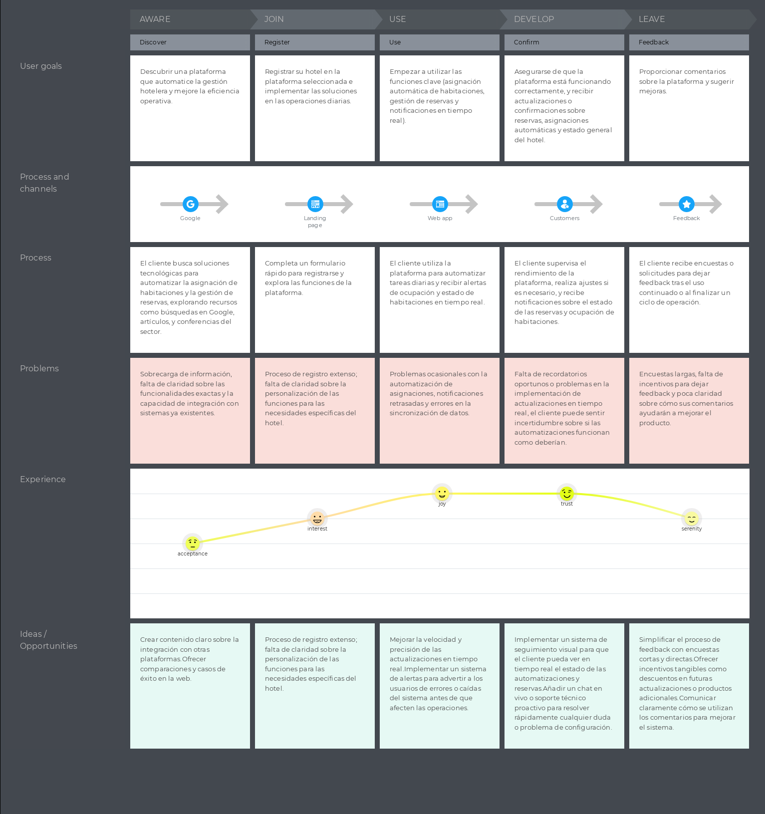

### 2.3.4 Empathy Mapping

#### Huesped
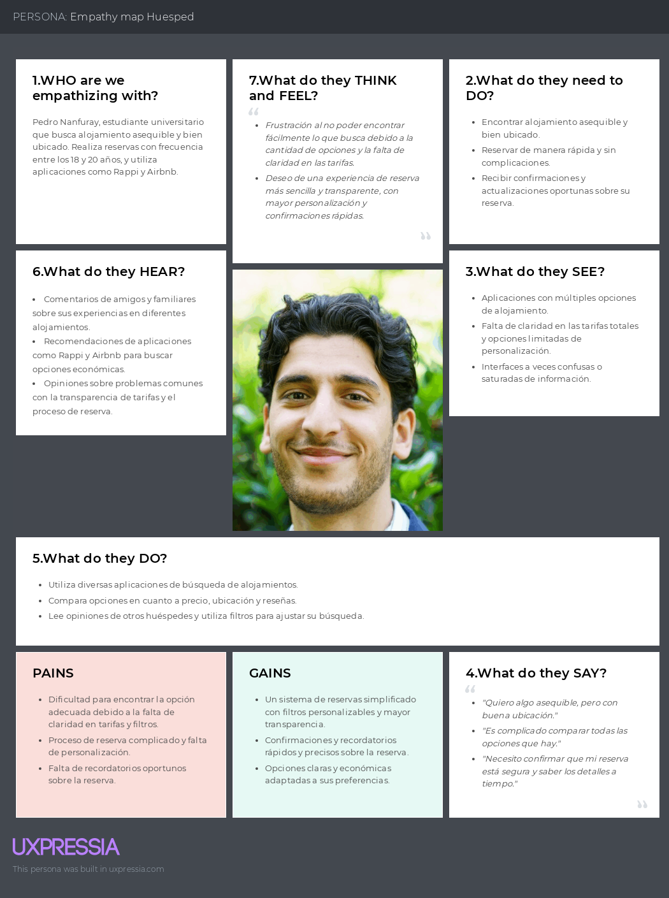

#### Empresas Hoteleras
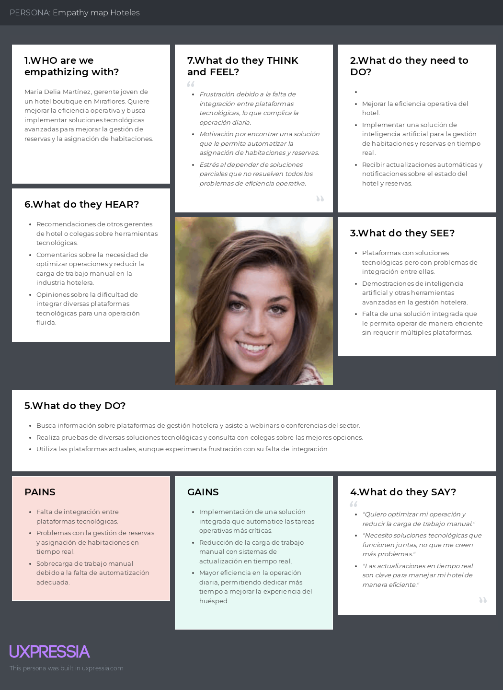

###  2.3.5 As-is Scenario Mapping
#### Empresas Hoteleras:

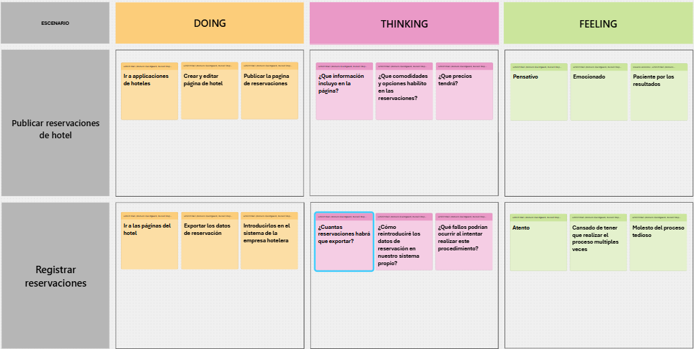
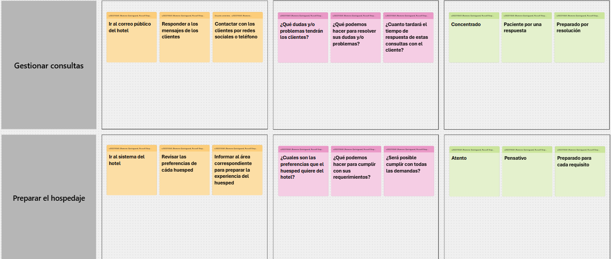
#### Huéspedes:
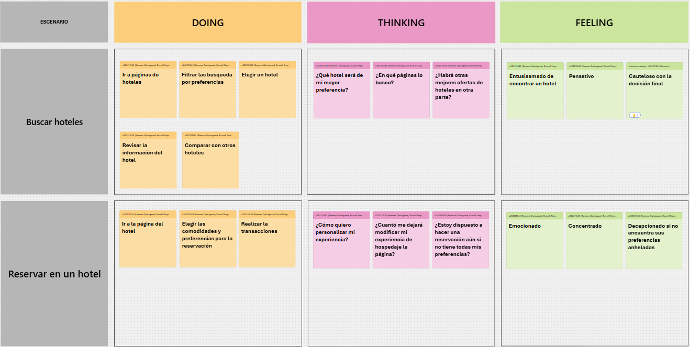
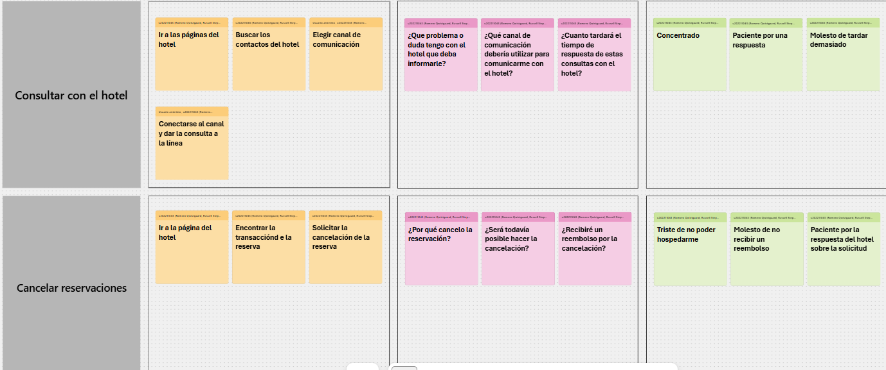

## 2.4  Ubiquitous Language

| **Término (Inglés)** | **Término (Español)** | **Definición** |
|----------------------|-----------------------|----------------|
| Reservation          | Reserva               | Proceso mediante el cual un huésped asegura una habitación en el hotel para una fecha específica. |
| Check-in             | Registro de entrada   | Proceso de recepción y registro de un huésped en el hotel al inicio de su estancia. |
| Check-out            | Registro de salida    | Proceso de salida y finalización de la estancia de un huésped en el hotel. |
| Guest                | Huésped               | Persona que se aloja en el hotel. |
| Room Service         | Servicio de habitaciones | Servicio proporcionado por el hotel para entregar alimentos y bebidas directamente a la habitación del huésped. |
| Housekeeping         | Limpieza              | Departamento encargado de la limpieza y mantenimiento de las habitaciones y áreas comunes del hotel. |
| Front Desk           | Recepción             | Área del hotel donde se realizan las funciones de check-in, check-out y atención al cliente. |
| Concierge            | Conserje              | Empleado del hotel que proporciona asistencia y servicios especiales a los huéspedes, como reservas en restaurantes, organización de tours, etc. |
| Occupancy Rate       | Tasa de ocupación     | Porcentaje de habitaciones ocupadas en el hotel en un período de tiempo específico. |
| No-show              | No presentación       | Situación en la que un huésped no se presenta para su reserva sin haberla cancelado previamente. |
| Overbooking          | Sobreventa            | Práctica de aceptar más reservas de las que hay disponibles, anticipando que algunas reservas no se presentarán. |
| Revenue Management   | Gestión de ingresos   | Estrategia para optimizar los ingresos del hotel mediante el ajuste de precios y la gestión de la disponibilidad de habitaciones. |
| Loyalty Program      | Programa de fidelidad | Programa diseñado para recompensar a los huéspedes frecuentes con beneficios y descuentos especiales. |
| Banquet              | Banquete              | Servicio de organización de eventos y comidas especiales en el hotel. |
| Conference Room      | Sala de conferencias  | Espacio en el hotel destinado a reuniones y eventos corporativos. |

# 3 Capítulo III: Requirements Specification
## 3.1 To-Be Scenario Mapping
#### Empresas Hoteleras
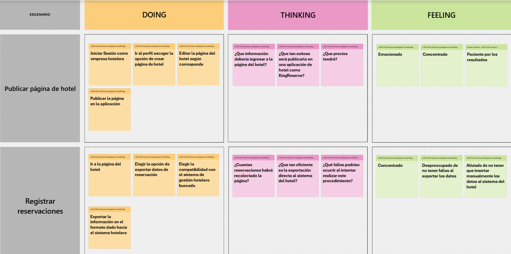

#### Huéspedes:
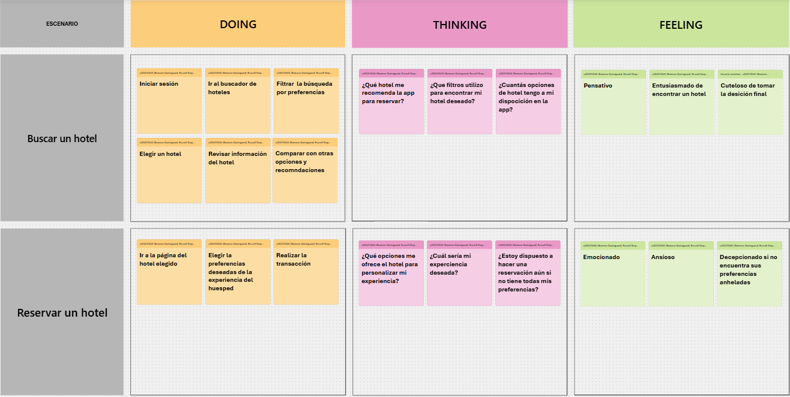
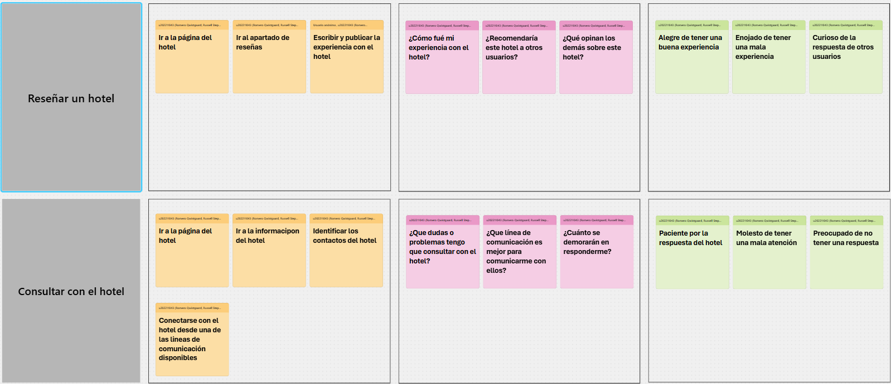
##3.2  User Stories
Las User Stories son una herramienta fundamental para definir los requisitos del proyecto. Cada User Story incluye criterios de aceptación que deben ser comprobables y redactados en tiempo presente, tercera persona, siguiendo la estructura de Gherkin (Given-When-Then). Además, se consideran User Stories para el sitio web estático (Landing Page) y Technical Stories para los features del RESTful API.


| **Epic / Story ID** | **Título**                              | **Descripción**                                                                                      | **Criterios de Aceptación**                                                                                                                                                   | **Relacionado con (Epic ID)** |
|---------------------|-----------------------------------------|------------------------------------------------------------------------------------------------------|------------------------------------------------------------------------------------------------------------------------------------------------------------------------------|-------------------------------|
| EPIC001             | Creación de la Landing Page             | Como visitante, quiero ser dirigido a la página de inicio al acceder al sitio web para obtener una visión general de la aplicación.    | Dado que un visitante accede a la página de inicio, cuando visualiza la página, entonces debe mostrar información sobre las características principales de la aplicación. | N/A                           |
| US001               | Acceso a la sección de Resumen       | Como visitante, quiero acceder a la sección de información de la página de resumen para obtener información clara sobre la aplicación. | **Escenario 1:** Dado que el visitante está en la página de inicio, cuando hace clic en el botón "Resumen", entonces debe ser dirigido a la sección correspondiente de información  y descripción de la empresa.<br> **Escenario 2:** Dado que el visitante está en la página de inicio, cuando hace clic en el botón "Resumen", entonces puede ver la información de héroe, pero la sección de información  y descripción de la empresa.<br> **Escenario 3:** Dado que el visitante está en la página de inicio, cuando intenta acceder a la sección de resumen haciendo clic en "Resumen", entonces  no puede acceder a la sección de información  y descripción de la empresa. | EPIC001 |
|US002| Acceso a la seccion de Características | Como visitante, quiero poder acceder a la página de "Características" para enterarme de las características claves de la aplicación. | **Escenario 1:** Dado que un visitante hace clic en el enlace "Características", cuando lo hace, entonces debe ser dirigido a la página correspondiente.<br> **Escenario 2:** Dado que un visitante accede a la sección  de "Características", cuando lo hace, entonces debe proporcionar información de características claves claras. <br> **Escenario 3:** Dado que un visitante intenta darle clic al boton de "Características", cuando lo hace entonces no debe dirigir a la sección de "Características" | EPIC001                    |
| US003               | Envío de Correos a los CEO de KingGroup            | Como visitante, quiero enviar correos con información adicional sobre las funcionalidades de la aplicación.                          | **Escenario 1:** Dado que un visitante se registra en la el formulario de contacto, cuando el registro es exitoso, entonces el sistema debe enviar un correo de aviso con la información del mensaje.  <br> **Escenario 2:** Dado que el visitante solicita enviar dudas adicionales, cuando la solicitud es procesada, entonces el sistema debe enviar un correo con información de las dudas sobre las funcionalidades solicitadas a KingGroup.<br> **Escenario 3:** Dado que un visitante intenta enviar con un correo electrónico a los CEOS, cuando lo hace, entonces debe recibir un mensaje de error indicando que el correo electrónico no se envio. | EPIC001                    |
| US004               | Registro de Nuevos Usuarios             | Como visitante, quiero poder registrarme como usuario para ponerme en contacto para el uso de la aplicación.| **Escenario 1:** Dado que un visitante hace clic en el botón "Contacto", cuando lo hace, entonces debe ser dirigido al formulario de registro correspondiente.<br> **Escenario 2:** Dado que un visitante completa el formulario de registro, cuando lo hace, entonces debe poder ingresar sus datos personales con su mensaje  y recibir una notificación de confirmación después de enviar el formulario.<br> **Escenario 3:** Dado que un visitante intenta contactaese sin completar todos los campos requeridos, cuando lo hace, entonces debe recibir un mensaje de error indicando qué campos faltan. | EPIC001                    |
| US005              | Información de Funcionalidades          | Como visitante, quiero ver un sector que detalle todas las funcionalidades que ofrece la aplicación.                                   | **Escenario 1:** Dado que un visitante accede a la página de inicio, cuando lo hace, entonces debe incluir un sector que muestre claramente todas las funcionalidades de la aplicación, con una breve descripción de cada una.<br> **Escenario 2:** Dado que un visitante hace clic en cualquier funcionalidad, cuando lo hace, entonces se debe abrir una página con detalles más específicos sobre esa funcionalidad.<br> **Escenario 3:** Dado que un visitante intenta acceder a una funcionalidad inexistente, cuando lo hace, entonces debe recibir un mensaje de error indicando que la funcionalidad no está disponible. | EPIC001                    |
| US006               | Sector de Planes Disponibles            | Como visitante, quiero ver los diferentes planes que ofrece la aplicación para escoger el que mejor se adapte a mis necesidades.       | **Escenario 1:** Dado que un visitante accede a la página de inicio, cuando lo hace, entonces debe incluir un sector donde se muestren claramente todos los planes disponibles.<br> **Escenario 2:** Dado que un visitante visualiza los planes, cuando lo hace, entonces cada plan debe estar acompañado de una breve descripción, precio y características principales.<br> **Escenario 3:** Dado que un visitante intenta seleccionar un plan inexistente, cuando lo hace, entonces debe recibir un mensaje de error indicando que el plan no está disponible. | EPIC001                    |
| US007               | Sector de Preguntas Frecuentes          | Como visitante, quiero tener acceso a un sector de preguntas frecuentes para obtener respuestas rápidas a dudas comunes.               | **Escenario 1:** Dado que un visitante accede a la página de inicio, cuando lo hace, entonces debe tener un sector dedicado a preguntas frecuentes.<br> **Escenario 2:** Dado que un visitante visualiza las preguntas frecuentes, cuando lo hace, entonces cada pregunta debe ser desplegable para mostrar la respuesta al hacer clic en ella.<br> **Escenario 3:** Dado que un visitante intenta acceder a una pregunta frecuente inexistente, cuando lo hace, entonces debe recibir un mensaje de error indicando que la pregunta no está disponible. | EPIC001                    |
| US008               | Conexión de King Group con la Aplicación | Como visitante, quiero conocer cómo King Group está conectado con esta aplicación para entender mejor su propósito y origen.           | **Escenario 1:** Dado que un visitante accede a la página de inicio, cuando lo hace, entonces debe incluir un sector que explique la relación entre King Group y la aplicación, mostrando información relevante sobre el grupo y su misión.<br> **Escenario 2:** Dado que un visitante intenta acceder a la información de King Group, cuando lo hace, entonces debe poder ver detalles sobre el propósito y origen de King Group.<br> **Escenario 3:** Dado que un visitante intenta acceder a información de King Group inexistente, cuando lo hace, entonces debe recibir un mensaje de error indicando que la información no está disponible. | EPIC001                    |
| US009               | Conexión de Datos del Formulario a Firebase | Como desarrollador, quiero conectar los datos del formulario de contacto a una base de datos de Firebase para almacenar y gestionar las consultas de los usuarios. | **Escenario 1:** Dado que un visitante completa el formulario de contacto, cuando lo envía, entonces los datos deben ser almacenados correctamente en la base de datos de Firebase.<br> **Escenario 2:** Dado que un visitante intenta enviar el formulario sin conexión a Internet, cuando lo hace, entonces debe recibir un mensaje de error indicando que no se puede conectar a la base de datos.<br> **Escenario 3:** Dado que un administrador accede a la base de datos de Firebase, cuando lo hace, entonces debe poder ver y gestionar todas las consultas enviadas a través del formulario de contacto. | EPIC001 |
| EPIC002             | Gestión de Huéspedes                    | Como administrador, quiero gestionar los datos de los huéspedes para mantener la información actualizada y organizada.                  | Dado que un administrador accede a la sección de gestión de huéspedes, cuando visualiza la información, entonces debe poder ver, editar y eliminar datos de los huéspedes. | N/A                           |
| US010               | Registro de Usuario                     | Como visitante, quiero poder registrarme como usuario para acceder a todas las funcionalidades de la aplicación.                      | **Escenario 1:** Dado que un visitante hace clic en el botón "Registrarse", cuando lo hace, entonces debe ser dirigido al formulario de registro correspondiente.<br> **Escenario 2:** Dado que un visitante completa el formulario de registro, cuando lo hace, entonces debe poder ingresar sus datos personales y recibir un correo electrónico de confirmación después de enviar el formulario.<br> **Escenario 3:** Dado que un visitante intenta registrarse sin completar todos los campos requeridos, cuando lo hace, entonces debe recibir un mensaje de error indicando qué campos faltan. | EPIC002                    |
| US011               | Inicio de Sesión                        | Como usuario registrado, quiero poder iniciar sesión para acceder a mi cuenta y utilizar las funcionalidades de la aplicación.         | **Escenario 1:** Dado que un usuario registrado ingresa sus credenciales, cuando lo hace, entonces debe poder iniciar sesión correctamente.<br> **Escenario 2:** Dado que un usuario ingresa credenciales incorrectas, cuando lo hace, entonces debe recibir un mensaje de error indicando que las credenciales son incorrectas.<br> **Escenario 3:** Dado que un usuario intenta iniciar sesión sin completar todos los campos requeridos, cuando lo hace, entonces debe recibir un mensaje de error indicando qué campos faltan. | EPIC002                    |
| US012               | Recuperación de Contraseña              | Como usuario, quiero poder recuperar mi contraseña en caso de olvidarla para poder acceder nuevamente a mi cuenta.                     | **Escenario 1:** Dado que un usuario hace clic en el enlace de "Recuperar Contraseña", cuando lo hace, entonces debe ser dirigido al formulario de recuperación de contraseña.<br> **Escenario 2:** Dado que un usuario completa el formulario de recuperación de contraseña, cuando lo hace, entonces debe recibir un correo electrónico con instrucciones para restablecer su contraseña.<br> **Escenario 3:** Dado que un usuario intenta recuperar su contraseña con un correo electrónico no registrado, cuando lo hace, entonces debe recibir un mensaje de error indicando que el correo electrónico no está registrado. | EPIC002                    |
| US013               | Configuración de Cuenta                 | Como usuario, quiero poder configurar mi cuenta para personalizar mi experiencia en la aplicación.                                      | **Escenario 1:** Dado que un usuario accede a la configuración de su cuenta, cuando lo hace, entonces debe poder ver y editar su información personal.<br> **Escenario 2:** Dado que un usuario guarda los cambios en la configuración de su cuenta, cuando lo hace, entonces debe recibir una confirmación de que los cambios se han guardado correctamente.<br> **Escenario 3:** Dado que un usuario intenta guardar cambios sin completar todos los campos requeridos, cuando lo hace, entonces debe recibir un mensaje de error indicando qué campos faltan. | EPIC002                    |
| EPIC003             | Gestión de Contenido                    | Como administrador, quiero gestionar el contenido de la aplicación para mantener la información actualizada y relevante.               | Dado que un administrador accede a la sección de gestión de contenido, cuando visualiza la información, entonces debe poder crear, leer, actualizar y eliminar contenido. | N/A                           |
| US014               | Crear Contenido                         | Como administrador, quiero poder crear nuevo contenido para mantener la información actualizada en la aplicación.                      | **Escenario 1:** Dado que un administrador accede a la sección de creación de contenido, cuando lo hace, entonces debe poder ingresar la información del nuevo contenido.<br> **Escenario 2:** Dado que un administrador guarda el nuevo contenido, cuando lo hace, entonces debe recibir una confirmación de que el contenido se ha creado correctamente.<br> **Escenario 3:** Dado que un administrador intenta crear contenido sin completar todos los campos requeridos, cuando lo hace, entonces debe recibir un mensaje de error indicando qué campos faltan. | EPIC003                    |
| US015               | Leer Contenido                          | Como usuario, quiero poder leer el contenido disponible en la aplicación para obtener información relevante.                           | **Escenario 1:** Dado que un usuario accede a la sección de contenido, cuando lo hace, entonces debe poder ver la lista de contenido disponible.<br> **Escenario 2:** Dado que un usuario selecciona un contenido específico, cuando lo hace, entonces debe poder ver los detalles del contenido seleccionado.<br> **Escenario 3:** Dado que un usuario intenta acceder a contenido inexistente, cuando lo hace, entonces debe recibir un mensaje de error indicando que el contenido no está disponible. | EPIC003                    |
| US016               | Actualizar Contenido                    | Como administrador, quiero poder actualizar el contenido existente para mantener la información relevante y actualizada.              | **Escenario 1:** Dado que un administrador accede a la sección de actualización de contenido, cuando lo hace, entonces debe poder editar la información del contenido existente.<br> **Escenario 2:** Dado que un administrador guarda los cambios en el contenido, cuando lo hace, entonces debe recibir una confirmación de que el contenido se ha actualizado correctamente.<br> **Escenario 3:** Dado que un administrador intenta actualizar contenido sin completar todos los campos requeridos, cuando lo hace, entonces debe recibir un mensaje de error indicando qué campos faltan. | EPIC003                    |
| US017               | Eliminar Contenido                      | Como administrador, quiero poder eliminar contenido obsoleto para mantener la información actualizada en la aplicación.               | **Escenario 1:** Dado que un administrador accede a la sección de eliminación de contenido, cuando lo hace, entonces debe poder seleccionar el contenido a eliminar.<br> **Escenario 2:** Dado que un administrador confirma la eliminación del contenido, cuando lo hace, entonces debe recibir una confirmación de que el contenido se ha eliminado correctamente.<br> **Escenario 3:** Dado que un administrador intenta eliminar contenido inexistente, cuando lo hace, entonces debe recibir un mensaje de error indicando que el contenido no está disponible. | EPIC003                    |
| EPIC004             | Interacción y Comentarios               | Como usuario, quiero poder interactuar y dejar comentarios en el contenido para compartir mis opiniones y experiencias.               | Dado que un usuario accede a la sección de comentarios, cuando visualiza el contenido, entonces debe poder agregar, leer y moderar comentarios. | N/A                           |
| US018               | Agregar Comentarios                     | Como usuario, quiero poder agregar comentarios en el contenido para compartir mis opiniones y experiencias.                           | **Escenario 1:** Dado que un usuario accede a la sección de comentarios, cuando lo hace, entonces debe poder ingresar su comentario.<br> **Escenario 2:** Dado que un usuario guarda su comentario, cuando lo hace, entonces debe recibir una confirmación de que el comentario se ha agregado correctamente.<br> **Escenario 3:** Dado que un usuario intenta agregar un comentario sin completar todos los campos requeridos, cuando lo hace, entonces debe recibir un mensaje de error indicando qué campos faltan. | EPIC004                    |
| US019               | Leer Comentarios                        | Como usuario, quiero poder leer los comentarios en el contenido para conocer las opiniones y experiencias de otros usuarios.          | **Escenario 1:** Dado que un usuario accede a la sección de comentarios, cuando lo hace, entonces debe poder ver la lista de comentarios disponibles.<br> **Escenario 2:** Dado que un usuario selecciona un comentario específico, cuando lo hace, entonces debe poder ver los detalles del comentario seleccionado.<br> **Escenario 3:** Dado que un usuario intenta acceder a un comentario inexistente, cuando lo hace, entonces debe recibir un mensaje de error indicando que el comentario no está disponible. | EPIC004                    |
| US020               | Moderar Comentarios                     | Como administrador, quiero poder moderar los comentarios para asegurar que cumplan con las normas de la comunidad.                    | **Escenario 1:** Dado que un administrador accede a la sección de moderación de comentarios, cuando lo hace, entonces debe poder ver la lista de comentarios pendientes de moderación.<br> **Escenario 2:** Dado que un administrador aprueba o rechaza un comentario, cuando lo hace, entonces debe recibir una confirmación de que la acción se ha realizado correctamente.<br> **Escenario 3:** Dado que un administrador intenta moderar un comentario inexistente, cuando lo hace, entonces debe recibir un mensaje de error indicando que el comentario no está disponible. | EPIC004                    |
| EPIC005             | Notificaciones                          | Como usuario, quiero recibir notificaciones para estar al tanto de las actualizaciones y eventos importantes en la aplicación.       | Dado que un usuario accede a la sección de notificaciones, cuando visualiza la información, entonces debe poder recibir y configurar notificaciones. | N/A                           |
| US021               | Recibir Notificaciones                  | Como usuario, quiero recibir notificaciones para estar al tanto de las actualizaciones y eventos importantes en la aplicación.       | **Escenario 1:** Dado que un usuario accede a la sección de notificaciones, cuando lo hace, entonces debe poder ver la lista de notificaciones recibidas.<br> **Escenario 2:** Dado que un usuario|EPIC005|
| EPIC006             | Filtros y Búsqueda                      | Como usuario, quiero poder filtrar y buscar contenido para encontrar información específica de manera eficiente. | N/A                                                                                                                                                                           | N/A                           |
| US022               | Filtrar Contenido                       | Como usuario, quiero poder filtrar el contenido para ver solo la información que me interesa.        | **Escenario 1:** Dado que un usuario accede a la página de contenido, cuando selecciona un filtro, entonces debe ver solo el contenido que coincide con el filtro seleccionado.<br> **Escenario 2:** Dado que un usuario aplica múltiples filtros, cuando lo hace, entonces debe ver solo el contenido que coincide con todos los filtros aplicados.<br> **Escenario 3:** Dado que un usuario intenta aplicar un filtro inexistente, cuando lo hace, entonces debe recibir un mensaje de error indicando que el filtro no está disponible. | EPIC006                      |
| US023               | Buscar Contenido                        | Como usuario, quiero poder buscar contenido específico para encontrar información rápidamente.        | **Escenario 1:** Dado que un usuario accede a la página de contenido, cuando ingresa un término de búsqueda, entonces debe ver una lista de resultados que coinciden con el término de búsqueda.<br> **Escenario 2:** Dado que un usuario realiza una búsqueda sin ingresar un término, cuando lo hace, entonces debe recibir un mensaje de error indicando que debe ingresar un término de búsqueda.<br> **Escenario 3:** Dado que un usuario realiza una búsqueda con un término inexistente, cuando lo hace, entonces debe recibir un mensaje indicando que no se encontraron resultados. | EPIC006                      |
| EPIC007             | Calendario                              | Como usuario, quiero poder gestionar eventos en un calendario para organizar mis actividades.         | N/A                                                                                                                                                                           | N/A                           |
| US024               | Visualizar Calendario                   | Como usuario, quiero poder visualizar un calendario con todos mis eventos para tener una vista general de mis actividades. | **Escenario 1:** Dado que un usuario accede a la página de calendario, cuando lo hace, entonces debe ver un calendario con todos sus eventos.<br> **Escenario 2:** Dado que un usuario intenta visualizar el calendario sin eventos, cuando lo hace, entonces debe ver un mensaje indicando que no hay eventos programados.<br> **Escenario 3:** Dado que un usuario intenta visualizar el calendario sin estar autenticado, cuando lo hace, entonces debe recibir un mensaje de error indicando que debe iniciar sesión. | EPIC007                      |
| US025               | Agregar Eventos al Calendario           | Como usuario, quiero poder agregar eventos al calendario para planificar mis actividades.             | **Escenario 1:** Dado que un usuario accede a la página de calendario, cuando hace clic en "Agregar Evento", entonces debe ver un formulario para ingresar los detalles del evento.<br> **Escenario 2:** Dado que un usuario completa el formulario de evento, cuando lo envía, entonces el evento debe ser agregado al calendario y visible en la vista del calendario.<br> **Escenario 3:** Dado que un usuario intenta agregar un evento sin completar todos los campos requeridos, cuando lo hace, entonces debe recibir un mensaje de error indicando qué campos faltan. | EPIC007                      |
| US026               | Editar Eventos                          | Como usuario, quiero poder editar eventos en el calendario para actualizar la información de mis actividades. | **Escenario 1:** Dado que un usuario accede a la página de calendario, cuando selecciona un evento existente, entonces debe ver una opción para editar los detalles del evento.<br> **Escenario 2:** Dado que un usuario edita los detalles de un evento, cuando lo guarda, entonces los cambios deben ser reflejados en la vista del calendario.<br> **Escenario 3:** Dado que un usuario intenta editar un evento sin permisos adecuados, cuando lo hace, entonces debe recibir un mensaje de error indicando que no tiene permisos para editar el evento. | EPIC007                      |
| US027               | Eliminar Eventos                        | Como usuario, quiero poder eliminar eventos del calendario para mantener mi agenda actualizada.       | **Escenario 1:** Dado que un usuario accede a la página de calendario, cuando selecciona un evento existente, entonces debe ver una opción para eliminar el evento.<br> **Escenario 2:** Dado que un usuario confirma la eliminación de un evento, cuando lo hace, entonces el evento debe ser eliminado del calendario y ya no debe ser visible en la vista del calendario.<br> **Escenario 3:** Dado que un usuario intenta eliminar un evento sin permisos adecuados, cuando lo hace, entonces debe recibir un mensaje de error indicando que no tiene permisos para eliminar el evento. | EPIC007                      |
| EPIC008             | Página de Inicio                        | Como visitante, quiero poder acceder a la página de inicio para obtener una visión general de la aplicación. | N/A                                                                                                                                                                           | N/A                           |
| US028               | Acceso a la Página de Inicio            | Como visitante, quiero poder acceder a la página de inicio para obtener información clara sobre la aplicación. | **Escenario 1:** Dado que un visitante accede al sitio web, cuando hace clic en el enlace "Inicio", entonces debe ser dirigido a la página de inicio.<br> **Escenario 2:** Dado que un visitante está en la página de inicio, cuando lo hace, entonces debe ver información clara y concisa sobre la aplicación.<br> **Escenario 3:** Dado que un visitante intenta acceder a la página de inicio desde un enlace roto, cuando lo hace, entonces debe recibir un mensaje de error indicando que la página no está disponible. | EPIC008 |
| US029| Incluir el cambio de idioma (I18n) | Como visitante, quiero que la aplicación soporte los idiomas español e inglés para poder utilizarla en mi idioma preferido.                               | **Escenario 1:** Dado que un usuario accede a la página de inicio, cuando selecciona español o inglés de la lista de opciones, entonces el contenido de la página debe cambiar automáticamente al idioma seleccionado.<br> **Escenario 2:** Dado que un usuario accede a la aplicación por primera vez, cuando lo hace, entonces debe ver la opción de seleccionar español o inglés como idioma preferido.<br> **Escenario 3:** Dado que un usuario selecciona un idioma que no está soportado, cuando lo hace, entonces debe recibir un mensaje de error indicando que el idioma no está disponible. | EPIC008 |

## Technical Stories for RESTful API Features

Requisitos definidos junto con el conjunto de User Stories y Epics para los requisitos identificados. Los User Stories incluyen Acceptance Criteria. En esta sección, el equipo redacta una introducción y presenta un cuadro con la estructura especificada a continuación. Solo se elabora un cuadro para todo el conjunto de Epics/Stories. Debe dedicar una línea del cuadro a cada Epic / User Story.


| **Epic / Story ID** | **Título**                              | **Descripción**                                                                                      | **Criterios de Aceptación**                                                                                                                                                   | **Relacionado con (Epic ID)** |
|---------------------|-----------------------------------------|------------------------------------------------------------------------------------------------------|------------------------------------------------------------------------------------------------------------------------------------------------------------------------------|-------------------------------|
| EPIC009             | IAM (Identity and Access Management)    | Como desarrollador, quiero implementar un sistema de gestión de identidades y accesos para asegurar la autenticación y autorización de los usuarios. | N/A                                                                                                                                                                           | N/A                           |
| TS029               | Crear Usuario                           | Como desarrollador, quiero crear un endpoint para registrar nuevos usuarios en el sistema.            | **Escenario 1:** Dado que un desarrollador envía una solicitud POST a `/api/users`, cuando la solicitud incluye datos válidos, entonces el sistema debe crear un nuevo usuario y devolver un código de estado 201.<br> **Escenario 2:** Dado que un desarrollador envía una solicitud POST a `/api/users`, cuando la solicitud incluye datos inválidos, entonces el sistema debe devolver un código de estado 400 con un mensaje de error. | EPIC009                      |
| TS030               | Autenticar Usuario                      | Como desarrollador, quiero crear un endpoint para autenticar usuarios y generar tokens de acceso.     | **Escenario 1:** Dado que un desarrollador envía una solicitud POST a `/api/auth`, cuando la solicitud incluye credenciales válidas, entonces el sistema debe devolver un token de acceso y un código de estado 200.<br> **Escenario 2:** Dado que un desarrollador envía una solicitud POST a `/api/auth`, cuando la solicitud incluye credenciales inválidas, entonces el sistema debe devolver un código de estado 401 con un mensaje de error. | EPIC009                      |
| EPIC010             | Gestión de Huéspedes                    | Como desarrollador, quiero implementar un sistema para gestionar la información de los huéspedes.     | N/A                                                                                                                                                                           | N/A                           |
| TS031               | Crear Huésped                           | Como desarrollador, quiero crear un endpoint para registrar nuevos huéspedes en el sistema.           | **Escenario 1:** Dado que un desarrollador envía una solicitud POST a `/api/guests`, cuando la solicitud incluye datos válidos, entonces el sistema debe crear un nuevo huésped y devolver un código de estado 201.<br> **Escenario 2:** Dado que un desarrollador envía una solicitud POST a `/api/guests`, cuando la solicitud incluye datos inválidos, entonces el sistema debe devolver un código de estado 400 con un mensaje de error. | EPIC010                      |
| TS032               | Obtener Huéspedes                       | Como desarrollador, quiero crear un endpoint para obtener la lista de huéspedes registrados.          | **Escenario 1:** Dado que un desarrollador envía una solicitud GET a `/api/guests`, cuando la solicitud es válida, entonces el sistema debe devolver una lista de huéspedes y un código de estado 200.<br> **Escenario 2:** Dado que un desarrollador envía una solicitud GET a `/api/guests`, cuando no hay huéspedes registrados, entonces el sistema debe devolver una lista vacía y un código de estado 200. | EPIC010                      |
| EPIC011             | Gestión de Habitaciones                 | Como desarrollador, quiero implementar un sistema para gestionar la información de las habitaciones.  | N/A                                                                                                                                                                           | N/A                           |
| TS033               | Crear Habitación                        | Como desarrollador, quiero crear un endpoint para registrar nuevas habitaciones en el sistema.        | **Escenario 1:** Dado que un desarrollador envía una solicitud POST a `/api/rooms`, cuando la solicitud incluye datos válidos, entonces el sistema debe crear una nueva habitación y devolver un código de estado 201.<br> **Escenario 2:** Dado que un desarrollador envía una solicitud POST a `/api/rooms`, cuando la solicitud incluye datos inválidos, entonces el sistema debe devolver un código de estado 400 con un mensaje de error. | EPIC011                      |
| TS034               | Obtener Habitaciones                    | Como desarrollador, quiero crear un endpoint para obtener la lista de habitaciones registradas.       | **Escenario 1:** Dado que un desarrollador envía una solicitud GET a `/api/rooms`, cuando la solicitud es válida, entonces el sistema debe devolver una lista de habitaciones y un código de estado 200.<br> **Escenario 2:** Dado que un desarrollador envía una solicitud GET a `/api/rooms`, cuando no hay habitaciones registradas, entonces el sistema debe devolver una lista vacía y un código de estado 200. | EPIC011                      |
| EPIC012             | Gestión de Comentarios                  | Como desarrollador, quiero implementar un sistema para gestionar los comentarios de los huéspedes.    | N/A                                                                                                                                                                           | N/A                           |
| TS035               | Crear Comentario                        | Como desarrollador, quiero crear un endpoint para registrar nuevos comentarios en el sistema.         | **Escenario 1:** Dado que un desarrollador envía una solicitud POST a `/api/comments`, cuando la solicitud incluye datos válidos, entonces el sistema debe crear un nuevo comentario y devolver un código de estado 201.<br> **Escenario 2:** Dado que un desarrollador envía una solicitud POST a `/api/comments`, cuando la solicitud incluye datos inválidos, entonces el sistema debe devolver un código de estado 400 con un mensaje de error. | EPIC012                      |
| TS036               | Obtener Comentarios                     | Como desarrollador, quiero crear un endpoint para obtener la lista de comentarios registrados.        | **Escenario 1:** Dado que un desarrollador envía una solicitud GET a `/api/comments`, cuando la solicitud es válida, entonces el sistema debe devolver una lista de comentarios y un código de estado 200.<br> **Escenario 2:** Dado que un desarrollador envía una solicitud GET a `/api/comments`, cuando no hay comentarios registrados, entonces el sistema debe devolver una lista vacía y un código de estado 200. | EPIC012                      |
| EPIC013             | Gestión de Personal                     | Como desarrollador, quiero implementar un sistema para gestionar la información del personal del hotel. | N/A                                                                                                                                                                           | N/A                           |
| TS037               | Crear Personal                          | Como desarrollador, quiero crear un endpoint para registrar nuevos empleados en el sistema.           | **Escenario 1:** Dado que un desarrollador envía una solicitud POST a `/api/staff`, cuando la solicitud incluye datos válidos, entonces el sistema debe crear un nuevo empleado y devolver un código de estado 201.<br> **Escenario 2:** Dado que un desarrollador envía una solicitud POST a `/api/staff`, cuando la solicitud incluye datos inválidos, entonces el sistema debe devolver un código de estado 400 con un mensaje de error. | EPIC013                      |
| TS038               | Obtener Personal                        | Como desarrollador, quiero crear un endpoint para obtener la lista de empleados registrados.          | **Escenario 1:** Dado que un desarrollador envía una solicitud GET a `/api/staff`, cuando la solicitud es válida, entonces el sistema debe devolver una lista de empleados y un código de estado 200.<br> **Escenario 2:** Dado que un desarrollador envía una solicitud GET a `/api/staff`, cuando no hay empleados registrados, entonces el sistema debe devolver una lista vacía y un código de estado 200. | EPIC013                      |

## 3.3 Impact Mapping
#### Empresas Hoteleras:
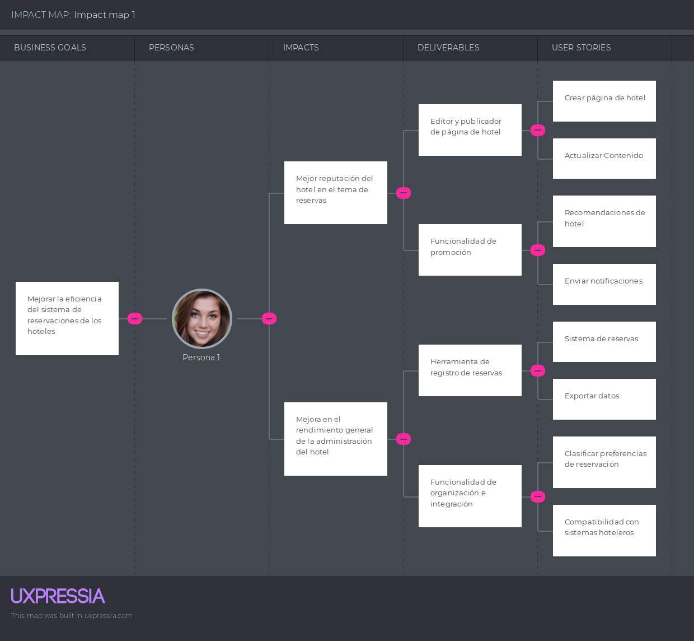
#### Huéspedes:
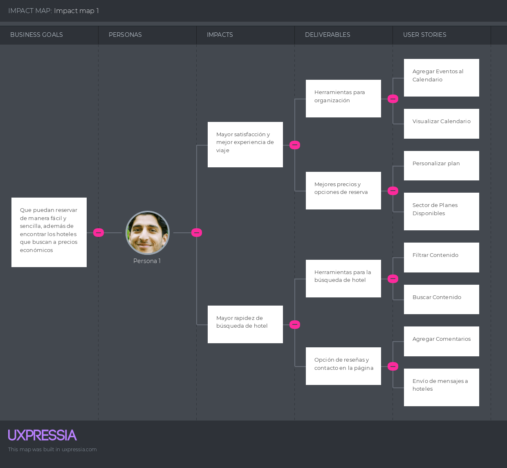
## 3.4 Product Backlog

| **Orden** | **User Story** | **Título**                              | **Descripción**                                                                                                                                                                                            | **Story Points** |
|-----------|----------------|-----------------------------------------|------------------------------------------------------------------------------------------------------------------------------------------------------------------------------------------------------------|------------------|
| 1         | US001          | Acceso a la sección de Resumen           | Como visitante, quiero acceder a la sección de información de la página de resumen para obtener información clara sobre la aplicación.                                                            | 2                |
| 2         | US002          | Acceso a la sección de Características   | Como visitante, quiero poder acceder a la página de "Características" para enterarme de las características claves de la aplicación.                                                              | 1                |
| 3         | US003          | Envío de Correos a los CEO de KingGroup | Como visitante, quiero enviar correos con información adicional sobre las funcionalidades de la aplicación.                                                                                         | 2                |
| 4         | US004          | Registro de Nuevos Usuarios             | Como visitante, quiero poder registrarme como usuario para ponerme en contacto para el uso de la aplicación.                                                                                        | 3                |
| 5         | US005          | Información de Funcionalidades          | Como visitante, quiero ver un sector que detalle todas las funcionalidades que ofrece la aplicación.                                                                                                   | 2                |
| 6         | US006          | Sector de Planes Disponibles            | Como visitante, quiero ver los diferentes planes que ofrece la aplicación para escoger el que mejor se adapte a mis necesidades.                                                                      | 3                |
| 7         | US007          | Sector de Preguntas Frecuentes          | Como visitante, quiero tener acceso a un sector de preguntas frecuentes para obtener respuestas rápidas a dudas comunes.                                                                               | 2                |
| 8         | US008          | Conexión de King Group con la Aplicación | Como visitante, quiero conocer cómo King Group está conectado con esta aplicación para entender mejor su propósito y origen.                                                                         | 3                |
| 9         | US009          | Conexión de Datos del Formulario a Firebase | Como desarrollador, quiero conectar los datos del formulario de contacto a una base de datos de Firebase para almacenar y gestionar las consultas de los usuarios.                                 | 2                |
| 10        | US010          | Registro de Usuario                     | Como visitante, quiero poder registrarme como usuario para acceder a todas las funcionalidades de la aplicación.                                                                                     | 2                |
| 11        | US011          | Inicio de Sesión                        | Como usuario registrado, quiero poder iniciar sesión para acceder a mi cuenta y utilizar las funcionalidades de la aplicación.                                                                      | 2                |
| 12        | US012          | Recuperación de Contraseña              | Como usuario, quiero poder recuperar mi contraseña en caso de olvidarla para poder acceder nuevamente a mi cuenta.                                                                                    | 3                |
| 13        | US013          | Configuración de Cuenta                 | Como usuario, quiero poder configurar mi cuenta para personalizar mi experiencia en la aplicación.                                                                                                  | 2                |
| 14        | US014          | Crear Contenido                         | Como administrador, quiero poder crear nuevo contenido para mantener la información actualizada en la aplicación.                                                                                     | 3                |
| 15         | US015          | Leer Contenido                          | Como usuario, quiero poder leer el contenido disponible en la aplicación para obtener información relevante.                           | 3               |
| 16        | US016          | Actualizar Contenido                    | Como administrador, quiero poder actualizar el contenido existente para mantener la información relevante y actualizada.              | 2               |
| 17         | US017          | Eliminar Contenido                      | Como administrador, quiero poder eliminar contenido obsoleto para mantener la información actualizada en la aplicación.               | 3               |
| 18         | US018          | Agregar Comentarios                     | Como usuario, quiero poder agregar comentarios en el contenido para compartir mis opiniones y experiencias.                           | 1                |
| 19         | US019          | Leer Comentarios                        | Como usuario, quiero poder leer los comentarios en el contenido para conocer las opiniones y experiencias de otros usuarios.          | 2                |
| 20         | US020          | Moderar Comentarios                     | Como administrador, quiero poder moderar los comentarios para asegurar que cumplan con las normas de la comunidad.                    | 3               |
| 21         | US021          | Recibir Notificaciones                  | Como usuario, quiero recibir notificaciones para estar al tanto de las actualizaciones y eventos importantes en la aplicación| 1 
| 12        | US022          | Filtrar Contenido                       | Como usuario, quiero poder filtrar el contenido para ver solo la información que me interesa.        | 2                |
| 23        | US023          | Buscar Contenido                        | Como usuario, quiero poder buscar contenido específico para encontrar información rápidamente.        | 3                |
| 24        | US024          | Visualizar Calendario                   | Como usuario, quiero poder visualizar un calendario con todos mis eventos para tener una vista general de mis actividades. | 2               |
| 25        | US025          | Agregar Eventos al Calendario           | Como usuario, quiero poder agregar eventos al calendario para planificar mis actividades.             | 3               |
| 26        | US026          | Editar Eventos                          | Como usuario, quiero poder editar eventos en el calendario para actualizar la información de mis actividades. | 2               |
| 27        | US027          | Eliminar Eventos                        | Como usuario, quiero poder eliminar eventos del calendario para mantener mi agenda actualizada.       | 3               |
| 28        | US028          | Acceso a la Página de Inicio            | Como visitante, quiero poder acceder a la página de inicio para obtener información clara sobre la aplicación. | 2                | 
|29        | US029          | Incluir el cambio de idioma (I18n)            | Como visitante, quiero que la aplicación soporte los idiomas español e inglés para poder utilizarla en mi idioma preferido. | 2                |


| **Orden** | **User Story** | **Título**                                        | **Descripción**                                                                                                                                                                          | **Story Points** |
|-----------|----------------|---------------------------------------------------|------------------------------------------------------------------------------------------------------------------------------------------------------------------------------------------|------------------|
| 1         | TS001          | Crear Cuenta de Usuario                           | **Como** desarrollador, **quiero** permitir a los usuarios crear una cuenta                                                                                                              | 1                |
| 2         | TS002          | Iniciar Sesión                                    | **Como** desarrollador, **quiero** permitir a los usuarios iniciar sesión con sus credenciales                                                                                           | 2                |
| 3         | TS003          | Reconfigurar credenciales                         | **Como** desarrollador, **quiero** permitir a los usuarios restaurar y cambiar sus credenciales e información personal.                                                                  | 1                |
| 4         | TS004          | Buscar hoteles                                    | **Como** desarrollador, **quiero** implementar una funcionalidad de búsqueda de hoteles por nombre, propietario ubicación y precio.                                                      | 3                |
| 5         | TS005          | Agregar paginas de hotel                          | **Como** desarrollador, **quiero** permitir a las empresas hoteleras agregar nuevas páginas de hotel en la aplicación.                                                                   | 2                |
| 6         | TS006          | Actualizar Información de la página               | **Como** desarrollador, **quiero** permitir a las empresas hoteleras actualizar la información de sus hoteles en sus páginas.                                                            | 1                |
| 7         | TS007          | Eliminar página de hotel                          | **Como** desarrollador, **quiero** permitir a los administradores eliminar su página de hotel.                                                                                           | 3                |
| 8         | TS008          | Implementar Sistema de Valoración y reseñas       | **Como** desarrollador, **quiero** implementar un sistema de valoración y opinión para que los usuarios puedan calificar los hoteles.                                                    | 3                |
| 9         | TS009          | Implementar Funcionalidad de guardado             | **Como** desarrollador, **quiero** permitir a los usuarios guardar una página de hotel en su cuenta y marcarlo según lo prefiera.                                                        | 2                |
| 10        | TS010          | Configurar Notificaciones de Nuevas Publicaciones | **Como** desarrollador, **quiero** crear un sistema que notifique a los usuarios sobre nuevas recomedaciones de hotel, avisos del hotel que reservaron, mensajes de otros usuarios, etc. | 1                |
| 11        | TS011          | Implementar Funcionalidad de Filtros en Búsqueda  | **Como** desarrollador, **quiero** añadir filtros a la búsqueda para refinar resultados de hoteles según sus criterios.                                                                  | 2                |
| 12        | TS012          | Implementar Funcionalidad de Exportación de Datos | **Como** desarrollador, **quiero** permitir a los usuarios exportar datos de reservas y otros trámites en formatos como docx, pdf o xml.                                                 | 3                |
| 13        | TS013          | Implementar Funcionalidad de tramites             | **Como** desarrollador, **quiero** permitir a los usuarios realizar trámites en la aplicación.                                                                                           | 3                |
| 14        | TS014          | Integrar API de Recomendaciones                   | **Como** desarrollador, **quiero** integrar una API externa para obtener recomendaciones de hoteles basadas en las preferencias del usuario y su información.                            | 3                |
| 15        | TS015          | Implementar Funcionalidad de comunidad            | **Como** desarrollador, **quiero** permitir a los usuarios crear y comentar en foros y circulos de discuciones.                                                                          | 3                |
| 16        | TS016          | Implementar Sistema de Mensajes Internos          | **Como** desarrollador, **quiero** implementar un sistema de mensajes internos para comunicación entre usuarios.                                                                         | 2                |
| 17        | TS017          | Implementar Sistema de reservas                   | **Como** desarrollador, **quiero** implementar un sistema de procesamiento de reservaciones                                                                                              | 3                |
| 18        | TS018          | Implementar editor de páginas web básico          | **Como** desarrollador, **quiero** implementar un editor de páginas web básico para las empresas de hoteles                                                                              | 3                |                                                           
 
# 4 Capitulo IV: Product Design
## 4.1 Style Guidelines
Las Style Guidelines son esenciales para garantizar una comunicación coherente y profesional en todos los aspectos de nuestra marca o proyecto, ya sea en publicaciones impresas, en línea o en cualquier otro medio de difusión. En esta sección, estableceremos un conjunto de directrices que nuestro equipo seguirá para diseñar el proyecto KingReserve, desarrollado por KingGroup. Estas pautas abarcarán aspectos clave como la selección de colores, tipografía, estructura del documento y otros elementos fundamentales.
<br>
Para el diseño de KingReserve, utilizaremos la plataforma Figma, que nos permitirá crear tanto la aplicación web como la página de inicio de manera efectiva. En ambas, implementaremos una paleta de colores que incluirá tonalidades de crema y marrón, evocando la naturaleza y la confianza que se asocian con el concepto de reservas. A continuación, se presentará un análisis más detallado de cada uno de los aspectos mencionados.


### 4.1.1 General Style Guidelines

**Branding:** El logotipo de KingReserve es mucho más que una simple imagen; es la manifestación visual de nuestra identidad. En el centro, el símbolo único que nos representa es nuestro nombre, "KingReserve", que fusiona el concepto de realeza con la idea de reservas. Esta combinación resalta la calidad y el prestigio que ofrecemos en el sector de reservas para los huespedes y profesionales que buscan los mejores lugares para vivir durante sus vacaciones.

Nuestro logotipo incluye un león, un símbolo de fuerza, nobleza y liderazgo, que refuerza nuestra misión de ofrecer un servicio de primera clase. Este diseño es versátil y se adapta a una variedad de plataformas y aplicaciones, asegurando que nuestra marca se destaque en cualquier entorno. El león y el concepto de realeza reflejan la confianza y la excelencia que queremos transmitir a nuestros usuarios, estableciendo una imagen de prestigio y confianza en el proceso de reserva.

<div style="text-align:center;">
    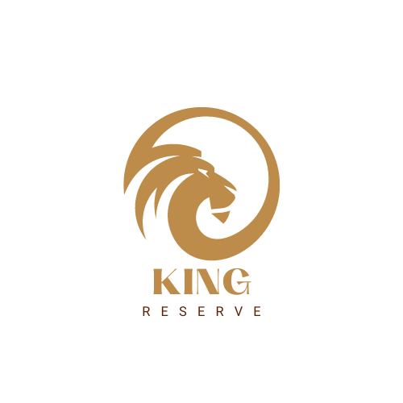
    <div><b>Horizontal layout</b></div>
</div>

<div style="text-align:center;">
    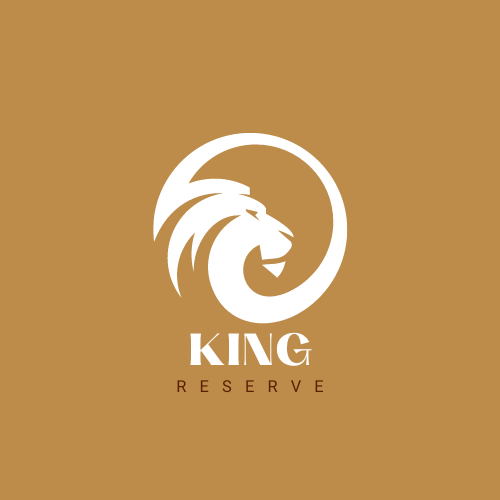
    <div><b>Inverted Colors</b></div>
</div>

<div style="text-align:center;">
    
    <div><b>Logo mark only</b></div>
</div>

**Typography**

La tipografía de KingReserve encapsula la esencia de nuestra innovadora startup, que busca revolucionar el proceso de gestión y operación de hoteles. Con un estilo moderno, ordenado y minimalista, se alinea perfectamente con la imagen que deseamos proyectar: una plataforma fácil de usar y confiable para la gestión de reservas, planillas y personal. Nuestra elección de tipografía refleja nuestro compromiso con la simplicidad y la accesibilidad, utilizando un lenguaje casual y sencillo que invita a nuestros usuarios a sentirse cómodos y empoderados al utilizar nuestra aplicación.

**Tipos de letras a usar:**
- **Hatton:** Para el logo de nuestro proyecto.
<div style="text-align:center;">
    <br>
    
</div>
<br>

<div style="text-align:justify;">
- <b>Poppins (encabezados):</b> Poppins es una tipografía moderna y legible que puede ser ideal para los encabezados y títulos de su plataforma. Transmite confianza y es fácil de leer en pantallas digitales.
</div>
<div style="text-align:center;">
    <br>
    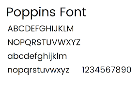
</div>
<br>

<div style="text-align:justify;">
- <b>Noto Sans (cuerpo de texto):</b> Noto Sans es una tipografía versátil que funciona bien para el cuerpo de texto en su plataforma. Su calidad ayudará a que la información sea fácil de absorber.
</div>
<div style="text-align:center;">
    <br>
    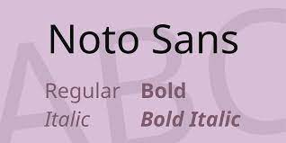
</div>
<br>

<div style="text-align:justify;">
- <b>Roboto (botones):</b> Roboto es una tipografía limpia que puede funcionar bien para los botones y llamados a la acción. Ayuda a crear un aspecto moderno y atractivo que alienta a los usuarios a participar.
</div>
<div style="text-align:center;">
    <br>
    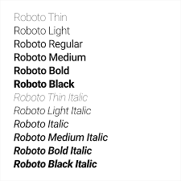
</div>
<br>

<div style="text-align:justify;">
- <b>Raleway (detalles):</b> Raleway puede usarse para resaltar detalles importantes o elementos de diseño. Su aspecto contemporáneo y elegante puede añadir un toque de sofisticación a su plataforma.
</div>
<div style="text-align:center;">
    <br>
    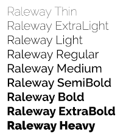
</div>
<br>

<div style="text-align:justify;">
- <b>Arial (texto legal y pie de página):</b> Para el texto legal y el pie de página, Arial es una elección segura. Es altamente legible y transmite profesionalismo.
</div>
<div style="text-align:center;">
    <br>
    
</div>
<br>


**Colors**

La selección de colores en KingReserve se ha llevado a cabo de manera estratégica, utilizando una paleta que refleja nuestra visión y valores. Los tonos #5b1f00, #ffd398 y #ffffff han sido elegidos meticulosamente para transmitir la esencia de nuestra innovadora plataforma de gestión hotelera. Estos colores no solo crean una armonía visual, sino que también establecen un equilibrio entre la gestión de reservas (representada por el marrón oscuro), la integridad (encarnada en el tono dorado claro) y la transparencia (reflejada en el blanco puro). Esta combinación refuerza nuestra identidad como una solución moderna y confiable en el ámbito de la gestión hotelera, destacándose por nuestra singularidad y compromiso con la eficiencia y la satisfacción del cliente.


**Gama de colores:**

<div style="display: flex; justify-content: space-around; align-items: center; text-align: center;">
    <div>
        <b>#5b1f00</b>
        <br>
        
    </div>
    <div>
        <b>#ffd398</b>
        <br>
        
    </div>
    <div>
        <b>#ffffff</b>
        <br>
        
    </div>
</div>

**Spacing**

El espaciado ideal en la plataforma web de KingReserve, dedicada a la gestión hotelera, debe priorizar la legibilidad y la comodidad del usuario.

Para una Plataforma Web:

<div style="display: flex; justify-content: space-around; align-items: flex-start; text-align: left;">
    <div>
        - <b>Espaciado entre líneas (line-height):</b>
        <br>
        Texto de cuerpo: 1.4 a 1.6 veces el tamaño de la fuente.
        <br><br>
        - <b>Espaciado entre párrafos:</b>
        <br>
        Margen inferior de al menos el 120% del tamaño de fuente entre párrafos.
        <br><br>
        - <b>Margen y espaciado alrededor de elementos de la interfaz:</b>
        <br>
        Al menos 20 píxeles de espacio entre elementos de la interfaz.
    </div>
    <div>
        - <b>Espaciado entre secciones o módulos:</b>
        <br>
        Margen superior e inferior de al menos 45 píxeles.
        <br><br>
        - <b>Espaciado entre elementos de menú y navegación:</b>
        <br>
        Al menos 15 píxeles de espacio entre elementos de navegación.
        <br><br>
        - <b>Espaciado alrededor de imágenes y gráficos:</b>
        <br>
        Al menos 20 píxeles de margen alrededor de las imágenes.
        <br><br>
        - <b>Espaciado en el pie de página:</b>
        <br>
        Margen superior e inferior de alrededor de 40 a 60 píxeles.
    </div>
</div>

**Lenguaje y tono de la comunicación**

El tono de comunicación y lenguaje ideal para KingReserve, nuestra plataforma de gestión hotelera, se caracteriza por ser profesional, confiable, claro y comprometido. En KingReserve, estamos dedicados a transformar la experiencia de gestión hotelera, haciendo que sea eficiente, segura y satisfactoria para todos nuestros usuarios. Creemos firmemente en la importancia de establecer una conexión de confianza con los administradores de hoteles y en comunicar de manera efectiva nuestro compromiso con la transparencia y la satisfacción del cliente en el proceso de gestión hotelera. Nuestro tono es profesional y accesible, reflejando nuestra misión de proporcionar una experiencia completa y personalizada en la gestión de reservas, planillas y personal. Nos esforzamos por diseñar nuestra plataforma de manera intuitiva y fácil de usar, especialmente para aquellos que pueden no estar familiarizados con la tecnología de gestión hotelera.

### 4.1.2 Web Style Guidelines
Nuestro enfoque en las "Web Style Guidelines" de KingReserve se centra en la creación de una experiencia de usuario consistente y atractiva en la gestión hotelera. Esto implica el uso de una paleta de colores cohesiva, tipografía legible y un diseño responsivo que se adapte a una variedad de dispositivos y tamaños de pantalla. Nos aseguramos de que cada elemento visual y funcional de nuestra plataforma contribuya a una navegación intuitiva y eficiente, facilitando la gestión de reservas, planillas y personal de manera efectiva y profesional.
<br>

<div style="text-align:justify;">
</div>
<div style="text-align:center;">
    <br>
    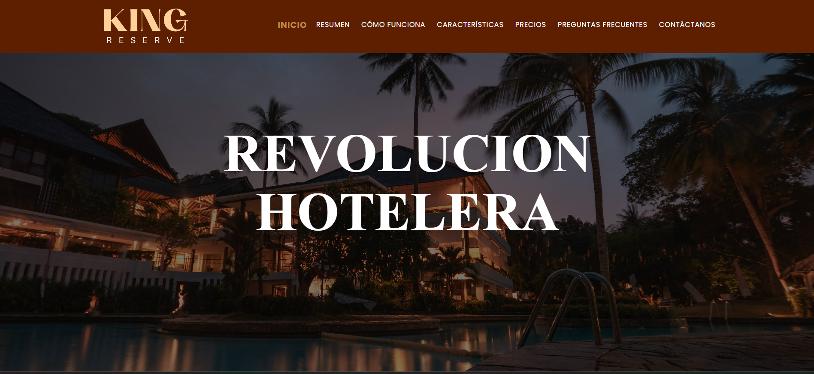
    <div><b>Primera vista de KingReserve page</b></div>
</div>
<br>

##  4.2 Information Architecture

## 4.2.1 Organization Systems

-Segmento Huésped

Registro y Acceso de Usuario: Sistema seguro que permite a los huéspedes registrarse e iniciar sesión, ofreciendo una experiencia personalizada y protegida, incluyendo opciones para recuperación de contraseñas y verificación de cuentas.

Gestión de Reservas: Los huéspedes pueden gestionar sus reservas, ver detalles de las mismas y realizar cambios si es necesario, proporcionando flexibilidad y control durante su estancia.

Configuración de Preferencias: Los huéspedes pueden establecer preferencias para tipos de habitaciones, comodidades y servicios, asegurando una experiencia personalizada durante su estancia.

Historial de Reservas: Un registro detallado de reservas anteriores permite a los huéspedes re-reservar fácilmente sus alojamientos favoritos y visualizar su historial de viajes.

-Segmento Hotel

Gestión de Ofertas y Promociones: Los hoteles pueden crear y gestionar ofertas especiales para atraer a los huéspedes, mejorando la lealtad de los clientes y aumentando las ventas.

Historial de Ventas: Una vista completa de todas las transacciones permite a los hoteles analizar tendencias de ventas y generar informes para la toma de decisiones estratégicas.

Gestión de Inventario y Disponibilidad: Este sistema ayuda a los hoteles a rastrear la disponibilidad de habitaciones y gestionar el inventario en tiempo real, optimizando las tasas de ocupación y minimizando el sobrecupo.

Sistema de Gestión de Reservas: Los hoteles pueden manejar de manera eficiente todas las reservas, incluidas cancelaciones y modificaciones, mejorando la eficiencia operativa y la satisfacción del cliente.

Gestión de Perfil del Hotel: Los hoteles pueden mantener un perfil detallado con información sobre comodidades, servicios y opiniones de clientes, lo cual ayuda a construir confianza y atraer a nuevos huéspedes.

## 4.2.2 Labeling Systems

-Segmento Huésped

Etiqueta de Estado de Reserva: Muestra el estado de la reserva (por ejemplo, confirmada, pendiente, cancelada) junto con los horarios de check-in y check-out, ayudando a los huéspedes a mantenerse informados sobre sus reservas.

Etiqueta de Solicitud de Servicios: Permite a los huéspedes rastrear el estado de cualquier solicitud o servicio especial (por ejemplo, servicio a la habitación, limpieza), asegurando un cumplimiento oportuno.

Etiqueta de Preferencias de Reserva: Resalta las preferencias de los huéspedes para tipos de habitaciones, comodidades o servicios especiales, asegurando un servicio personalizado durante toda su estancia.

- Segmento Hotel

Etiqueta de Reserva: Contiene información clave como nombres de huéspedes, asignaciones de habitaciones y fechas de reserva, ayudando al personal del hotel a gestionar las reservas sin problemas.

Etiqueta de Disponibilidad: Muestra la disponibilidad de habitaciones en tiempo real, ayudando al personal del hotel a tomar decisiones rápidas e informadas sobre las reservas.

Etiqueta de Pedidos: Rastrear los pedidos de servicios o comodidades adicionales de los huéspedes, asegurando una entrega precisa y oportuna por parte del personal.

Etiqueta de Promociones y Ofertas: Resalta promociones y ofertas actuales tanto para huéspedes como para el personal, fomentando las ventas adicionales y aumentando el compromiso de los huéspedes.

## 4.2.4  Searching Systems

## Segmento Huésped

Búsqueda por Palabras Clave: Los huéspedes pueden usar una barra de búsqueda para encontrar hoteles específicos, habitaciones o comodidades por nombre o palabra clave, simplificando el proceso de reserva.

Búsqueda por Filtros: Los filtros permiten a los huéspedes reducir opciones por precio, ubicación, comodidades y más, ayudándolos a encontrar rápidamente el alojamiento perfecto.

## Segmento Hotel

Búsqueda por Palabras Clave: El personal del hotel puede buscar reservas específicas, huéspedes o servicios utilizando palabras clave, facilitando el acceso rápido a información importante.

Búsqueda por Filtros: Los filtros ayudan al personal a refinar los resultados de búsqueda por estado de reserva, tipo de habitación o preferencias de huéspedes, mejorando la eficiencia operativa.

## 4.2.5 Navigation Systems

-Segmento Huésped

Menú de Navegación: Un menú superior permite a los huéspedes acceder rápidamente a sus reservas, preferencias y configuraciones de cuenta, asegurando una experiencia de usuario fluida.

Enlaces Rápidos: Proporciona acceso fácil a funciones de uso frecuente como historial de reservas, soporte y ofertas especiales, mejorando la usabilidad.

-Segmento Hotel

Menú de Navegación: Un menú superior permite al personal del hotel navegar eficientemente entre reservas, inventario y promociones, optimizando su flujo de trabajo.

Enlaces Rápidos: Ofrece acceso rápido a funciones críticas como gestión de reservas, actualizaciones de inventario y configuración de promociones, aumentando la velocidad operativa.


##  4.3 Landing Page UI Design
### 4.3.1 Landing Page Wireframe


1. **Jerarquía Visual**: El título grande y las imágenes dominantes guían la atención del usuario, destacando los elementos más importantes.

2. **Distribución del Contenido**: El diseño divide el contenido en bloques bien definidos, lo que facilita una navegación intuitiva y progresiva.

3. **Espacio en Blanco**: El uso adecuado del espacio en blanco mejora la legibilidad y evita sobrecargar visualmente al usuario.

4. **Accesibilidad**: El diseño se adapta bien a diferentes dispositivos (responsive), asegurando una navegación fluida tanto en escritorio como en móviles.

5. **Elementos Interactivos**: Existen áreas claramente dedicadas a botones, promoviendo la interacción de forma sencilla.

6. **Principios de Diseño**: El diseño es consistente, bien alineado y sigue una estructura clara que facilita la experiencia de usuario.

### 4.3.2  Landing Page Mock-up


### Mock-ups del Landing Page

1. **Diseño Responsivo**: Los mock-ups muestran una clara adaptación del diseño a diferentes dispositivos, como móviles, portátiles y monitores de escritorio. Esto asegura una experiencia de usuario coherente y accesible en cualquier formato.

2. **Uso de Imágenes de Impacto**: La imagen principal en el sitio web de escritorio y portátil resalta la experiencia visual. La combinación de la fotografía nocturna con el texto "Revolución Hotelera" crea un efecto atractivo que captura la atención del usuario.

3. **Coherencia Visual**: El diseño mantiene una identidad visual consistente en todos los dispositivos, con el logotipo de **King Reserve** en la parte superior izquierda y una paleta de colores marrón y dorado que refleja un estilo elegante y moderno.

4. **Tipografía Legible**: Los textos grandes y bien contrastados permiten una lectura fácil tanto en dispositivos móviles como en pantallas grandes. El título principal en la pantalla de escritorio se resalta de manera prominente.

5. **Navegación Clara**: El menú superior visible en los mock-ups para escritorio y portátil está bien organizado, facilitando la navegación rápida entre las secciones del sitio.

6. **Llamadas a la Acción (CTA)**: En la versión móvil, se destacan los botones "Reservar" y "Ver más", lo que fomenta la interacción directa del usuario, asegurando que los elementos interactivos son fácilmente accesibles.

## 4.4 Web Applications UX/UI Design
### 4.4.1 Web Applications Wireframes
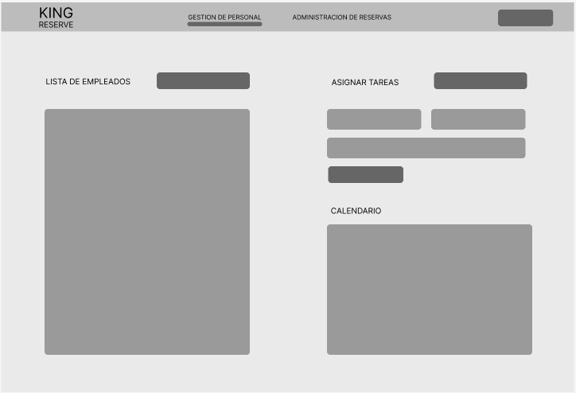

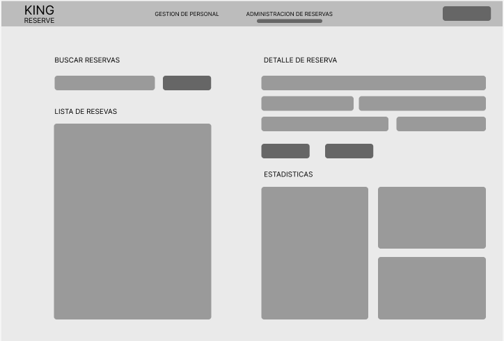

### 4.4.2 Web Applications Wireflow Diagrams
User Goal 1: Iniciar sesión <br>
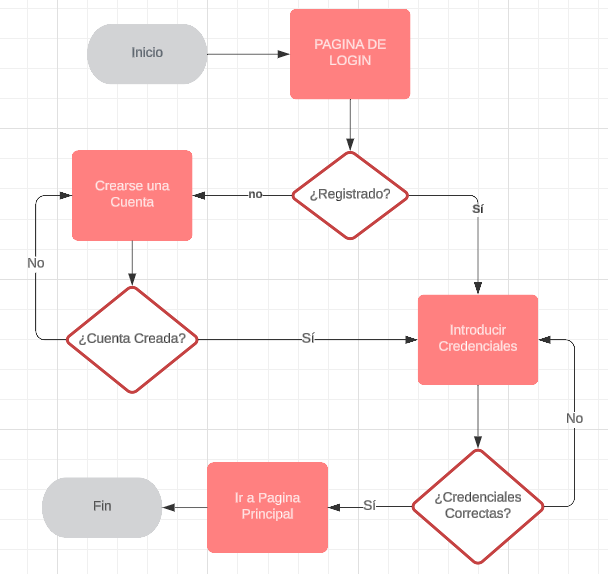

User Goal 2: Asignar una tarea a un empleado <br>
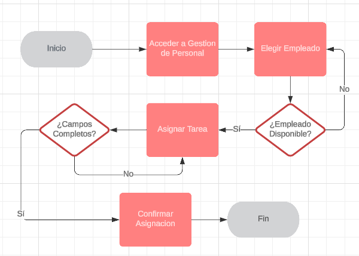

User Goal 3: Modificar el horario de un empleado <br>
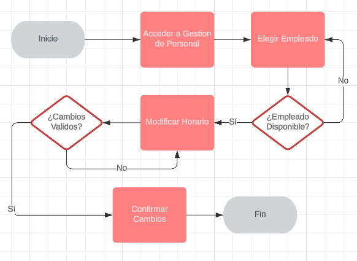

User Goal 4: Añadir una reserva <br>
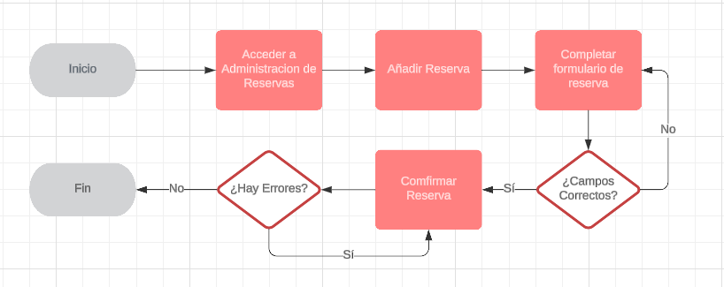

User Goal 5: Modificar una reserva existente <br>
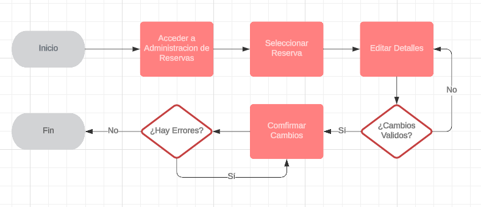

User Goal 6: Cancelar una reserva <br>
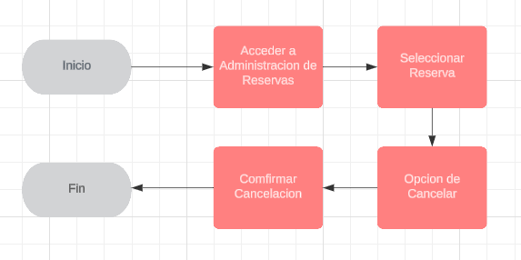

User Goal 7: Generar reportes de estadísticas personalizadas <br>
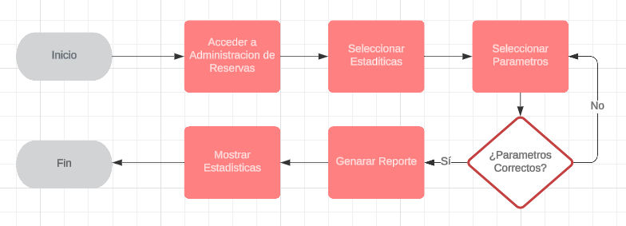

User Goal 8: Enviar una notificación al personal <br>
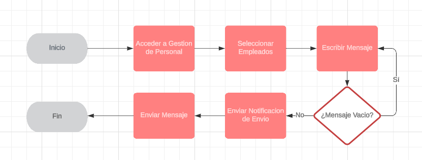

### 4.4.3 Web Applications Mock-ups

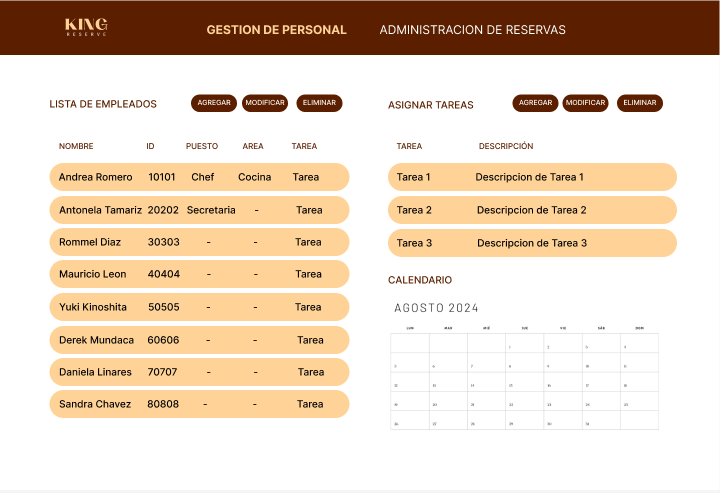

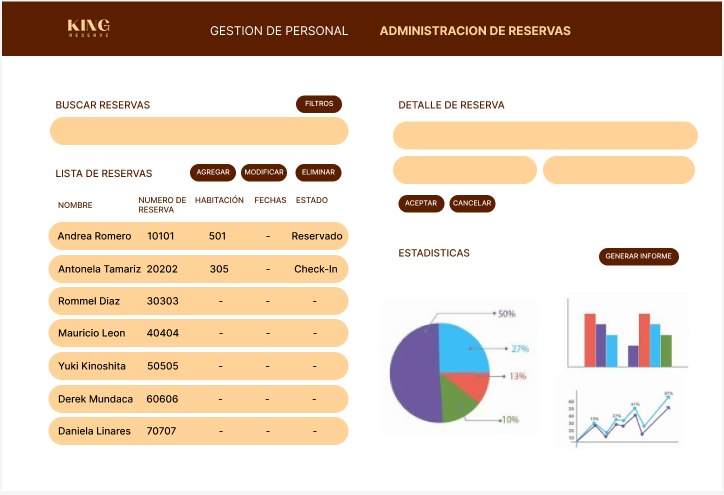

### 4.4.4 Web Applications User Flow Diagrams

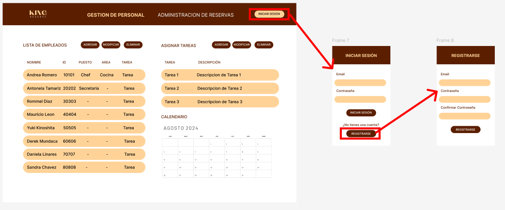
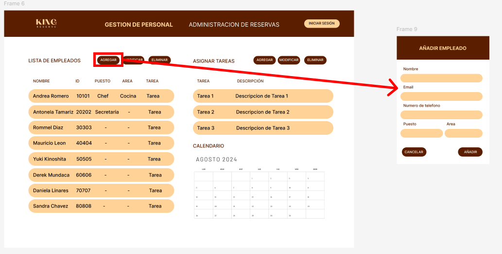
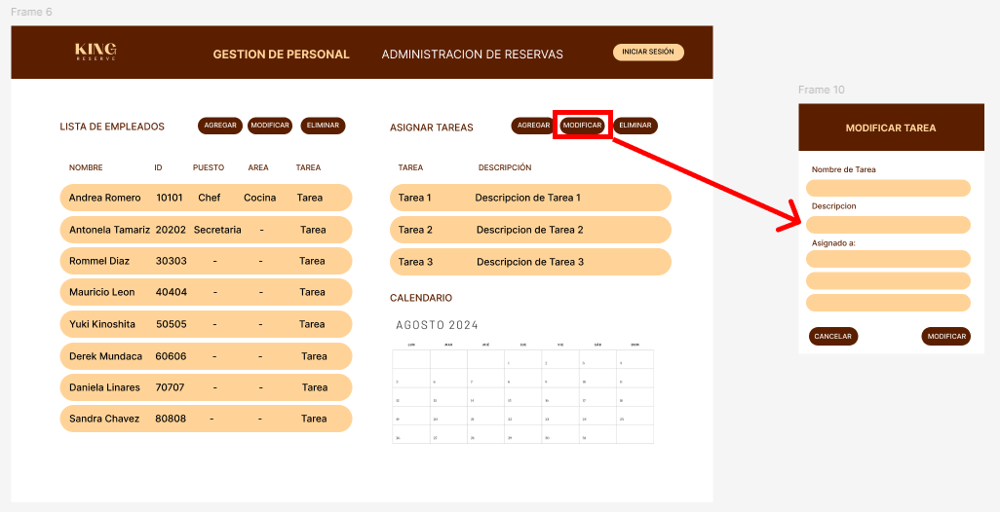
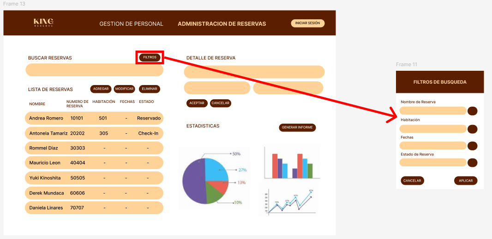
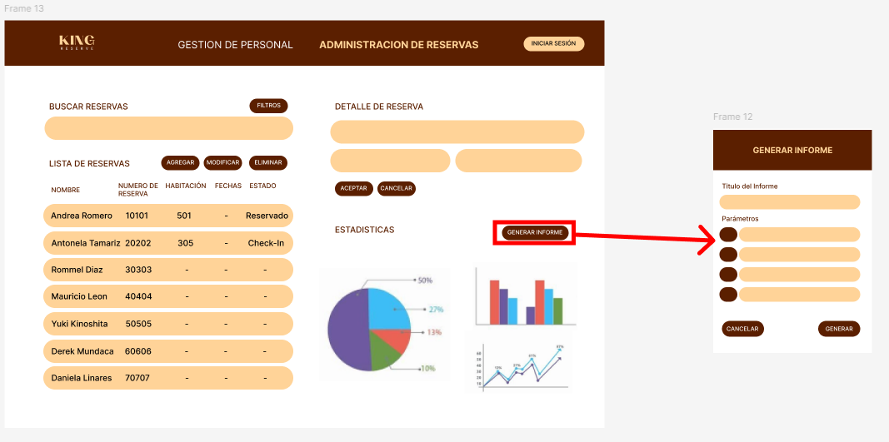
### 4.5 Web Applications Prototyping
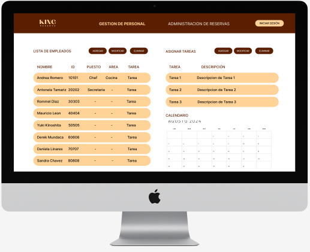 <br>
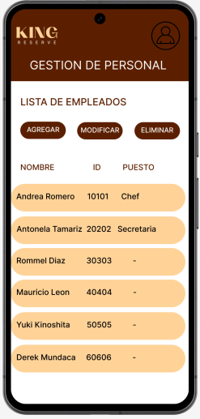 <br>
| Tipo de Video                 | Enlace                                                                                                  |
|-------------------------------|---------------------------------------------------------------------------------------------------------|
| Prototype Desktop Video       | https://upcedupe-my.sharepoint.com/:v:/g/personal/u202216035_upc_edu_pe/EZKwDgE2b5BInXQA0C8ijZEB4kZaJLE6x_Xuq7fkeph8WA?nav=eyJyZWZlcnJhbEluZm8iOnsicmVmZXJyYWxBcHAiOiJTdHJlYW1XZWJBcHAiLCJyZWZlcnJhbFZpZXciOiJTaGFyZURpYWxvZy1MaW5rIiwicmVmZXJyYWxBcHBQbGF0Zm9ybSI6IldlYiIsInJlZmVycmFsTW9kZSI6InZpZXcifX0%3D&e=PhGVZ9 |
| Prototype Mobile Video        | https://upcedupe-my.sharepoint.com/:v:/g/personal/u202216035_upc_edu_pe/EeJf2XgJW2JAsXFWZ_0UOrgBlizX862fVw5mXH_YAoXDNQ?nav=eyJyZWZlcnJhbEluZm8iOnsicmVmZXJyYWxBcHAiOiJTdHJlYW1XZWJBcHAiLCJyZWZlcnJhbFZpZXciOiJTaGFyZURpYWxvZy1MaW5rIiwicmVmZXJyYWxBcHBQbGF0Zm9ybSI6IldlYiIsInJlZmVycmFsTW9kZSI6InZpZXcifX0%3D&e=37tJZ3 |

## 4.6 Domain-Driven Software Architecture
Los diseños C4 son una forma efectiva de representar la arquitectura de un sistema de software de manera clara y concisa. En el caso del proyecto King Reserve, los diseños C4 nos permiten visualizar la estructura y las interacciones entre los diferentes componentes del sistema. 

En el nivel más alto, el diseño C4 nos muestra el contexto del sistema, identificando los actores externos y los sistemas con los que interactúa King Reserve. A medida que descendemos en los niveles de detalle, podemos ver los contenedores que componen el sistema, como la aplicación web, la base de datos y los servicios externos. Además, los diagramas C4 nos permiten visualizar los componentes internos de cada contenedor, como los módulos y las clases.

Estos diseños proporcionan una visión clara de la arquitectura del sistema, lo que facilita la comunicación entre los miembros del equipo y ayuda a identificar posibles problemas o mejoras. Al utilizar los diseños C4 en el proyecto King Reserve, podemos asegurarnos de que todos los involucrados tengan una comprensión común de la arquitectura y puedan colaborar de manera efectiva en su implementación y evolución. 
### 4.6.1 Software Architecture Context Diagram
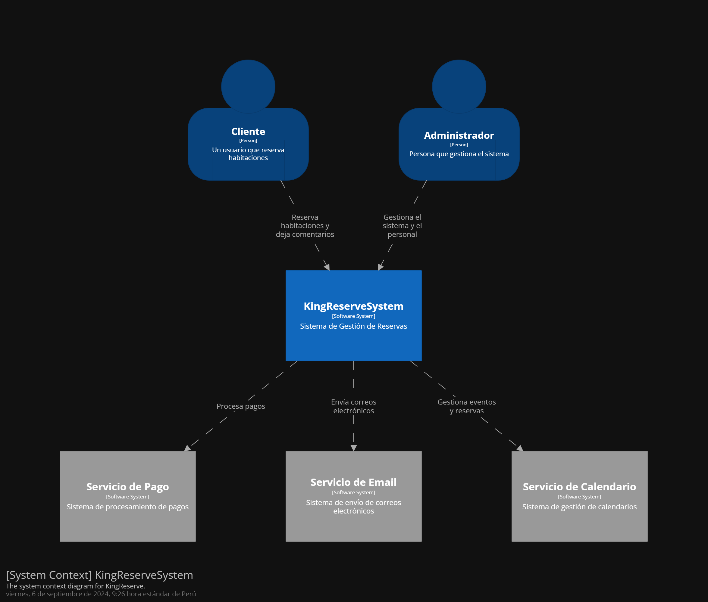
### 4.6.2 Software Architecture Container Diagrams
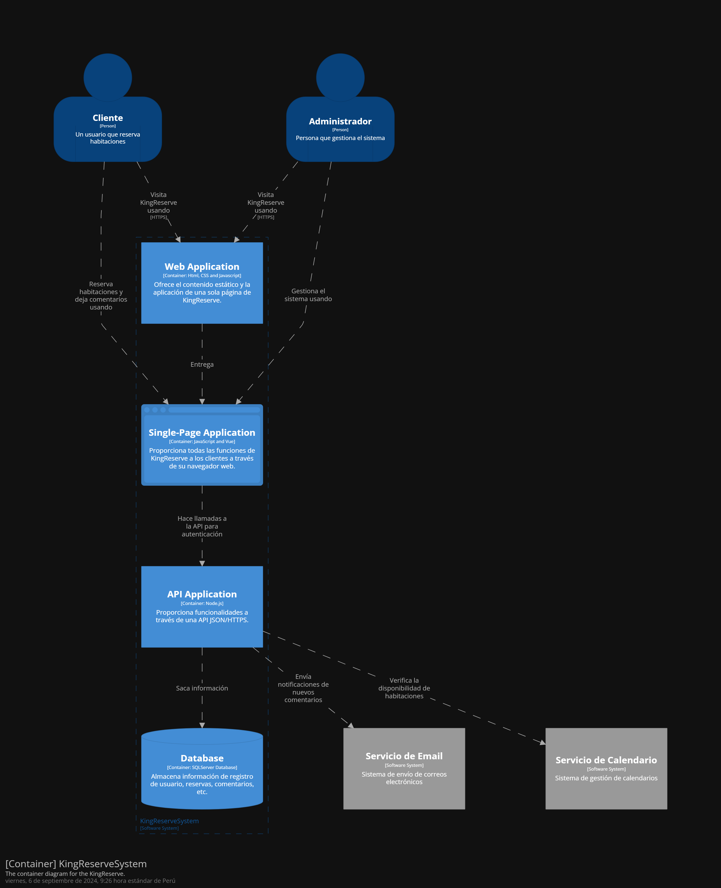
### 4.6.3  Software Architecture Components Diagrams
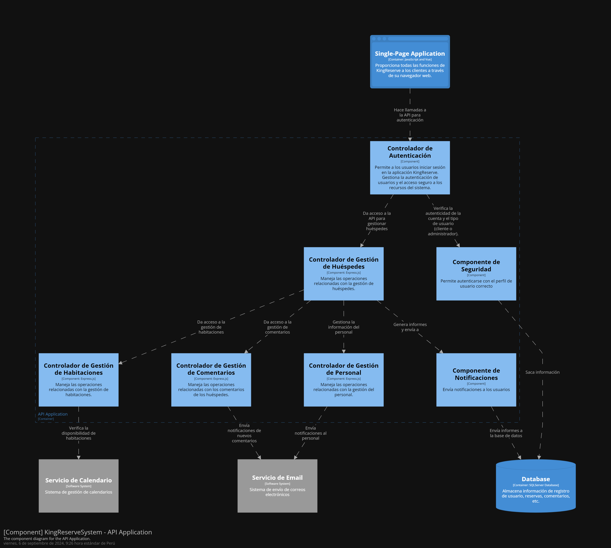

## 4.7 Software Object-Oriented Design
### 4.7.1 Class Diagrams
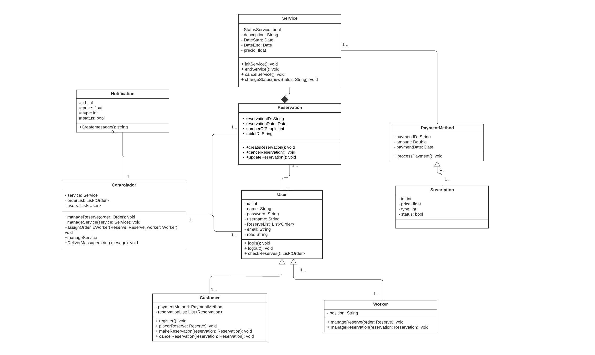
### 4.7.2  Class Dictionary
Service: Contiene los atributos StatusService, description, DateStart, DateEnd y price. Los métodos asociados permiten iniciar (initService), finalizar (endService), cancelar (cancelService), y cambiar el estado (changeStatus) de un servicio. Está relacionada con la clase Order, indicando que los servicios pueden estar vinculados a órdenes, y con la clase Controlador, que gestiona los servicios.

Reservation: Incluye los atributos reservationID, reservationDate, tableID, numberOfPeople, y tableID. Los métodos asociados son createReservation para crear una reserva, cancelReservation para cancelarla, y updateReservation para actualizarla. Está relacionada con la clase Customer, ya que los clientes pueden hacer y gestionar reservas, y con la clase Worker, que puede administrar las reservas.

Notification: Contiene los atributos id, price, type y status. El método CreateMessage permite crear un mensaje de notificación. Está vinculada con la clase Controlador, sugiriendo que las notificaciones son manejadas centralmente.

PaymentMethod: Sus atributos son paymentID, amount y paymentDate. Su método processPayment permite procesar un pago. Está relacionada con la clase Customer, indicando que los métodos de pago están asociados a los clientes y a las reservas que ellos realizan.

Suscription: Incluye los atributos id, price, type y status. Aunque no tiene métodos explícitos, está relacionada con la clase User, sugiriendo que los usuarios pueden tener suscripciones dentro del sistema.

User: Tiene los atributos id, name, password, username, orderList, email, y role. Los métodos asociados son login para iniciar sesión, logout para cerrar sesión y checkReservation para revisar las reservas del usuario. Está vinculada con las clases Reservation y Order, lo que indica que los usuarios pueden hacer y gestionar reservas y órdenes.

Customer: Sus atributos incluyen paymentMethod y reservationList. Los métodos son register para registrarse, placeReserve para realizar una reserva, y cancelReservation para cancelar una reserva. Está relacionada con las clases Reservation y PaymentMethod, lo que indica que los clientes pueden gestionar tanto las reservas como los métodos de pago.

Worker: Los atributos de esta clase son position. Los métodos asociados incluyen manageReserve para gestionar órdenes y reservas. Está vinculada con las clases Order y Reservation, sugiriendo que los trabajadores son responsables de gestionar las reservas y servicios.

Controlador: Contiene los atributos service, orderList, y users. Los métodos asociados son manageReserve para gestionar órdenes, manageService para gestionar servicios, assignOrderToWorker para asignar órdenes a trabajadores, y DeliverMessage para entregar mensajes. Está vinculado con las clases Service, Order, y Worker, indicando que este controlador gestiona el flujo general de órdenes, servicios y asignación de trabajadores.

| Clase | Atributos | Métodos | Relaciones |
|-------|-----------|---------|------------|
| Service | StatusService, description, DateStart, DateEnd, price | initService, endService, cancelService, changeStatus | Order, Controlador |
| Reservation | reservationID, reservationDate, tableID, numberOfPeople, tableID | createReservation, cancelReservation, updateReservation | Customer, Worker |
| Notification | id, price, type, status | CreateMessage | Controlador |
| PaymentMethod | paymentID, amount, paymentDate | processPayment | Customer, Reservation |
| Suscription | id, price, type, status | | User |
| User | id, name, password, username, orderList, email, role | login, logout, checkReservation | Reservation, Order |
| Customer | paymentMethod, reservationList | register, placeReserve, cancelReservation | Reservation, PaymentMethod |
| Worker | position | manageReserve | Order, Reservation |
| Controlador | service, orderList, users | manageReserve, manageService, assignOrderToWorker, DeliverMessage | Service, Order, Worker |

## 4.8 Database Design

La base de datos de King Reserve es un componente crucial del sistema, responsable de almacenar y gestionar todos los datos relacionados con reservas, huéspedes, habitaciones y otra información esencial. Diseñada con escalabilidad y rendimiento en mente, la base de datos garantiza la recuperación y manipulación eficiente de datos, brindando una experiencia fluida tanto para los huéspedes como para el personal del hotel.

El esquema de la base de datos está cuidadosamente diseñado para capturar las entidades necesarias y sus relaciones, permitiendo una representación precisa de las operaciones del hotel. Tablas como "Reservas", "Huéspedes" y "Habitaciones" almacenan información relevante, mientras que tablas adicionales manejan datos auxiliares como comodidades, promociones y disponibilidad.

Para garantizar la integridad y consistencia de los datos, se implementan restricciones e índices adecuados. Las restricciones de clave primaria y clave externa mantienen la integridad referencial, mientras que las restricciones únicas evitan entradas duplicadas. Los índices optimizan el rendimiento de las consultas, permitiendo una recuperación rápida de datos incluso en conjuntos de datos grandes.

Además, el diseño de la base de datos incorpora medidas de seguridad para proteger la información confidencial. Se implementan controles de acceso, cifrado y mecanismos de autenticación adecuados para proteger los datos de los huéspedes y del hotel contra accesos no autorizados.

Con una base de datos robusta y bien estructurada, King Reserve puede gestionar eficientemente las reservas, proporcionar información precisa de disponibilidad y ofrecer una experiencia fluida a sus huéspedes. La base de datos sirve como el soporte del sistema, respaldando el funcionamiento sin problemas de los procesos de gestión hotelera.

### 4.8.1  Diagrama de la Base de Datos
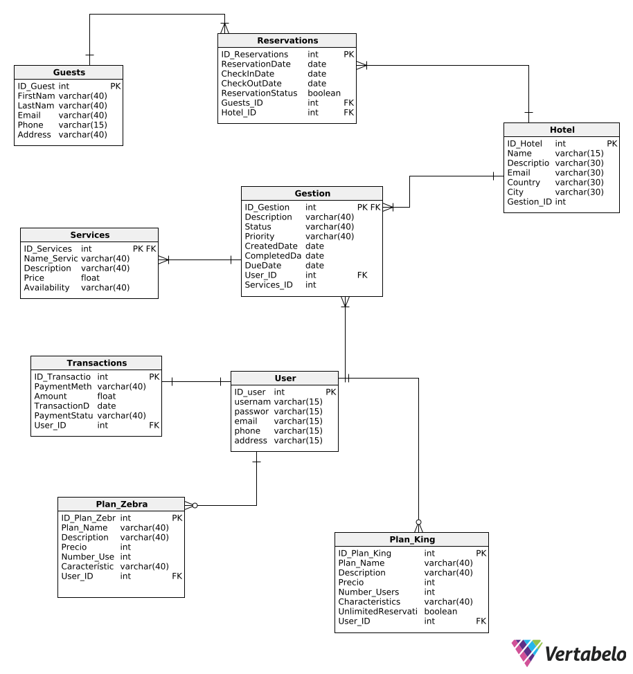

# 5 CAPÍTULO V: Product Implementation, Validation & Deployment

## 5.1 Software Configuration Management
En este apartado se resume todo el contenido recopilado, examinando los procedimientos a seguir y evaluando el estado emocional.
### 5.1.1  Software Development Environment Configuration
En la siguiente sección se detalla la ruta de acceso de cada uno de los productos de software, facilitando a cualquier miembro del equipo el desarrollo de cada aspecto del trabajo:
* **Visual Studio Code:** Entorno de desarrollo.\

* **HTML5:** Lenguaje de marcado para la elaboración de páginas web.\

* **CSS3:** Tecnología para dar estilo a nuestras páginas web.\

* **JavaScript:** Lenguaje de programación orientado a objetos utilizado para implementar funcionalidades en nuestra Landing Page.\

* **GitHub:** Repositorio colaborativo en la nube.\

* **Netifly:** Plataforma que facilita implementar despliegues sencillos para nuestras páginas web.\

* **LucidChart:** Aplicación web dedicada a la elaboración de Wireflows, User Flows y diagramas de clases.\


* **Vertabelo:** Plataforma colaborativa para la creación de diagramas de base de datos.\

* **Figma:** Herramienta colaborativa que permite elaborar wireframes y mockups.\

### 5.1.2 Source Code Management
**Repositorio de la Landing Page:** 
**Implementación de GitFlow:**
Para nuestra estrategia de gestión de versiones con Git, nos hemos inspirado en el artículo "A successful Git branching model" de Vincent Driessen, adoptando el modelo de ramificación GitFlow. Este enfoque nos permite establecer claramente las convenciones de ramificación que aplicamos en nuestro proyecto.

* **Rama Principal (Main branch):** Contiene el código en producción y se conoce como la Master branch o Main branch.
    * Notación: main
* **Rama de Desarrollo (Develop branch):** Acumula las últimas actualizaciones y cambios para la próxima versión. Funciona como un entorno de integración y prueba continua.
    * Notación: develop
* **Rama de Lanzamiento (Release branch):** Facilita la preparación de una nueva versión del producto, permitiendo correcciones de errores y recibiendo más actualizaciones de Develop.
    * Debe derivarse de: develop
    * Debe fusionarse con: develop y master/main
    * Notación: release
* **Rama de Características (Feature branch):** Se utiliza para desarrollar nuevas funcionalidades para la siguiente versión o futuras iteraciones.
    * Debe derivarse de: develop
    * Debe fusionarse de vuelta a: develop
    * Notación: feature
* **Rama de Corrección Rápida (Hotfix branch):** Aborda errores críticos en producción, permitiendo la implementación rápida de soluciones.
    * Debe derivarse de: master/main
    * Debe fusionarse con: develop y master/main
    * Notación: hotfix

**Conventional Commits:** 
Adoptamos esta metodología para estructurar los mensajes de confirmación de cambios de manera estándar y semántica, lo que facilita la comunicación y la automatización de registros de cambios.
**Tipos de Commits Convencionales:**
* feat: Nuevas características o funcionalidades.
* fix: Correcciones de errores.
* docs: Cambios o mejoras en la documentación.
* style: Cambios de formato que no afectan la funcionalidad.
* refactor: Mejoras en la estructura o legibilidad del código.
* test: Adición o modificación de pruebas.
* chore: Cambios en el proceso de construcción o tareas de mantenimiento.
* perf: Mejoras de rendimiento en el código.
### 5.1.3 Source Code Style Guide & Conventions
En la redacción de nuestro código, hemos adoptado el uso exclusivo de la nomenclatura en inglés para todos los lenguajes mencionados.
**HTML**
* **Uso de minúsculas en elementos HTML:**
```html

<header>
  <nav>Navigation Menu</nav>
</header>
<!-- Cierre correcto de elementos HTML -->
<section>
  <article>This is an article</article>
  <article>This is another article</article>
</section>
```
* **Atributos en minúsculas:**
```html
<input type="text" placeholder="Enter your name">
```
* **Especificación de atributos para imágenes:**
```html

```
**CSS**
* **Nombres significativos para ID y clases:**
```css
#main {}
#accessForm {}
.mainButton {}
```
* **Nombres cortos y descriptivos para ID y clases:**
```css
#menu {}
.userProfile {}
Uso de propiedades abreviadas en CSS:
margin: 10px 5px;
background: url('background.jpg') no-repeat center center;
```
* **Omisión de unidades después de cero:**
```css
margin: 0;
padding: 0;
Orden alfabético en las declaraciones CSS:
.content {
  align-items: center;
  display: flex;
  justify-content: space-between;
  padding: 20px;
}
```
**JavaScript**
* **Funciones con sintaxis expandida:**
```javascript
function updateCounter() {
  // Code to update the counter
}
```
* **Nombres de variables en lowercamelCase:**
```javascript
let visitCounter = 0;
let remainingTime = 120;
```
* **Uso de let y const en lugar de var:**
```javascript
const API_URL = 'https://api.example.com';
let operationResult = sum(5, 3);
function sum(a, b) {
  return a + b;
}
```
### 5.1.4  Software Deployment Configuration
En esta sección, detallamos el proceso de implementación de nuestra landing page en la plataforma de GitHub.

1. Se crea un repositorio en GitHub para alojar el código de nuestra landing page.

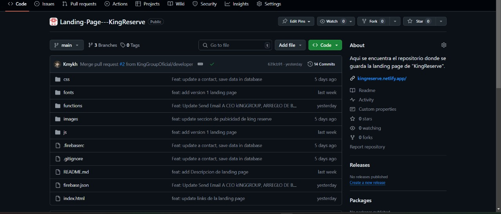

2. Agregamos a los participantes:

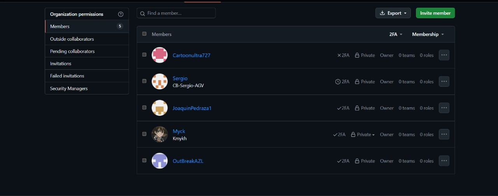

3. Habilitamos Netlifly para poder importar nuestro proyecto:

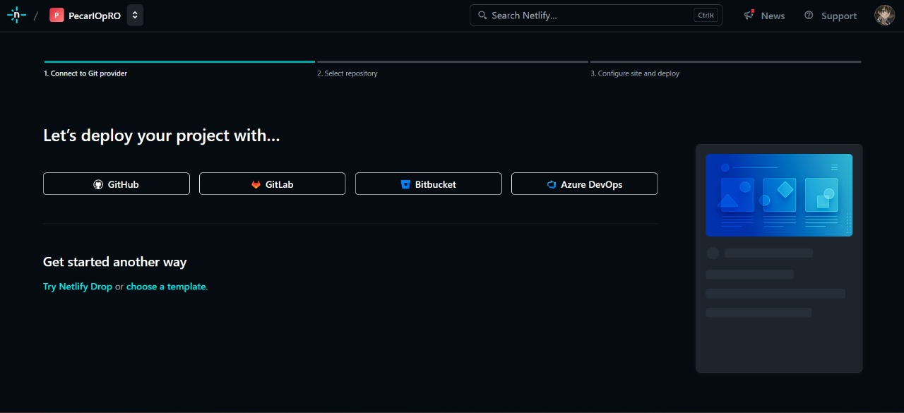

4. Seleccionamos el repositorio donde alojamos la landing page de nuestro proyecto

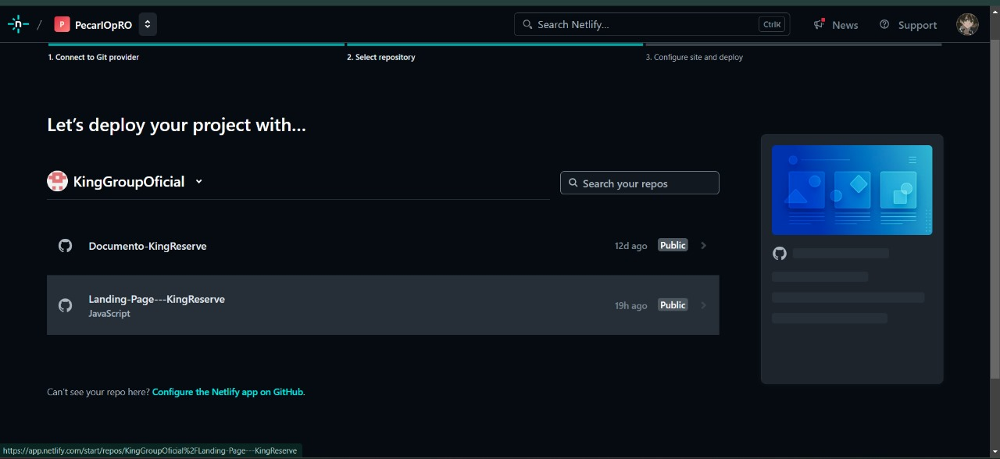

5. Seleccionamos la opcion de deploy para empezar el despleigue de la landing page

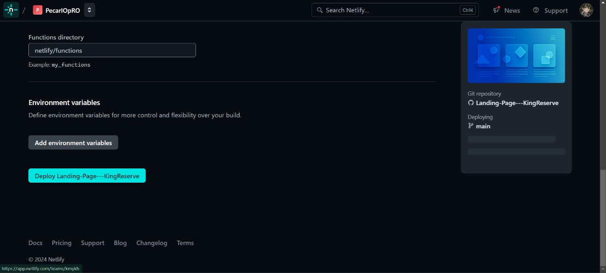

6. Finalmente, se confirma el despliegue de nuestra página web después de completar todo el procedimiento.

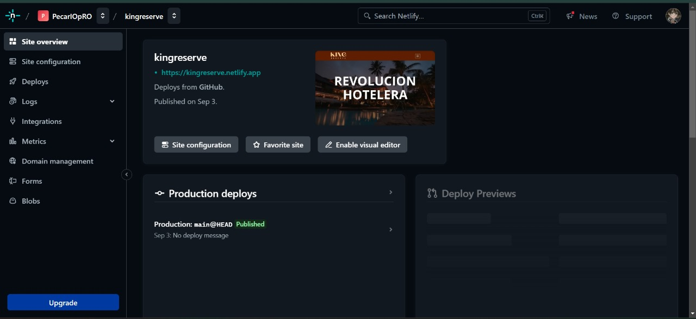

Este proceso garantiza el despliegue satisfactorio de nuestra landing page en la plataforma de Netlifly, siguiendo las especificaciones y requisitos de nuestro proyecto.
**Enlace de la Landing Page: [https://kingreserve.netlify.app/](https://kingreserve.netlify.app/)**

## 5.2 Landing Page, Services & Applications Implementation

### 5.2.1 Sprint 1 
Este informe documenta el progreso realizado durante la fase de definición de requisitos del proyecto, que incluye entrevistas con los interesados y creación de artefactos antes y después de la implementación de la aplicación web estática. Proporcionar una visión clara del avance y garantizar una comunicación efectiva entre el equipo de desarrollo y los interesados son los objetivos principales.

Durante esta etapa, se realizaron extensas entrevistas con los interesados para comprender sus necesidades, expectativas y requisitos particulares para la aplicación. Las entrevistas proporcionaron información útil que ayudó a definir los requisitos del proyecto.


Se realizaron actividades de creación de artefactos antes y después de la implementación de la aplicación web estática, además de entrevistas. Estos objetos fueron

#### 5.2.1.1 Sprint Planning 1

| Sprint # | Sprint 1  | 
|--------------------|------------|
| Sprint Planning Background | 
| Date | 2024-09-02 | 
| Time |  10:00 AM |
| Location |  UPC - Campus San Miguel |
| Preparate by| Maycol Jhordan Rojas Velasquez | 
|  Attendees (to planning meeting) | Gómez Vallejos Sergio André ,Zevallos Linares Alessandro Netto ,Pedraza Maldonado Joaquin Andree ,Romero Qwistgaard Russell Stephen  | 
| Sprint n-1 Review Summary | --- | 
| Sprint Planning Background | Durante esta etapa, se llevó a cabo una exhaustiva verificación de la funcionalidad de la landing page diseñada para el proyecto. El objetivo principal fue asegurar que la landing page cumpla con los estándares de calidad y proporcionar una experiencia óptima para los visitantes. |
| Sprint Goal & User Stories | 
| Sprint 1 Goal | Desarrolar la funcionalidad de la página web con i18n. Se considerará que el objetivo del sprint se ha cumplido si todas las historias de usuario relacionadas con la landing page están implementadas y hecho con las entrevistas de segmentos objetivos.|  
| Sprint Velocity | Se establece un Velocity de 20 Story Points para este Sprint. | 
| Sum of Story Points | 20 Story Points | 

#### 5.2.1.2 Sprint Backlog 1

<table align="center" border="1" width="90%" style="text-align:center">
 <tr>
    <td colspan="2"><b>User Story</b></td>
    <td colspan="6"><b>Work-Item / Task</b></td>
  </tr>
  <tr>
    <td><b>Id</b></td>
    <td><b>Title</b></td>
    <td><b>Id</b></td>
    <td><b>Title</b></td>
    <td><b>Estimation</b></td>
    <td><b>Assigned To</b></td>
    <td><b>Status(To-do/ In-Process/ To-Review/ Done)</b></td>
  </tr>
  <tr>
    <td>US001</td>
    <td>Acceso a la sección de Resumen</td>
    <td>T01</td>
    <td>Implementar acceso a la sección de Resumen</td>
    <td>2</td>
    <td>Rojas Velasquez, Maycol Jhordan</td>
    <td>Done</td>
 </tr>
 <tr>
    <td>US002</td>
    <td>Acceso a la sección de Características</td>
    <td>T02</td>
    <td>Implementar acceso a la sección de Características</td>
    <td>1</td>
    <td>Rojas Velasquez, Maycol Jhordan</td>
    <td>Done</td>
 </tr>
 <tr>
    <td>US003</td>
    <td>Envío de Correos a los CEO de KingGroup</td>
    <td>T03</td>
    <td>Implementar envío de correos</td>
    <td>2</td>
    <td>Rojas Velasquez, Maycol Jhordan</td>
    <td>Done</td>
 </tr>
 <tr>
    <td>US004</td>
    <td>Registro de Nuevos Usuarios</td>
    <td>T04</td>
    <td>Implementar registro de nuevos usuarios</td>
    <td>3</td>
    <td>Rojas Velasquez, Maycol Jhordan</td>
    <td>Done</td>
 </tr>
 <tr>
    <td>US005</td>
    <td>Información de Funcionalidades</td>
    <td>T05</td>
    <td>Implementar sección de funcionalidades</td>
    <td>2</td>
    <td>Rojas Velasquez, Maycol Jhordan</td>
    <td>Done</td>
 </tr>
 <tr>
    <td>US006</td>
    <td>Sector de Planes Disponibles</td>
    <td>T06</td>
    <td>Implementar sector de planes disponibles</td>
    <td>3</td>
    <td>Rojas Velasquez, Maycol Jhordan</td>
    <td>Done</td>
 </tr>
 <tr>
    <td>US007</td>
    <td>Sector de Preguntas Frecuentes</td>
    <td>T07</td>
    <td>Implementar sector de preguntas frecuentes</td>
    <td>2</td>
    <td>Rojas Velasquez, Maycol Jhordan</td>
    <td>Done</td>
 </tr>
 <tr>
    <td>US008</td>
    <td>Conexión de King Group con la Aplicación</td>
    <td>T08</td>
    <td>Implementar conexión de King Group con la aplicación</td>
    <td>3</td>
    <td>Rojas Velasquez, Maycol Jhordan</td>
    <td>Done</td>
 </tr>
 <tr>
    <td>US009</td>
    <td>Conexión de Datos del Formulario a Firebase</td>
    <td>T09</td>
    <td>Implementar conexión de datos del formulario a Firebase</td>
    <td>2</td>
    <td>Rojas Velasquez, Maycol Jhordan</td>
    <td>Done</td>
 </tr>
     <tr>
    <td>US010</td>
    <td>Incluir Internacionalización (i18n)</td>
    <td>T10</td>
    <td>Implementar el cambio de idioma</td>
    <td>2</td>
    <td>Rojas Velasquez, Maycol Jhordan</td>
    <td>Done</td>
 </tr>
</table>

## 5.2.1.3 Development Evidence for Sprint Review

Durante este sprint, se han realizado avances significativos en la implementación de la Landing Page. Se han completado varias historias de usuario de la landing page y se han realizado múltiples commits en los repositorios correspondientes. A continuación, se presenta una tabla que incluye los commits relacionados con la implementación para el repositorio de la landing page.

### Commits

| Repository |Branch| Commit Id | Commit Message| Commit Message Body| Commited on (Date)|
|--------|-----------|--------|-------|---------------------------------|-------|
| KingGroupOficial/Landing-Page---KingReserve   | developer | 1786b49d0209c936e067dcd2e97fb6734b390fa1   | feat: add version 1 landing page | Se creo una primera version preliminar base de la landing page      | 2024-08-30|
| KingGroupOficial/Landing-Page---KingReserve   | developer | e83f2ff35b69c8a4d4ba1f84f8ea7e1c9db5aec8  | feat: update logo and add her seccion preliminar base de la landing page |Se agrego la parte del hero y una cambio de logo de la pagina| 2024-08-30|
| KingGroupOficial/Landing-Page---KingReserve   | developer | db72dee2f94cf8003d0e3ddab081bddd74697b4e  | feat: update plan |Se mejora la vizualizacion del apartado de planes de suscripción | 2024-08-30|
| KingGroupOficial/Landing-Page---KingReserve   | developer | db72dee2f94cf8003d0e3ddab081bddd74697b4e  | feat: update plan |Se mejora la vizualizacion del apartado de planes de suscripción | 2024-08-30|
| KingGroupOficial/Landing-Page---KingReserve   | developer | 5d8ce03a2eeaa912b0db04e40da51da38f3aa4fb  | Feat: Update Send Email A CEO kINGGROUP, ARREGLO DE BUGS |Se arreglo el problema de envio de correo electronico, ademas de busgs con el logo y tipos de tipografia | 2024-09-03|
| KingGroupOficial/Landing-Page---KingReserve   | developer | 58f345de2b81a334890dc8f01f4b420c119aa178  | feat: update links de la landing page | Se le dio destino a los botones de redes sociales, direcciones de subcripciones. | 2024-09-03|
| KingGroupOficial/Landing-Page---KingReserve   | developer | b67299811f0435e3bb3ea04d14a7a223508873de  | Feat: add I18n | Se le dio la internazionalizacion a la pagina.| 2024-09-03|

### Imagenes 


## 5.2.1.4 Testing Suite Evidence for Sprint Review

En esta sección se explica y presenta el conjunto de Unit Tests, Integration Tests y Acceptance Tests automatizados, desarrollados para la landing page asociados con las User Stories especificadas en el Sprint.

### Commits

| Repository |Branch| Commit Id | Commit Message| Commit Message Body| Commited on (Date)|
|--------|-----------|--------|-------|---------------------------------|-------|
| KingGroupOficial/Landing-Page---KingReserve   | developer | 7f3c2874287552489b28ff2a84744f0fe0f18b75 | feat: add Descripcion de landing page | Se agrego la parte de resumen nombrando al grupo y idea del proyecto      | 2024-08-30|
| KingGroupOficial/Landing-Page---KingReserve   | developer|e83f2ff35b69c8a4d4ba1f84f8ea7e1c9db5aec8  |  feat: update logo and add her seccion|Se desarrolo el hero y las caracteristicas del Web Application  | 2024-08-30|
| KingGroupOficial/Landing-Page---KingReserve   | developer| 5d8ce03a2eeaa912b0db04e40da51da38f3aa4fb | Feat: Update Send Email A CEO kINGGROUP, ARREGLO DE BUGS  |  Aqui hace la funcion donde podremos enviar correo de los registros. | 2024-09-03 |
| KingGroupOficial/Landing-Page---KingReserve   | developer | ad047b4e1660faf1d8e0187dcadbe0570613bf2a  |Feat: update a contact, save data in database  |Aqui se hizo el apartado de un nuevo formulario de contacto y una administracion de los datos usados en Firebase | 2024-08-30|
| KingGroupOficial/Landing-Page---KingReserve   | developer |   aebc0a4c8428f77150983aaaa449a4a347fc0a6a |  feat: Update Funciones |Se agrego las funcionalidades que ofrece nuestro aplicativo |2024-08-30 |
| KingGroupOficial/Landing-Page---KingReserve   | developer |  aebc0a4c8428f77150983aaaa449a4a347fc0a6a  |feat: Update Funciones   | Se agrego una visualizacion mas dinamica de los planes que ofrezemos | 2024-08-30 |
| KingGroupOficial/Landing-Page---KingReserve   | developer | 9bdc211d3c022974457c975452aa94fbb1e23e5f   | feat: update seccion de pubicidad de king reserve  | Se desarrollo la parte de pregutnas frecuentes, enlaces publicos y sociales.|2024-08-30 |
| KingGroupOficial/Landing-Page---KingReserve   | developer | 58f345de2b81a334890dc8f01f4b420c119aa178   |  feat: update links de la landing page |Se desarollo la conexcion de KingGroup y la aplicación  | 2024-09-03 |

## Imagenes
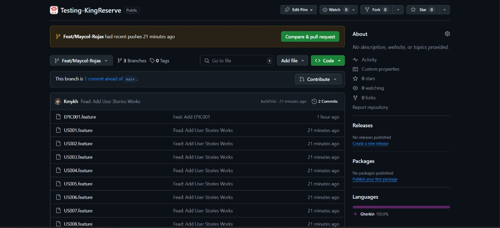

## 5.2.1.5  Execution Evidence for Sprint Review

Durante este Sprint, se han alcanzado varios hitos importantes en la implementación de la Landing Page, las aplicaciones web y los servicios web de King Reserve. Se han completado las siguientes tareas:

- Implementación de la sección de Resumen.
- Implementación de la sección de Características.
- Envío de correos a los CEO de KingGroup.
- Registro de nuevos usuarios.
- Visualización de funcionalidades.
- Visualización de planes disponibles.
- Implementación de la sección de Preguntas Frecuentes.
- Conexión de King Group con la aplicación.
- Conexión de datos del formulario a Firebase.
- Implementacion de la Internacionalizacion

### Screenshots

#### Landing Page
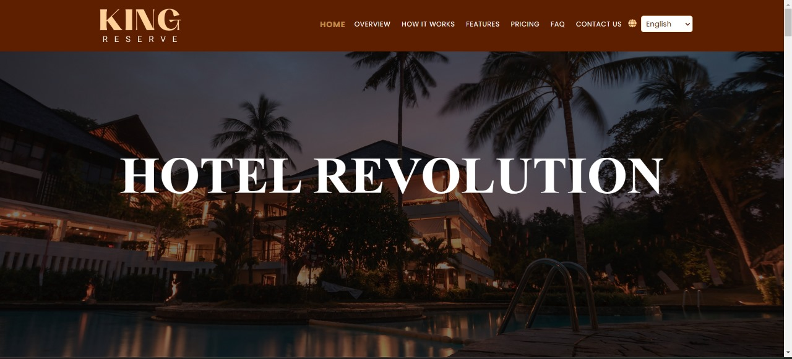

#### Sección de Características
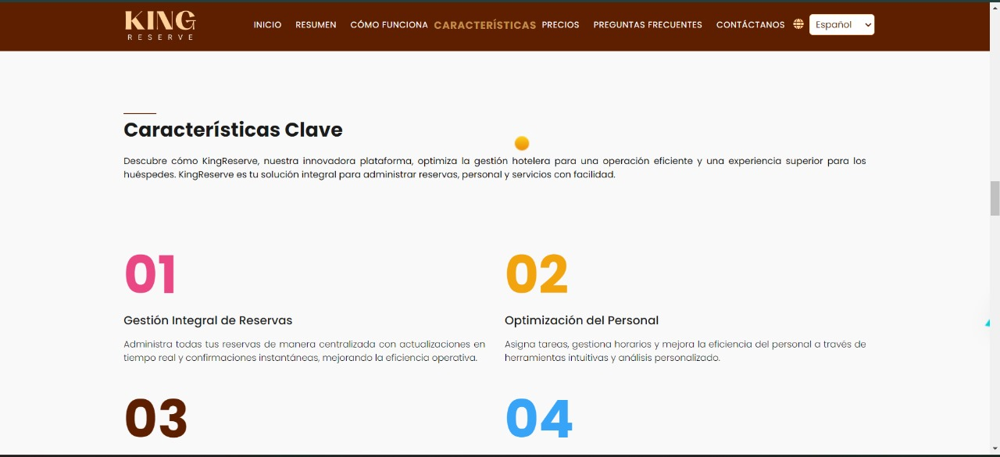

#### Sección de Planes Disponibles
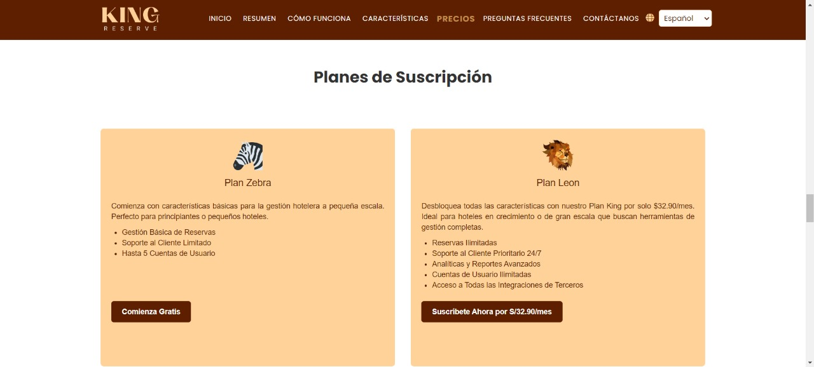

#### Sección de Preguntas Frecuentes
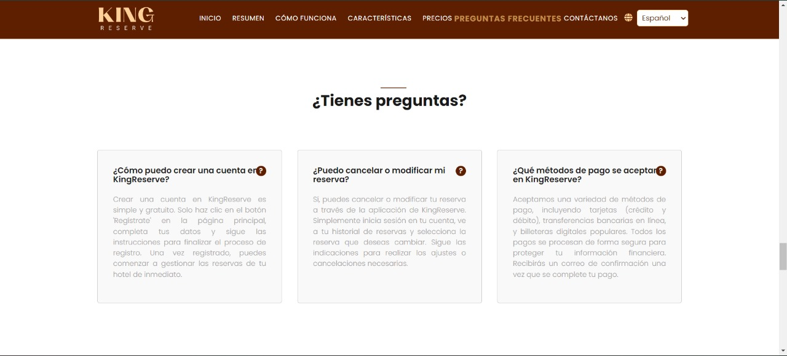

### Seccion de cambio de idioma 
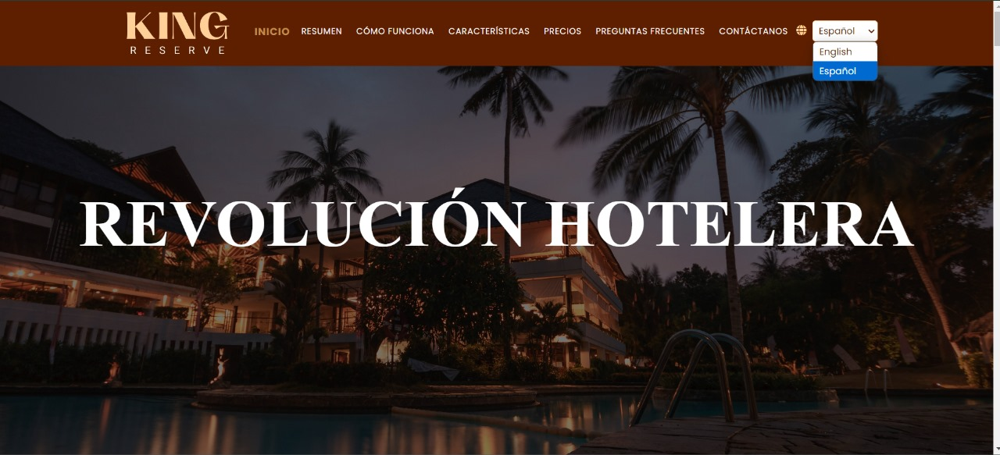

### Video de Demostración

Para una demostración completa de la visualización y navegación logradas en este Sprint, por favor vea el siguiente video:

|Nombre|Link|
|--------------------|------------|
|Video de Demostración | https://upcedupe-my.sharepoint.com/:v:/g/personal/u202219984_upc_edu_pe/EVt0Nx5B_7tCvOJOQPutx4MB3DofKynew2_pIgkDRkttSg?nav=eyJyZWZlcnJhbEluZm8iOnsicmVmZXJyYWxBcHAiOiJTdHJlYW1XZWJBcHAiLCJyZWZlcnJhbFZpZXciOiJTaGFyZURpYWxvZy1MaW5rIiwicmVmZXJyYWxBcHBQbGF0Zm9ybSI6IldlYiIsInJlZmVycmFsTW9kZSI6InZpZXcifX0%3D&e=Qbz30y |


## 5.2.1.7 Software Deployment Evidence for Sprint Review

Durante este Sprint, se han realizado varias actividades relacionadas con el despliegue de los productos de King Reserve, incluyendo la Landing Page El despliegue se ha llevado a cabo utilizando Netlify, un proveedor de servicios en la nube que facilita la implementación continua y la automatización del despliegue. A continuación, se detallan los pasos realizados y se presentan capturas de pantalla que ilustran el proceso.

### Actividades de Despliegue

1. **Creación de Cuenta en Netlify**
   - Se creó una cuenta en Netlify para gestionar el despliegue de los proyectos.
   - Captura de pantalla de la cuenta creada:

     
     

2. **Configuración de Repositorios**
   - Se configuraron los repositorios de GitHub para la integración continua con Netlify.
   - Captura de pantalla de la configuración del repositorio:
     
     


3. **Configuración de Proyectos en Netlify**
   - Se configuraron los proyectos de desarrollo en Netlify para la automatización del despliegue.
   - Captura de pantalla de la configuración del proyecto:
     


4. **Despliegue de la Landing Page**
   - Se desplegó la Landing Page utilizando Netlify.
   - Captura de pantalla de la Landing Page desplegada:
     
    - Enlace: https://kingreserve.netlify.app/

## 5.2.1.8 Team Collaboration Insights during Sprint


Durante este Sprint, el equipo ha trabajado de manera colaborativa por 2 alumnos en el diseño y programacion en la implementación de la Landing Page de King Reserve. A continuación, se presenta un resumen de cómo se han desarrollado las actividades de implementación, junto con capturas de pantalla de los analíticos de colaboración y commits en GitHub realizados por los miembros del equipo.

### Actividades de Implementación

El equipo ha dividido las tareas de implementación de la Landing Page en varias actividades clave, asegurando que todos los miembros del equipo participen activamente en el desarrollo. Las actividades incluyen:

- Diseño y maquetación de la Landing Page.
- Implementación de secciones clave como el encabezado, pie de página, y contenido principal.
- Configuración de la integración continua y despliegue en Netlify.
- Pruebas y ajustes finales para asegurar la calidad del producto.

### Analíticos de Colaboración

A continuación, se presentan capturas de pantalla de los analíticos de colaboración en GitHub, mostrando la participación de cada miembro del equipo en términos de commits y contribuciones.

#### Captura de Analíticos de Colaboración en GitHub
-En el repositorio de la Landing Page 


### Commits en GitHub

A continuación, se presenta una tabla con los commits realizados por los miembros del equipo durante este Sprint.

| Repository | Branch | Commit Id | Commit Message | Commit Message Body | Commited on (Date) | Autor |
|------------|--------|-----------|----------------|---------------------|--------------------|-------|
| KingGroupOficial/Landing-Page---KingReserve | developer | 1786b49d0209c936e067dcd2e97fb6734b390fa1 | feat: add version 1 landing page | Se creó una primera versión preliminar base de la landing page | 2024-08-30 | Maycol Jhordan Rojas Velasquez |
| KingGroupOficial/Landing-Page---KingReserve | developer | e83f2ff35b69c8a4d4ba1f84f8ea7e1c9db5aec8 | feat: update logo and add hero section | Se agregó la parte del hero y un cambio de logo de la página | 2024-08-30 | Maycol Jhordan Rojas Velasquez |
| KingGroupOficial/Landing-Page---KingReserve | developer | db72dee2f94cf8003d0e3ddab081bddd74697b4e | feat: update plan | Se mejora la visualización del apartado de planes de suscripción | 2024-08-30 | Maycol Jhordan Rojas Velasquez |
| KingGroupOficial/Landing-Page---KingReserve | developer | 5d8ce03a2eeaa912b0db04e40da51da38f3aa4fb | feat: update send email to CEO KingGroup, fix bugs | Se arregló el problema de envío de correo electrónico, además de bugs con el logo y tipos de tipografía | 2024-09-03 | Maycol Jhordan Rojas Velasquez |
| KingGroupOficial/Landing-Page---KingReserve | developer | 58f345de2b81a334890dc8f01f4b420c119aa178 | feat: update links on the landing page | Se le dio destino a los botones de redes sociales, direcciones de suscripciones | 2024-09-03 | Maycol Jhordan Rojas Velasquez |
| KingGroupOficial/Landing-Page---KingReserve | developer | b67299811f0435e3bb3ea04d14a7a223508873de | feat: add i18n | Se le dio la internacionalización a la página | 2024-09-03 | Maycol Jhordan Rojas Velasquez |

El equipo ha trabajado de manera efectiva y colaborativa durante este Sprint, asegurando que todos los miembros participen activamente en la implementación de la Landing Page. Los analíticos de colaboración y los commits en GitHub reflejan el esfuerzo conjunto y la dedicación del equipo para alcanzar los objetivos del Sprint.
### 5.2.2.1 Sprint planning 2 
| Sprint # | Sprint 2  | 
|--------------------|------------|
| Sprint Planning Background | 
| Date | 2024-09-28 | 
| Time |  1:00 AM |
| Location |  UPC - Campus San Miguel |
| Preparate by| Joaquin Pedraza Maldonado | 
|  Attendees (to planning meeting) | Gómez Vallejos Sergio André ,Zevallos Linares Alessandro Netto ,Pedraza Maldonado Joaquin Andree ,Romero Qwistgaard Russell Stephen  | 
| Sprint n-2 Review Summary | --- | 
| Sprint Planning Background | Durante esta etapa, se llevó a cabo una exhaustiva verificación del frontEnd Webb App y la implementacion de las mejoras continuas dadas en nuestro sprint 1. |
| Sprint Goal & User Stories | 
| Sprint 2 Goal | Desarrolar la funcionalidad de la  webb App con i18n. Se considerará que el objetivo del sprint se ha cumplido con la funcionalidad hecha y el frontEnd.|  
| Sprint Velocity | Se establece un Velocity de 20 Story Points para este Sprint. | 
| Sum of Story Points | 20 Story Points | 
## 5.2.2.3 Development Evidence for Sprint Review

Durante este sprint, se han realizado avances significativos en la implementación de la Landing Page. Se han completado varias historias de usuario de la landing page y se han realizado múltiples commits en los repositorios correspondientes. A continuación, se presenta una tabla que incluye los commits relacionados con la implementación para el repositorio de la landing page.

### Commits

| Repository |Branch| Commit Id | Commit Message| Commit Message Body| Commited on (Date)|
|--------|-----------|--------|-------|---------------------------------|-------|
| KingGroupOficial/Front-End-KingReserve  | developer | 563940ff8013fe4ff9ee3c1ee154a0cf83096e4e | feat:Add person administration| Se agrego el component person y administracion | 2024-09-26|
| KingGroupOficial/Front-End-KingReserve | developer|f33c21b9ce8b946b2db1d29f0990b38f98c5e4a6  |  feat: Update person Administration and Export Pdf |Se actualizo el person y Administration y se puede exportar en Pdf | 2024-09-27|
|KingGroupOficial/Front-End-KingReserve  | developer| 77976ba2e7155cbd23467a73b44656309dbe8e68 | Feat: Add Stadisticas person and reserves |  Aqui hace la funcion donde podremos enviar correo de los registros. | 2024-09-27 |
|KingGroupOficial/Front-End-KingReserve   | developer | 1b85a82dafbfab505fafbae169572f14a74639f4  |Feat: new data base  |Aqui se creo la base de datos| 2024-09-27|
| KingGroupOficial/Front-End-KingReserve | developer |   afde1d0ac3acbce311c2e55b454abc1d8d603073 |  feat: Staff of KingReserve |Se el staff en KingReserve|2024-09-27 |
|KingGroupOficial/Front-End-KingReserve   | developer |  6ce5fd23b6a062388fd152ba606ad059bdbd6825  |feat: Add stadistics Review   | Se añadio las Reviews de stadistics | 2024-09-27 |
| KingGroupOficial/Front-End-KingReserve  | developer | 347f45b9f97fe594387e6aa1e52f69cb4b2ad339   | feat:color buttons and CRUD |Se añadio los colores a los botones y el CRUD en los componentes.|2024-09-27 |
| KingGroupOficial/Front-End-KingReserve   | developer | 0890b48e10467a579e6d016678ee1443c64614e7   |  feat:update rooms details and fake api|Se desarollo lso detalles de los rooms y sobre el fake api | 2024-09-27 |

### Imagenes 


## 5.2.2.4 Testing Suite Evidence for Sprint Review

En esta sección se explica y presenta el conjunto de Unit Tests, Integration Tests y Acceptance Tests automatizados, desarrollados para la landing page asociados con las User Stories especificadas en el Sprint.

### Commits

| Repository |Branch| Commit Id | Commit Message| Commit Message Body| Commited on (Date)|
|--------|-----------|--------|-------|---------------------------------|-------|
|  KingGroupOficial/Front-End-KingReserve   | developer | 517b0cbc978be7c8ae42b1eab0cf0967d059ec53 | feat: Add files via upload | Se añadieron archivos faltantes    | 2024-09-27|
|  KingGroupOficial/Front-End-KingReserve   | developer|62b19a1af69ddc74fccbda4a7aa7a53409d39c2e  |  feat: Delete src/king-reserve/staff directory|Se elimio el directorio staff   |2024-09-27|
|  KingGroupOficial/Front-End-KingReserve   | developer| 2f5020df1625fcd35514ea8147c207eb6c90e574 | Feat: add color stadistics |Se añadio colores a stadistics para su diseño de interfaz | 2024-09-27 |
|  KingGroupOficial/Front-End-KingReserve    | developer | a8a25a838a0bdf347947fae2a37e5e82e7a36384  |Feat:add rooms colors |Se añadio colores a rooms para su diseño de interfaz| 2024-09-27|
| KingGroupOficial/Front-End-KingReserve  | developer |   e78a77d6bc0c760fe04abc98186a4c068bf027ad |  feat:color buttons |Se agrego colores a los botones para que sean mas intuitivos |2024-08-30 |
|  KingGroupOficial/Front-End-KingReserve   | developer |  acc4b3940cbddc385b9209f1084b2f04920b32f4  |feat: add colors   | Se agrego colores a los botones e interfaz correspondientes a nuestro proyecto| 2024-09-27 |
| KingGroupOficial/Front-End-KingReserve   | developer | 40c1b4d2dc28e0cd3b8fecbdeef1d304100665cc   | feat: Merge branch 'developer' | Se hizo un Merge al finalizar con la rama developer|2024-09-27|
|  KingGroupOficial/Front-End-KingReserve   | developer | 7a7ac68301cad74eddeaef9a83129ed3475c16b0   |  feat: ADD api fake persons |Se añadio el api fake de persons | 2024-09-27 |

## Imagenes

## Conclusiones Generales

1. Durante este Sprint, el equipo ha demostrado una colaboración efectiva y una distribución equitativa de las tareas. Todos los miembros del equipo han participado activamente en la implementación de la Landing Page, contribuyendo con commits significativos y trabajando en conjunto para resolver problemas y mejorar la calidad del producto. La utilización de herramientas como GitHub y Netlify ha facilitado la integración continua y el despliegue automatizado, permitiendo un flujo de trabajo más eficiente y coordinado.

2. Se han logrado avances significativos en la implementación de la Landing Page de King Reserve. El equipo ha completado con éxito varias tareas clave, incluyendo el diseño y maquetación de la página, la implementación de secciones importantes como el encabezado, el pie de página y el contenido principal, así como la configuración de la integración continua y el despliegue en Netlify. Estos logros han sentado una base sólida para futuras iteraciones y mejoras, asegurando que la Landing Page cumpla con los requisitos y expectativas del proyecto.

## 6.4 Bibliografía

1. The C4 model for visualising software architecture (2024) Recuperado de: https://c4model.com
2. Naming Conventions for java (2024) Recuperado de: https://www.oracle.com/java/technologies/javase/codeconventions-namingconventions.html#:~:text=Except%20for%20variables%2C%20all%20instance,should%20be%20short%20yet%20meaningful.

## Anexos


**Enlaces**

</center>

 |Segmento del trabajo|Link de repositorio|
|---------|---------|
| LandingPage (Anexo A)    | https://kingreserve.netlify.app/ |
| Diagramas de clases (Anexo B)   |  https://upcedupe-my.sharepoint.com/:v:/g/personal/u20221d401_upc_edu_pe/EUv9OiiAZgtKgkO9fzCMedUBkaxSq29Emvi84Fn6uYdO3A?e=jC6bjZ&nav=eyJyZWZlcnJhbEluZm8iOnsicmVmZXJyYWxBcHAiOiJTdHJlYW1XZWJBcHAiLCJyZWZlcnJhbFZpZXciOiJTaGFyZURpYWxvZy1MaW5rIiwicmVmZXJyYWxBcHBQbGF0Zm9ybSI6IldlYiIsInJlZmVycmFsTW9kZSI6InZpZXcifX0%3D  |
| Diagramas de base de datos (Anexo C)   | https://my.vertabelo.com/doc/GeHrKz6hgPvFhSH4XkuEu95kq78E4Eab   |
